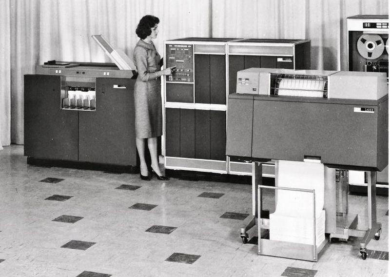
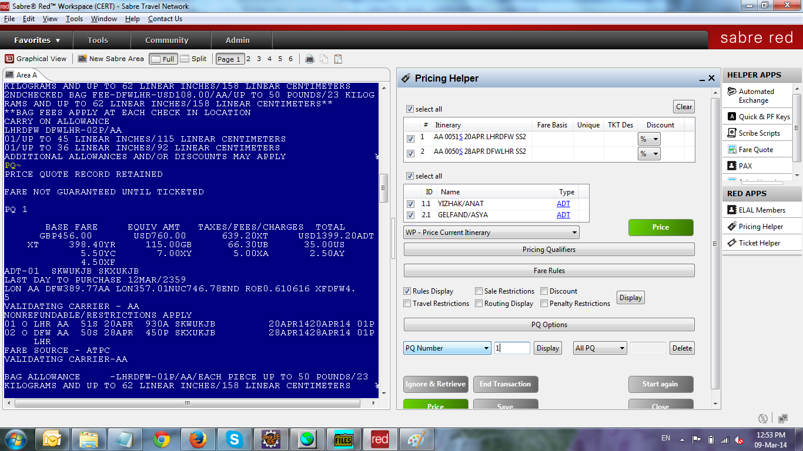

> "in short, that all things physical are information-theoretic in origin and this is a participatory universe" - John Wheeler, 1989

## 1 Introduction

Management Information Systems (MIS) is a field that combines the practices of managing people, processes, and technology to provide essential information that supports decision-making in organizations. MIS bridges the gap between computer science and business, offering a comprehensive approach to managing and utilizing information systems to achieve organizational goals.

- Management refers to the process of coordinating and overseeing the activities of an organization to achieve defined objectives. It involves planning, organizing, leading, and controlling resources, including human, financial, and technological assets. Effective management ensures that all parts of the organization work together harmoniously and efficiently to meet goals.
- Information refers to data that has been processed and organized in a meaningful way, making it useful for decision-making. In the context of MIS, information is the valuable output derived from data that helps managers understand their environment, make informed decisions, and solve problems.
- A system is a set of interrelated components that work together to achieve a common goal. In MIS, a system typically refers to a combination of hardware, software, data, procedures, and people that interact to process data and produce information. Systems in MIS are designed to collect, store, process, and distribute information.

Therefore MIS is an information-processing system for business operation. The terms data, information, and knowledge are often used interchangeably, but they represent distinct concepts in the context of information processing and decision-making in MIS.

- Data: Raw facts and figures without context, such as numbers (`200`) or text (`James`).
- Information: Data that has been processed and interpreted to provide meaning. For example, `200 units sold`, `First name: James`.
- Knowledge: Information that has been further processed, analyzed, and combined with experience, insights, and context to create a deeper understanding. It is used to inform decisions and actions. For example, `The average daily sales for the past three days is 200 units.` may give the knowledge of `Implementing a promotional campaign on weekdays increases daily sales by 20% based on past trends`.

Management Information Systems (MIS) is an interdisciplinary field that integrates management practices with information technology to provide managers with the information necessary to make informed decisions. By understanding the components of management, information, and systems, organizations can effectively harness technology to improve efficiency, support strategic planning, and gain competitive advantages.

## 2 A Brief History of MIS

MIS is based on computer systems and evolves with the computer system evolution. There are new type of business application in almost every decade.

- 1950s-1960s: Emergence of early computer systems for data processing.
- 1970s: Introduction of Decision Support Systems (DSS).
- 1980s: Rise of Personal Computers (PCs), office automation, and relational databases.
- 1990s: ERP systems gain popularity.
- 2000s: Internet and E-business
- 2010s: Big data, cloud computing, and Business Intelligence (BI).
- Present: AI-driven business operation.

### 2.1 Early Business Applications

Most of today's business applications were first developed in 1960s. Following are some examples, some are even used today. Guess which one?

- IBM 1401 Computer: The IBM 1401 was a popular business computer during the 1960s.It was widely used for tasks such as payroll processing, inventory management, and accounts receivable/payable. Companies could input data using punched cards, and the computer would process transactions and generate reports.The IBM 1401 played a crucial role in automating routine business operations.
- Banking Systems: Banks adopted early computer systems to manage customer accounts, track transactions, and calculate interest. These systems allowed for faster account updates, check processing, and statement generation.For example, the Bank of America used computers to handle its growing customer base.
- Reservation Systems: Airlines, hotels, and other travel-related businesses relied on computerized reservation systems.
- Inventory Control:Businesses needed efficient ways to track inventory levels and reorder products. Early computer applications helped manage stock, monitor sales, and optimize supply chains. Companies like General Electric and Ford used computerized inventory control systems.
- Manufacturing Process Control: Industries such as automotive manufacturing embraced computer control systems. Computers monitored production lines, adjusted machinery settings, and ensured quality control. The IBM 1620 was used for process control in various manufacturing plants.
- Decision Support Systems: While not as widespread, some companies experimented with decision support systems. These systems provided data analysis, forecasting, and scenario modeling. They helped managers make informed decisions based on available information.

Below is the image of IBM 1401 -- the first widely used business computer.

Source [IBM 1401 in Computer History Museum](https://computerhistory.org/blog/about-the-computer-history-museums-ibm-1401-machines/).

The IBM 1401 use punched cards as its data input.

Source [Punched Card in Wikipedia](https://en.wikipedia.org/wiki/Punched_card).

### 2.2 The SABRE System

In the early 1960s, one of the most remarkable innovations in the field of Management Information Systems (MIS) was the development of the SABRE (Semi-Automatic Business Research Environment) system by American Airlines. This pioneering effort not only revolutionized the airline industry but also set a precedent for the use of real-time processing systems in business.

#### The Birth of SABRE

The story begins in the mid-1950s when American Airlines was grappling with the challenges of managing an increasingly complex reservation system. At that time, booking a flight was a manual process involving paper tickets, handwritten logs, and telephone calls. This method was not only time-consuming but also prone to errors, especially as the volume of passengers grew.

In 1953, C.R. Smith, then president of American Airlines, met with R. Blair Smith, an IBM sales representative, during a flight. Inspired by IBM's work with real-time computer systems for the U.S. Air Force's SAGE (Semi-Automatic Ground Environment) project, which used computers to manage and process air defense information, C.R. Smith envisioned a similar system for managing airline reservations. This serendipitous conversation led to a groundbreaking partnership between American Airlines and IBM.

#### Development and Implementation

Work on the SABRE system began in earnest in 1957, and it took several years of intensive development to bring the system to life. The project was ambitious, aiming to create a real-time computer network that could handle the reservation needs of American Airlines across the entire United States.

By 1960, the system was partially operational, and in 1964, it was fully deployed. SABRE used two IBM 7090 mainframe computers located in Briarcliff Manor, New York. These computers were interconnected with a network of over 1,000 terminals installed in airports and ticket offices across the country.

Source: [Sabre.com](https://central.sabre.com/)

#### Impact and Legacy

The introduction of the SABRE system had a profound impact on American Airlines and the airline industry as a whole. Here are a few key aspects of its impact:

1. Efficiency and Accuracy: SABRE automated the booking process, significantly reducing the time required to make a reservation from hours to just a few seconds. This not only improved customer satisfaction but also increased the accuracy of reservations, reducing errors and overbooking.

2. Competitive Advantage: The system gave American Airlines a significant competitive edge. By streamlining operations and improving customer service, American Airlines was able to attract more passengers and operate more efficiently than its competitors.

3. Industry Transformation: SABRE set a new standard for the airline industry. Other airlines soon recognized the benefits of such systems, leading to widespread adoption of similar technologies. The success of SABRE demonstrated the potential of computer systems to transform business operations, paving the way for the development of other MIS applications in various industries.

4. Technological Innovation: The collaboration between American Airlines and IBM showcased the possibilities of real-time computing and networking. The technologies and methodologies developed for SABRE influenced future innovations in computer science and information systems.

#### A Lasting Legacy

Today, SABRE remains one of the most iconic examples of early MIS implementation. The system has evolved significantly over the decades, incorporating modern technologies and expanding its capabilities. SABRE now operates as an independent company, providing technology solutions to airlines and travel agencies worldwide.

The story of SABRE is not just a tale of technological innovation but also a testament to the power of visionary leadership and collaboration. It highlights how a chance meeting and a bold idea can lead to transformative changes, setting the stage for the modern information systems that drive businesses today.

### 2.3 Modern Business Applications

With the advances of computer hardware and software, today's business applications are everywhere and more intelligent than their precedences. A historical view shows the evolution of business applications - often called ERP (Enterprise Resource Planning) or Enterprise Systems (ES).

- 1960s: ERP's foundational system, known as MRP (Material Requirements Planning), emerged. It was designed to assist businesses in: Balancing production with demand; Managing inventory levels; Scheduling production processes.
- 1970s: MRP I was developed, which utilized software applications for generating schedules for operations and raw material purchases and tracking orders
- 1980s: MRP II was developed, which utilized software applications and applications for: (1) Coordinating manufacturing processes; (2) Managing product planning, parts purchasing, and inventory control; (3) Tracking product distribution and shipping; (4) Automating accounting and financial processes.
- 1990s: ERP (Enterprise Resource Planning) emerged, which integrated various functions of a company into a single, interconnected system, including: (1) Financial management (accounting, budgeting, forecasting); (2) Human resource management (payroll, benefits, performance management); (3) Supply chain management (procurement, inventory management, logistics); (4) Customer relationship management (sales, marketing, customer service)
- 2000s: ERP II or Enterprise Systems (ES) emerged, which described the new advancements in ERP systems, including (1)Business intelligence (data analytics, reporting, dashboards); (2) Extended ERP. Integration with other systems, such as Customer Relationship Management (CRM) and Supply Chain Management (SCM); (3) E-business and e-commerce capabilities
- Present day: ERP or ES systems continue to evolve with the latest business and technological trends, including (1)Cloud-based deployment options; (2) Mobile accessibility and apps; (3) Artificial intelligence and machine learning integration; (4) Internet of Things (IoT) connectivity;

Modern applications are designed with cloud-native architecture in mind. They run on cloud platforms (such as Amazon Web Services (AWS), Microsoft Azure, or Google Cloud), allowing for scalability, flexibility, and cost-effectiveness. Cloud-native applications use micro-services, which break down complex systems into smaller, independent components. This approach enables faster development, easier maintenance, and better resource utilization.

Modern business applications are used in almost every business domain and process, empowering organizations to operate efficiently, adapt to changing market dynamics, and deliver exceptional customer experiences. By leveraging the latest technologies, businesses can ensure they remain competitive and responsive to market demands.

### 2.4 AI in Business: Transforming Modern Enterprises

### AI in Business: Transforming Modern Enterprises

Artificial Intelligence (AI) has become a pivotal force in modern business, driving innovation, efficiency, and competitiveness. By automating routine tasks, providing deep insights through data analysis, and enhancing decision-making processes, AI technologies are reshaping how businesses operate and compete in the global market.

AI offers several features that make it invaluable in the business context. One of the most significant is automation. AI can automate repetitive and time-consuming tasks, freeing up human resources for more strategic activities. For instance, Robotic Process Automation (RPA) is used to handle routine tasks such as data entry, invoice processing, and customer service inquiries. This not only improves efficiency but also reduces the potential for human error.

Data analysis and insights are another critical feature of AI. AI systems can analyze large volumes of data to uncover patterns, trends, and insights that would be difficult to detect manually. Machine learning algorithms, for example, can analyze customer data to identify purchasing patterns and predict future behavior, enabling businesses to develop targeted marketing strategies.

Natural Language Processing (NLP) is a feature of AI that enables machines to understand, interpret, and respond to human language. This capability is seen in chatbots and virtual assistants that interact with customers, providing instant support and improving customer satisfaction. Predictive analytics, which uses historical data to predict future outcomes and trends, is another powerful feature of AI. In manufacturing, predictive maintenance uses sensors and data analytics to foresee equipment failures before they occur, reducing downtime and maintenance costs.

AI also excels in delivering personalized experiences and recommendations to users based on their behavior and preferences. E-commerce platforms like Amazon use AI to recommend products based on past purchases and browsing history. Additionally, AI provides intelligent recommendations and supports decision-making processes through decision support systems. Financial institutions, for example, use AI to assess credit risk and make lending decisions by analyzing vast amounts of financial data and transaction histories.

The applications of AI in business are vast and varied.

- In customer service, AI-powered chatbots and virtual assistants handle customer inquiries, provide support, and resolve issues 24/7. Companies like H&M use chatbots on their websites and social media to answer customer questions, track orders, and provide product recommendations.
- In marketing and sales, AI analyzes customer data to optimize marketing campaigns and improve sales strategies. Netflix, for instance, uses AI to analyze viewing habits and preferences, delivering personalized content recommendations to its users.
- In supply chain management, AI optimizes logistics, inventory management, and demand forecasting. DHL employs AI to predict demand and optimize delivery routes, reducing operational costs and improving delivery times.
- Human resources also benefit from AI, with applications assisting in recruiting, employee engagement, and performance management. Companies like Unilever use AI to screen job applicants by analyzing video interviews, assessing facial expressions, tone of voice, and word choice.
- In the finance sector, AI enhances fraud detection, algorithmic trading, and financial planning. JP Morgan Chase uses AI for fraud detection by analyzing transaction patterns and flagging unusual activities in real-time. In healthcare, AI supports diagnostic processes, treatment recommendations, and patient monitoring. IBM Watson Health, for example, assists doctors by analyzing medical records and research papers to provide evidence-based treatment options.

In conclusion, AI is revolutionizing the business landscape by enhancing efficiency, improving decision-making, and delivering personalized experiences. As AI technologies continue to evolve, their applications in business are expected to expand, offering even more innovative solutions and driving further transformation across industries. Businesses that leverage AI effectively will gain a significant competitive edge in the market.

While AI offers significant advantages and transformative potential, its implementation in business also comes with several challenges. These challenges can impact the effectiveness of AI solutions and pose risks to organizations that must be managed carefully to realize the full benefits of AI technologies.

- Data Quality and Availability: One of the primary challenges in deploying AI systems is ensuring the availability and quality of data. AI systems rely on large volumes of high-quality data to function effectively. However, businesses often face difficulties in gathering, cleaning, and maintaining such data. Incomplete, inconsistent, or biased data can lead to inaccurate AI predictions and insights, undermining the reliability of AI applications. To address this, organizations must invest in robust data management practices and tools to ensure their data is accurate, complete, and relevant.
- Integration with Existing Systems: Integrating AI solutions with existing business systems and processes can be complex and time-consuming. Many organizations have legacy systems that may not be compatible with modern AI technologies, requiring significant modifications or even complete overhauls. This integration process can disrupt normal business operations and incur substantial costs. To mitigate these issues, businesses should plan for phased integration and allocate adequate resources for system upgrades and training.
- Talent Shortage: There is a notable shortage of skilled professionals who can design, implement, and manage AI systems. AI expertise requires a combination of skills in data science, machine learning, software engineering, and domain-specific knowledge. This talent gap can slow down AI adoption and development within organizations.
- Ethical and Legal Concerns: The use of AI in business raises various ethical and legal issues that need to be carefully considered. AI systems can inadvertently perpetuate biases present in the training data, leading to unfair or discriminatory outcomes. Moreover, the lack of transparency in AI decision-making processes, often referred to as the "black box" problem, can create accountability challenges. Organizations must establish ethical guidelines and frameworks for AI development and use, ensuring fairness, accountability, and transparency in their AI applications. Compliance with data protection laws and regulations, such as GDPR, is also crucial to avoid legal repercussions.
- Cost and Resource Allocation: Implementing AI technologies can be expensive, requiring substantial investments in hardware, software, and skilled personnel. Small and medium-sized enterprises (SMEs) may find it particularly challenging to allocate the necessary resources for AI initiatives. Additionally, ongoing maintenance and updates of AI systems can add to the costs. Businesses need to conduct thorough cost-benefit analyses to ensure that AI investments are justified and align with their strategic goals.
- Security Risks: AI systems can introduce new security vulnerabilities, as they often require access to sensitive data and critical business operations. Cybersecurity threats, such as data breaches and adversarial attacks, can compromise the integrity and reliability of AI systems. Organizations must implement robust security measures to protect AI systems and the data they process, including encryption, access controls, and regular security audits.

While AI holds immense potential to transform business operations and drive innovation, organizations must navigate several challenges to harness its full benefits. Addressing issues related to data quality, system integration, talent shortages, ethical considerations, costs, change management, and security is crucial for the successful deployment of AI in business. By proactively managing these challenges, businesses can leverage AI to achieve greater efficiency, enhance decision-making, and gain a competitive edge in the market.

## 3 Components of MIS

Management Information Systems (MIS) are integral to modern organizations, providing the necessary tools and information to support business operations and decision-making. At the core of any MIS are three critical components: people, processes, and data. These components work together seamlessly, supported by underlying information technology comprising hardware and software.

### 3.1 High Level Components

#### People

People are the most important component of any MIS. They include the users who interact with the system and the IT professionals who design, implement, and maintain it. This group encompasses a wide range of roles, each contributing to the effective functioning of the MIS:

- End Users: These are individuals who use the MIS to perform their daily tasks. They include employees at various levels, from clerical staff to senior management, who rely on the system to access information, generate reports, and make decisions.
- IT Professionals: This group includes system analysts, developers, network administrators, and support staff who are responsible for creating, managing, and maintaining the MIS. They ensure that the system is reliable, secure, and performs efficiently.

The collaboration between end users and IT professionals is crucial for the successful implementation and operation of an MIS. End users provide valuable feedback that helps IT professionals to refine and improve the system, ensuring it meets the organization’s needs.

#### Processes

Processes refer to the methods and procedures that define how tasks are performed within the organization. In the context of MIS, processes are the structured activities that transform raw data into meaningful information. These processes can be broadly categorized into several types:

- Data Collection: This involves gathering raw data from various sources within and outside the organization. Effective data collection processes ensure that the data is accurate, relevant, and timely.
- Data Processing: Once collected, the data is processed using algorithms and rules to convert it into usable information. This may involve sorting, filtering, aggregating, and analyzing the data.
- Information Dissemination: The processed information is then distributed to the relevant stakeholders through reports, dashboards, and other means. This ensures that decision-makers have access to the information they need when they need it.
- Feedback and Improvement: Continuous feedback from end users is used to improve the processes, ensuring they remain efficient and effective.

Well-defined and optimized processes are essential for an MIS to provide accurate and timely information, which in turn supports effective decision-making and organizational efficiency.

#### Data

Data is the raw material that drives an MIS. It includes all the facts, figures, and statistics that are collected, processed, and stored by the system. Data can come from various sources, including internal operations, customer interactions, market research, and external databases. The quality of data is critical, as inaccurate or outdated data can lead to poor decision-making.

- Data Collection: Data must be collected systematically to ensure its accuracy and completeness. This can involve manual entry, automated sensors, or integration with other information systems.
- Data Storage: Once collected, data must be stored securely and efficiently. This involves the use of databases and data warehouses that can handle large volumes of data and provide quick access when needed.
- Data Management: Managing data involves ensuring its accuracy, consistency, and security. Data management practices include regular updates, backups, and access controls to protect sensitive information.

Data is the foundation of an MIS, and its proper management is essential for transforming it into valuable information that can drive business decisions.

Hardware components include servers, computers, storage devices, and networking infrastructure. Servers host databases and applications, while end-user devices (such as desktops, laptops, and mobile devices) access the MIS. Scalable and reliable hardware is essential for efficient MIS operations.

Software encompasses various applications and tools used within the MIS.

- Office tools and collaboration tools.
- Database management systems (DBMS) store and retrieve data.
- Enterprise resource planning (ERP) systems integrate multiple essential functions (e.g., manufacturing, accounting, finance, HR, inventory) into a unified platform.
- Today's enterprise system (ES) includes Customer Relationship Management (CRM), Human Capital Management (HCM), Supply Chain Management (SCM) and Business Intelligence (BI).
- Business intelligence (BI) software analyzes data and provides insights.

### 3.2 Information Technology and Business Applications

The components of people, processes, and data are supported by the underlying information technology, which includes both hardware and software.

- Hardware: This includes all the physical devices and equipment used to collect, store, process, and disseminate data. Examples of hardware components are servers, computers, networking devices, and storage systems. Reliable and scalable hardware is essential for the smooth operation of an MIS.
- Software: Software includes the programs and applications that run on the hardware, enabling the processing and analysis of data. This can range from operating systems and database management systems to specialized applications for data analysis, reporting, and visualization. Software must be user-friendly, reliable, and capable of meeting the specific needs of the organization.

Business application software plays a critical role in modern enterprises by streamlining operations, enhancing decision-making, and improving overall efficiency. Among the various types of business application software, four key categories stand out: Enterprise Resource Planning (ERP), Customer Relationship Management (CRM), Supply Chain Management (SCM), and Business Intelligence (BI). Each of these categories serves distinct functions and offers unique benefits to organizations.

#### Enterprise Resource Planning (ERP)

Enterprise Resource Planning (ERP) systems integrate various functions of a business into a unified system to streamline processes and information across the organization. ERP systems are designed to improve the efficiency of business operations by providing a comprehensive and real-time view of core business processes. Key Functions of ERP are:

- Financial Management: Manages financial transactions, including accounting, budgeting, and financial reporting. It ensures compliance with regulatory standards and provides insights into the financial health of the organization.
- Human Resource Management (HRM): Automates HR processes such as payroll, recruitment, performance evaluations, and employee records management. It helps in optimizing workforce management and improving employee satisfaction.
- Manufacturing and Production Planning: Facilitates production scheduling, material requirements planning, and quality control. It helps in optimizing manufacturing processes and ensuring timely production of goods.
- Supply Chain Management: many ERP solutions include basic SCM functionalities include procurement, inventory management, and logistics to ensure smooth operations from raw material acquisition to product delivery. Large companies have a separate SCM system.
- Customer Relationship Management: many ERP solutions include basic CRM functionalities to manage customer interactions and sales processes. Large companies have a separate CRM system.

#### Customer Relationship Management (CRM)

Customer Relationship Management (CRM) systems focus on managing a company’s interactions with current and potential customers. The primary goal of CRM software is to improve business relationships, enhance customer satisfaction, and drive sales growth. Key Functions of CRM are:

- Sales Management: Tracks sales leads, opportunities, and customer interactions. It helps in managing the sales pipeline, forecasting sales, and closing deals more efficiently.
- Marketing Automation: Automates marketing campaigns, including email marketing, social media marketing, and lead generation. It enables personalized marketing efforts and improves the effectiveness of marketing strategies.
- Customer Service and Support: Manages customer service requests, support tickets, and customer feedback. It provides tools for resolving customer issues promptly and improving overall customer satisfaction.
- Customer Data Management: Centralizes customer information, including contact details, purchase history, and communication records. It helps in creating a 360-degree view of the customer, enabling better relationship management.

#### Supply Chain Management (SCM)

Supply Chain Management (SCM) systems oversee the flow of goods, information, and finances as they move from supplier to manufacturer to wholesaler to retailer to consumer. SCM systems aim to optimize supply chain operations, reduce costs, and improve efficiency. Key Functions of SCM are:

- Procurement: Manages the acquisition of raw materials and goods from suppliers. It includes vendor selection, purchase orders, and supplier relationship management.
- Inventory Management: Tracks inventory levels, orders, and deliveries. It ensures that the right amount of inventory is available at the right time to meet customer demand.
- Logistics and Distribution: Manages the transportation and storage of goods. It includes route planning, shipping, and warehousing to ensure timely and cost-effective delivery of products.
- Demand Planning and Forecasting: Predicts customer demand to optimize inventory levels and production schedules. It helps in minimizing stock outs and reducing excess inventory.
- Supply Chain Analytics: Provides insights into supply chain performance through data analysis and reporting. It helps in identifying bottlenecks and improving supply chain processes.

#### Business Intelligence (BI)

Business Intelligence (BI) systems analyze data to provide actionable insights that inform business decisions. BI tools help organizations make sense of their data, identify trends, and drive strategic planning. Key Functions of BI are:

- Data Mining and Analytics: Extracts patterns and insights from large datasets. It includes techniques such as clustering, classification, and regression analysis to uncover hidden trends.
- Reporting and Dashboards: Generates visual reports and dashboards that provide real-time insights into business performance. It enables users to monitor key performance indicators (KPIs) and make data-driven decisions.
- Performance Management: Tracks and measures organizational performance against predefined goals. It helps in setting targets, monitoring progress, and identifying areas for improvement.
- Predictive Analytics: Uses statistical models and machine learning algorithms to predict future trends and outcomes. It helps organizations anticipate changes and make proactive decisions.
- Data Visualization: Presents data in graphical formats such as charts, graphs, and maps. It makes complex data easier to understand and interpret, facilitating better decision-making.

## 4 Vizio Case: What's the Most Important Business Function?

Which is the most important function of a business? accounting, finance, marketing, management, HR, IS, or supply chain? It depends. You can outsource any function if it is not the core of your company operation.

In 1986, William Wang graduated from the University of Southern California with a degree in electrical engineering. His career began in the realm of customer service, working for a company that manufactured computer monitors. During this time, monitors were unimpressive, typically grim beige boxes displaying monochrome green or amber text on black backgrounds. This job provided Wang with invaluable insight into the supply chain of electronic devices and honed his understanding of customer needs and industry standards.

In the early 2000s, Wang encountered the burgeoning technology of Liquid Crystal Display (LCD) televisions. He immediately recognized the potential of LCD technology to revolutionize home entertainment, offering superior picture quality and a sleek design compared to the existing bulky television sets. This revelation sparked an idea: why not make these high-quality LCD TVs affordable for the average consumer? Driven by this vision, Wang made a bold decision. He refinanced his house to gather the necessary funds to create a prototype LCD TV. In 2002, with his prototype in hand and a mission to democratize access to high-quality LCD and plasma TVs, Wang launched Vizio.

Wang's next move was crucial. He knew that gaining a foothold in the highly competitive electronics market required a strategic partnership. He approached Costco, a major retail giant, with his vision. During a pivotal meeting, Wang asked for just one thing: a spot at the entrance of Costco stores to demo his LCD TVs. He promised to handle all customer support issues personally, ensuring that Costco would not have to bear any additional burden. At the end of the meeting, Wang made a bold proclamation: “I will beat SONY in five years.” Skepticism filled the room. While nobody believed such an audacious claim, they saw little risk in giving him a chance.

By the second quarter of 2003, Vizio’s products had found a place on Costco shelves. The strategy was simple yet effective: leverage Costco's high foot traffic and strategic placement to capture consumer attention without spending heavily on traditional marketing. Vizio's focus on providing high-quality products at affordable prices, combined with excellent customer service, began to pay off. Consumers quickly embraced Vizio TVs, drawn by their value and performance.

The results were nothing short of remarkable. By the fourth quarter of 2007, Vizio’s market share had soared to 14.2%, surpassing Sony’s 12.5%. William Wang’s bold vision and strategic execution had paid off, making Vizio the number-one seller of LCD TVs in North America within just five years. This journey from a simple customer service role to the helm of a leading consumer electronics brand underscores the power of innovation, strategic partnerships, and unwavering determination.

## 5 Why Should One Learn MIS?

For business major students in fields such as accounting, finance, management, and marketing, learning Management Information Systems (MIS) is crucial. MIS provides the knowledge and skills necessary to leverage technology effectively in today's business environment. Here are the three most important reasons, supported by data, why business students should learn MIS:

### 1. Enhancing Decision-Making and Strategic Planning

In fields like accounting, finance, and management, making informed decisions is key to success. MIS equips students with the ability to analyze data, generate actionable insights, and support strategic planning. By understanding MIS, business students can:

- **Accounting**: Utilize accounting information systems (AIS) to track financial transactions accurately, generate financial reports, and ensure regulatory compliance. According to a study by the International Federation of Accountants (IFAC), 83% of accounting firms use AIS to enhance their decision-making processes.
- **Finance**: Leverage financial information systems to analyze market trends, manage investment portfolios, and perform risk assessments. Notably, more than 70% of stock exchange transactions are now executed by computer algorithms, known as high-frequency trading, demonstrating the importance of MIS in financial markets.

#### 2. Driving Efficiency and Operational Excellence

Efficiency is a critical factor in all business disciplines. MIS helps streamline operations, automate routine tasks, and optimize resource utilization, leading to improved productivity and reduced costs. Business students can benefit from MIS by:

- **Marketing**: Utilizing marketing information systems (MKIS) to analyze customer data, track marketing campaigns, and segment markets. According to HubSpot, 64% of marketers actively invest in website optimization and marketing analytics tools, indicating the critical role of MIS in marketing.
- **Management**: Applying enterprise resource planning (ERP) systems to integrate various business functions, ensuring smooth operations and real-time access to information. Gartner reports that 88% of organizations consider ERP systems essential for business operations, leading to increased efficiency and productivity.

#### 3. Supporting Innovation and Competitive Advantage

In a rapidly changing business environment, innovation and adaptability are essential. MIS provides the tools and knowledge needed to stay ahead of technological trends and maintain a competitive edge. Business students can leverage MIS to:

- **Accounting**: Adopt innovative accounting software that incorporates artificial intelligence and machine learning to automate complex tasks and detect anomalies. The Association of Chartered Certified Accountants (ACCA) reports that 63% of accountants believe AI will have a significant impact on the accounting profession.
- **Marketing**: Implement digital marketing tools and platforms that utilize big data analytics to gain deeper insights into consumer behavior. Google reports that businesses leveraging data-driven marketing are 6 times more likely to be profitable year-over-year, highlighting the importance of MIS in marketing strategies.
