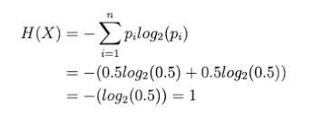
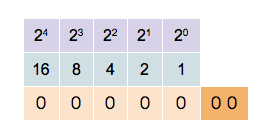
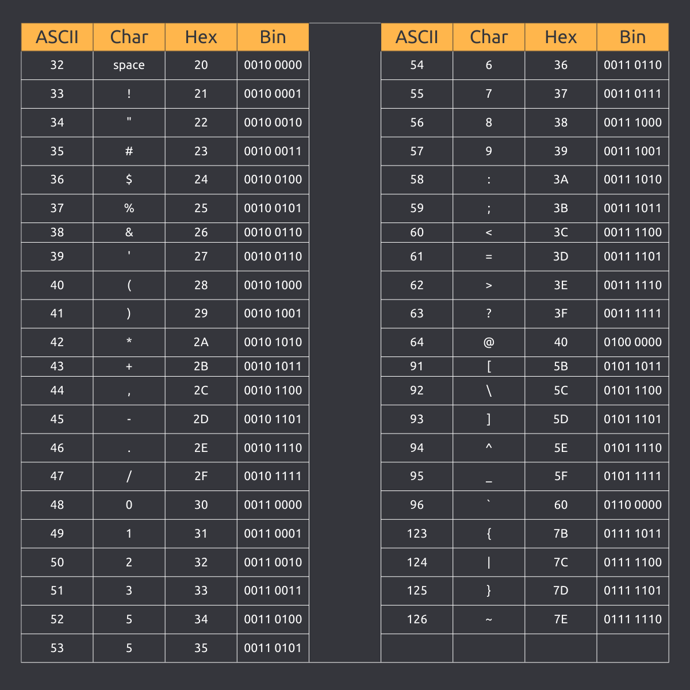
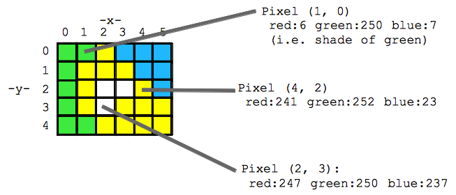
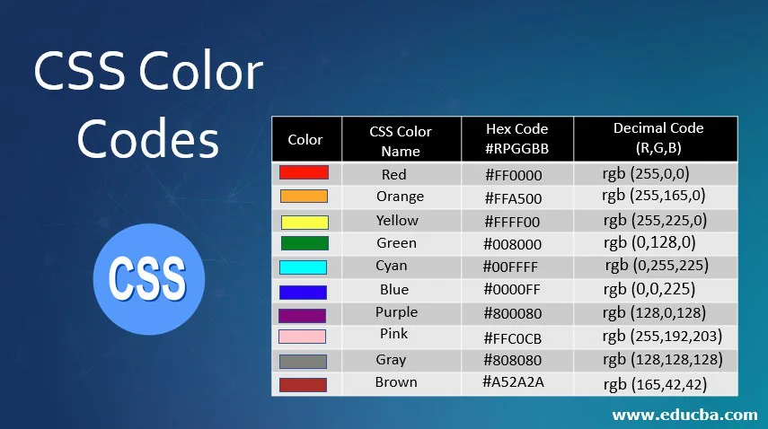

Information refers to the result of processing, analyzing, and interpreting data, which provides meaning, relevance, and usefulness to the recipient. It is the transformation of data into a form that is understandable, useful, and relevant to the context.

For centuries, humanity has depended on information for survival, communication, and progress. From ancient storytelling and written records to modern digital data, information has been a fundamental driver of human advancement. However, for much of history, information remained an abstract and elusive concept—something people intuitively understood but never formally defined or measured. There was no clear way to quantify information, no universally accepted method to assess its content, and no standard unit to express its value. Questions such as "How can information be measured?" and "What is the fundamental unit of information?" remained unanswered until the mid-20th century, when Claude Shannon introduced a mathematical framework that revolutionized our understanding of information and communication. The lack of a precise measure of information meant that its role in communication, decision-making, and technological advancement was often underestimated.

## 1 A Brief History of the Information Concept

The concept of information has evolved over time, with early understandings focused on the communication of messages and the storage of knowledge. Here's a brief overview:

- Ancient Civilizations: The earliest recorded forms of information date back to ancient civilizations, where written languages and symbols were used to convey messages and store knowledge.
- Printing Press (1450s): The invention of the printing press by Johannes Gutenberg revolutionized the dissemination of information, making it possible to mass-produce books and other written materials.
- Industrial Revolution (18th-19th centuries): The development of new technologies, such as the telegraph and telephone, enabled faster and more efficient communication of information over long distances.
- Digital Age (20th century): The advent of computers, the internet, and digital technologies has transformed the way we create, share, and access information, leading to an exponential growth in the amount of information available.
- Modern Era (21st century): Today, we are in the midst of an information explosion, with vast amounts of data being generated every day from various sources, including social media, sensors, and the Internet of Things (IoT).

[Claude Shannon](https://en.wikipedia.org/wiki/Claude_Shannon), known as the "father of information theory," introduced a groundbreaking concept of information in his seminal 1948 paper [“A Mathematical Theory of Communication.”](https://ieeexplore.ieee.org/document/6773024). Shannon’s work laid the foundation for how we understand and quantify information in modern communication systems, including those used in business and technology. Shannon’s information theory introduced the following core ideas:

- Entropy as a Measure of Information: Shannon defined information in terms of uncertainty. The more unpredictable a message, the more information it contains. This provided a way to mathematically quantify the information content in a signal. In practice, it defines the **bit** as the fundamental unit of information.
- Channel Capacity and Noise: Shannon analyzed how much information could be transmitted over a communication channel, accounting for noise and distortion. This led to the famous Shannon Capacity Theorem, which set the fundamental limits of data transmission. The Nyquist-Shannon sampling theorem states that "To perfectly reconstruct a continuous-time signal from its discrete samples, the sampling rate must be at least twice the highest frequency present in the signal." One practical application is the Hi-Fi audio: Human hearing typically ranges from 20 Hz to 20 kHz. A sampling rate of at least 40 kHz is required for perfect reconstruction. CDs use a standard sampling rate of 44.1 kHz / 16-bit for Hi-Fi audio. Modern digital high-resolution audio uses 96kHz / 24-bit or higher for super Audio CD (SACD).
- Redundancy and Coding Theory: His work laid the foundation for error correction and efficient encoding techniques, which later influenced digital communication, data compression, and cryptography. Wi-Fi & Mobile Communication (5G, LTE) use error correction ensures data integrity in wireless networks. Computer memory and hard drivers use error correction codes (ECC) to prevent data corruption.

## 2 Bit and Information

### 2.1 Unit of Information

Shannon defined information as the reduction of uncertainty and used [Entropy](https://en.wikipedia.org/wiki/Entropy) to quantify the level of information. Entropy measures the uncertainty or unpredictability of a random variable or the amount of information required to describe the state of a system. Shannon provided a clear and precise mathematical definition of entropy/information, resolving thousands of years of confusion surrounding the concept.

It is intuitive to think that when the probability distribution of a random variable is more uniform, the entropy is higher. This means there is more uncertainty and more information content. For example, a fair coin flip (with equal probabilities of heads and tails) has higher entropy compared to a biased coin. When the probability distribution is skewed (one outcome is much more likely than the others), the entropy is lower. This means there is less uncertainty and less information content. For example, if a coin is biased to always land on heads, the entropy is zero because there is no uncertainty.

Shannon gave a simple mathematic definition of entropy that can be explained with a simple example. Consider a fair coin toss, where the outcome can be either heads `(H)` or tails `(T)`. Since the coin is fair, each outcome has an equal probability of `P(H) = P(T) = 0.5`. Entropy `H(X)` measures the average amount of information produced by a stochastic source of data. For our fair coin toss example, the amount of information is 1 bit:



[Source: Information Entropy](https://medium.com/@mhannan94/information-entropy-3cce2bac62a2)

However, if the coin is not fair, but comes up heads or tails with probabilities `P(H) = 0.7` and `P(T) = 0.3`, then there is less uncertainty. Every time it is tossed, the head is more likely to come up than the tail. The reduced uncertainty is quantified in a lower entropy: `H(X) = -0.7 * log0.7 - 0.3 * log0.3 = 0.8816`. On average each toss of the coin delivers less than one full bit of information.

If you toss two fair coins, the possible outputs are `HH`, `HT`, `TH`, and `TT`, with equal probability of `0.25`. Its entropy is `(HX) = -0.25 * log0.25 - 0.25 * log0.25 - 0.25 * log0.25 - 0.25 * log0.25 = 2`. So there are 2 bits of information.

Now think about the entropy of stock market. During periods of high volatility, stock prices can change rapidly and unpredictably. Events like financial crises, political instability, or sudden economic shifts increase market entropy. In stable market conditions, where prices change more slowly and predictably, the entropy is lower.

The bit is the unit of information that represents the smallest possible decision between two equally likely outcomes. A bit is a binary unit that can take one of two values: 0 or 1. In information theory, these two values can represent any two distinct alternatives, such as yes/no, true/false, or on/off.

### 2.2 Binary is Universal

The bit is the unit of information because it represents the smallest possible decision between two equally likely outcomes. Following are three most important reasons that bits are used in digital computers as the basic unit of processing:

- Binary system: The binary system uses only two digits: `0` and `1`. This simplicity makes it ideal for electronic representation and manipulation.
- Mathematical convenience: Bits are easily manipulated using Boolean algebra, making mathematical operations and data processing straightforward.
- Universal applicability: Bits can represent various types of information, such as numbers, text, images, and audio, making them a universal unit of information.

The bit unit scales up naturally to more complex scenarios, where the amount of information required to identify an outcome from a set of possibilities depends on the number of possible outcomes and their probabilities. Whether it's distinguishing between heads and tails in a coin toss (1 bit) or among four equally likely outcomes (2 bits), the bit serves as the basic measure of information content, underpinning how we quantify and process information in communication systems and beyond.

## 3 Binary System

Binary is easily represented electronically using two voltage levels (e.g., `0V` and `5V`) or two current levels (e.g., `0mA` and `5mA`). This makes it ideal for digital electronics. Binary is based on switching between two states (`0` and `1`), which is easily implemented using electronic switches (transistors).

A transistor is a current-driven semiconductor device that can control the flow of electric current. In the context of binary code, a transistor can be used to represent `0` and `1` by switching between two states. When the transistor is `"on"`, it can represent `1`, and when it is `"off"`, it can represent `0`. Transistors witch on and off rapidly and consume low power. They are highly reliable and can be easily integrated into complex circuits and scaled down in size.

### 3.1 Boolean Algebra

Boolean algebra is about the binary operations. Four basic operations are:

- `AND` (Conjunction): Represented by the symbol `∧`. In binary, `AND` is performed by multiplying the two bits. Example: `1 ∧ 1 = 1`, `1 ∧ 0 = 0`, `0 ∧ 1 = 0`, `0 ∧ 0 = 0`.
- `OR` (Disjunction): Represented by the symbol `∨`. In binary, In binary, OR is performed by comparing each bit and setting the result to 1 if at least one of the bits is 1. Example: `1 ∨ 1 = 1`, `1 ∨ 0 = 1`, `0 ∨ 1 = 1`, `0 ∨ 0 = 0`.
- `NOT` (Negation): Represented by the symbol `¬`. In binary, `NOT` is performed by flipping the bit. Example: `¬1 = 0`, `¬0 = 1`.
- `XOR` (Exclusive OR): Represented by the symbol `⊕`. In binary, `XOR` is performed by adding the two bits **modulo 2**. Example: `1 ⊕ 1 = 0`, `1 ⊕ 0 = 1`, `0 ⊕ 1 = 1`, `0 ⊕ 0 = 0`.

All these Boolean operations can be easily implemented using transistor-based logical gates. Boolean operations can implement math operations like addition, subtraction, and division using binary numbers and transistor-based logical gates.

The Videos [How Transistors do Math](https://www.youtube.com/watch?v=VBDoT8o4q00) is a good resource to learn the details.

It is highly recommended to read the book [Code: The Hidden Language of Computer Hardware and Software](https://www.charlespetzold.com/blog/2022/06/Announcing-Code-2nd-Edition.html).


### 3.2 Multiple Bits and Bytes

A bit is the basic building block of all digital data, especially in digital communication. It can represent two things/states, thus more bits are used in most cases. Two bits can represent four states. `n` bits can represent `2 ^ n` states or different things.

A byte, on the other hand, is a group of 8 bits that can represent a character, a small number, or other small piece of data. In total, it can represent `2 ^ 8 = 256` different things. It is the basic unit of measurement for data storage and transmission. It is used to describe the size of file, memory and disk. As the amount of data grows, larger units of measurement are needed. In old days, a cell phone text message has a size limit of 160 characters (160B).

- A kilobyte (KB) is equal to `1,024` bytes, about a thousand bytes. It is about the size of a small text file.
- A megabyte (MB) is equal to `1,048,576` bytes, or `1,024KB`, about a million bytes. A frame of HD video is about `6MB`.
- A gigabyte (GB) is equal to `1,073,741,824` bytes, or `1,024MB`, about a billion bytes. A typical laptop memory size is between `4GB` and `64GB`. An average 4K movie have a size of `100GB`.
- A terabyte (TB) is equal to `1,099,511,627,776` bytes, or `1,024GB`, about a trillion bytes. A large computer hard drive may have 1TB to 10TB.
- A petabyte (PB) is equal to `1,125,899,906,842,624 bytes`, or `1,024TB`. In 2023, YouTube hosted `4.3PB` data each day and Facebook produced `4PB` data each day. [Source: Edge Delta](https://edgedelta.com/company/blog/how-much-data-is-created-per-day).
- An exabyte (EB) is equal to `1,024PB`.
- A zettabyte (ZB) is equal to `1,024EB`. In 2023, the world created around `120ZB` of data. [Source: Edge Delta](https://edgedelta.com/company/blog/how-much-data-is-created-per-day).
- A yottabyte (YB) is equal to `1,204ZB`.

In computer, when people talk about the size of memory and file, the unit of measurement is based on byte such as `B`, `KB`, `GB` etc. In telecom and communication, the unit of measurement is `bit`, using lowercase `b`. However, `1kb = 1000b`, `1mb = 1000kb`, `1gb = 1000mb`, it uses the `1000`, not the factor of `1024`.

## 4 Everything in Binary

This binary system is the foundation of digital computers, and it's used in every aspect of their operation.

### 4.1 Numbers

Binary numbers, which are the language of computers, consist of only two digits: `0` and `1`. Decimal numbers, on the other hand, are the familiar numbers used in everyday life, consisting of ten digits: `0` through `9`. A decimal number can be represented by one or more binary digits, where each bit represents a power of `2`. The conversion of binary numbers to decimal numbers and vice versa is a fundamental concept in digital electronics and computer science.

Each binary digit has a corresponding place value. The rightmost bit has a place value of 1, which is 2^0. The 2nd bit from the right has a place value of 2, which is 2^1, the 3rd bit has a place value of 4, which is 2^2, and so on and so forth. It is a tradition in computer science to count from `0`, therefore the nth bit has a place value of `2 = 2^n`.



[source: Wikipedia binary number](https://en.wikipedia.org/wiki/Binary_number)

For example, to convert the binary number 1010 to decimal, we can use the following method:

1. Write down the binary number: 1010
2. Start from the right: 2^0 = 1, 2^1 = 2, 2^2 = 4, 2^3 = 8
3. Multiply each binary digit by the corresponding power of 2: 1×8 + 0×4 + 1×2 + 0×1 = 10
4. The result is the decimal equivalent: 10

On the other hand, to convert a decimal number to a binary number, we can use the "divide by 2" method in reverse. We divide the decimal number by 2 repeatedly, keeping track of the remainders. The remainders, read from bottom to top, form the binary equivalent of the decimal number. For example, to convert the decimal number `10` to binary, we would divide it by `2` repeatedly as follows:

```text
10 ÷ 2 = 5 (remainder 0)
5 ÷ 2 = 2 (remainder 1)
2 ÷ 2 = 1 (remainder 0)
1 ÷ 2 = 0 (remainder 1)
```

Reading the remainders from bottom to top, we get the binary equivalent: `1010`.

### 4.2 Hexadecimal

Hexadecimal is a number system that uses 16 distinct symbols to represent numbers, unlike the decimal system which uses 10 symbols. This unique system is the language of computers, and it plays a crucial role in programming, coding, and data storage. In hexadecimal, the 16 symbols are: `0`, `1`, `2`, `3`, `4`, `5`, `6`, `7`, `8`, `9`, `A`, `B`, `C`, `D`, `E`, and `F`. These symbols represent the numbers `0-9`, and then `A-F` represent the numbers `10-15`. This system is base `16`, meaning it uses `16` digits to represent numbers, whereas the decimal system is base `10`, using `10` digits.

Hexadecimal is used in computers because it provides a more efficient way to represent binary code, which is the fundamental language of computers. Binary code uses only `0`s and `1`s, but it is difficult for humans to read and understand. Hexadecimal provides a bridge between binary and human-readable text, making it easier for programmers to write and debug code. For example, the binary code `1010` can be represented in hexadecimal as `A`. This makes it easier to read and understand the code, and it also reduces the number of digits needed to represent the code.

In addition to programming, hexadecimal is also used in data storage and transmission. It is used to represent colors in graphics and web design, and it is also used in cryptography to encode and decode secure messages.

#### 4.2.1 Conversion Between Hexadecimal and Binary

Converting between these systems is straightforward because each hexadecimal digit maps directly to a group of four binary digits (bits).

To convert a hexadecimal number to a binary number, write it as a four-digit bits: `0` as `0000`, `1` as `0001`, `2` as `0010`, ..., `F` as `1111`. The hexadecimal number `2F3` is `0010 1111 0011`.

To convert a binary number to a hexadecimal number, from the rightmost bit, group the binary digits into sets of four, pad the leftmost group with zeros in its left, then convert each set to the corresponding hexadecimal number. For example, `1011110011` is `0010 1111 0011` that is `2F3` in hexadecimal.

#### 4.2.2 Conversion Between Hexadecimal and Decimal

To convert a hexadecimal number to a decimal (base 10), follow these steps:

- Write down the hexadecimal number and identify its digits and their positions.
- Multiply each digit by 16 raised to the power of its position, starting from 0 at the rightmost digit.
- Sum all the results to get the decimal equivalent.

For example, to convert the hexadecimal number `2F3` to decimal:

- Identify the digits and their positions: `2` is in position `2`, `F` in position `1`, `3` in position `0`.
- Multiply each digit by 16 raised to the power of its position: `2 * (16 ^ 2) = 512`, `F * (16 ^ 1) = 15 * 16 = 240`, `3 * (16 ^ 0) = 3`.
- Sum the result: `512 + 240 + 3 = 755`

To convert a decimal number to a hexadecimal number, follow these steps:

- Divide the decimal number by 16 and record the quotient and the remainder.
- Repeat the division using the quotient from the previous step until the quotient is 0.
- Write down the remainders in reverse order. These remainders represent the hexadecimal digits.

For example, to convert the decimal number `755` to hexadecimal:

- Divide by 16: `755 / 16 = 47 remainder 3`
- Divide the quotient by 16: `47 / 16 = 2 remainder 15`
- Divide the quotient by 16: `2 / 16 = 0 remainder 2`.
- Write the remainders in reverse order: `2F3`.

### 4.3 Text

One of the key ways in which binary is used is to represent text, allowing computers to store, process, and communicate written language. There are many different ways to code text with bits, one old standard is the American Standard Code for Information Interchange (ASCII) system.

In the ASCII system, each character - whether a letter, number, symbol, or space - is assigned a unique binary code. This binary code is made up of 7 or 8 bits, depending on the system, and is represented using only the two digits 0 and 1. The combination of these 0s and 1s corresponds to a specific character, allowing computers to understand and process text.
For example, the letter `"A"` is represented by the binary code `01000001`, while the letter `"B"` is represented by `01000010`. The number `"1"` is represented by `00110001`, and the space character is represented by `00100000`. This system allows for a total of 128 unique characters to be represented, including all the letters of the alphabet (both uppercase and lowercase), numbers, and common symbols.


[Source](https://linuxhandbook.com/ascii-table/)

In the early days of computing, communication was limited to a few languages and characters, ASCII was enough. However, with the advent of globalization and the internet, the need for a universal language of characters became increasingly important. This is where Unicode comes in – a revolutionary character encoding standard that has enabled communication across languages and cultures. Unicode was first introduced in 1991 by a group of computer scientists and linguists who recognized the need for a unified character set. They aimed to create a standard that would allow computers to represent and exchange text in any language, regardless of the platform or device.

Unicode is a system that enables computers to represent characters from any language using one to four bytes. It starts with one byte for basic characters like English letters and common symbols. As the complexity of the characters increases, more bytes are used: two bytes for extended characters found in languages like Latin, Greek, and Cyrillic; three bytes for characters from common languages such as Chinese, Arabic, and Hindi; and four bytes for rare characters, emojis, and historic texts. This flexible encoding allows Unicode to cover a vast array of characters from different languages and symbols, making it the standard for text representation in digital systems.

Today, Unicode is the most widely used character encoding standard in the world, supporting over 150 languages and scripts. One of the key features of Unicode is its ability to represent a vast range of characters, including letters, digits, symbols, and even emojis. The Unicode Standard includes over 143,000 characters, each assigned a unique code point. This means that every character, from the simplest letter to the most complex hieroglyph, can be represented and communicated using Unicode. Another significant advantage of Unicode is its platform independence. Whether you are using a Windows or Mac computer, a smartphone or tablet, Unicode ensures that text is displayed correctly and consistently across all devices. This has enabled seamless communication and collaboration across the globe, regardless of language or platform.

Here are some examples of Unicode characters: Latin: A (U+0041), ñ (U+00F1); Greek: α (U+03B1), Ω (U+03A9); Math: π (U+03C0), ∞ (U+221E); Currency: $ (U+0024), € (U+20AC); Emojis: 😊 (U+1F60A), 👍 (U+1F44D). The "U+" notation represents the Unicode code point in hexadecimal form.

### 4.4 Screen Picture

A picture in a computer screen is a collection of millions of these pixels, arranged in a grid to create a complete image. Below are some common screen resolutions:

- 1080p (Full HD, FHD): 1920x1080 pixels, commonly used for gaming and streaming.
- 1440p (2K, Quad HD, QHD): 2560x1440 pixels, versatile for various uses, including gaming and office work.
- 4K (Ultra HD, UHD): 3840x2160 pixels, ideal for sharp image and text clarity, often used for professional applications.
- 5K: 5120x2880 pixels, offers high pixel density and is commonly used with Mac computers for photo editing and other tasks requiring sharp images.

A screen pixel is the smallest unit of a digital image, representing a single point on a computer screen. It is made up of three-color components - red, green, and blue (RGB) - each with a intensity value ranging from 0 to 255. When combined, these color components create a specific color and brightness, forming a tiny building block of a larger digital picture. Each pixel's color and intensity contribute to the overall appearance of the picture, allowing for a wide range of colors, shades, and details to be displayed on the screen. As the pixels are arranged and lit up, they form a cohesive image, making up the digital pictures we see on our screens every day.

Binary data represents screen pixels through a combination of bits (0s and 1s) that form a binary code. This binary code is used to represent the color and intensity of each pixel on the screen. Here's a step-by-step explanation of how it works:

- Color Representation: Each pixel on the screen is represented by a combination of three colors: Red (R), Green (G), and Blue (B). Each color has a intensity value ranging from `0` (minimum intensity) to `255` (maximum intensity).
- Binary Encoding: Each intensity value is converted into binary code using 8 bits (0s and 1s). For example, the intensity value `255` would be represented as `11111111` in binary or `FF` in hexadecimal.
- Pixel Representation: The binary code for each color component `(R, G, B)` is combined to form a single binary code for each pixel. This binary code is typically 24 bits long (8 bits for each color component).
- Pixel Array: The binary code for each pixel is arranged in a 2D array, representing the entire screen. Each pixel's binary code is placed in its corresponding position in the array.
- Screen Representation: The 2D array of binary codes represents the entire screen, with each pixel's binary code determining its color and intensity.



[source: Stanford CS 101 Image introduction](https://web.stanford.edu/class/cs101/image-1-introduction.html)

For example, to display a red pixel of Red `(R: 255, G: 0, B: 0)`, the binary Code is R: `11111111 (255), G: 00000000 (0), B: 00000000 (0)`. Combined Binary Code is `11111111 00000000 00000000`, or `FF0000` in hexadecimal. This combined binary code represents a single pixel with maximum red intensity and no green or blue intensity. This is a simplified example, and actual screen representation can be more complex, involving additional factors like alpha channels (transparency) and color depth.

Here is a Youtube video [HOw Pixels Work](https://www.youtube.com/watch?v=0B79dGR19Tg).

Below is a table of basic colors and their names used in a web page.



### 4.5 Multimedia and more

Video is represented by breaking down each frame into tiny pixels, which are then assigned binary codes based on their color and intensity. For example, a 1080p video frame consists of `1920 x 1080` pixels, each represented by a 24-bit binary code (8 bits for red, 8 bits for green, and 8 bits for blue). This results in a total of `2,073,600` binary digits per frame! These binary codes are stored sequentially, creating a digital representation of the video. Each frame is represented by a series of 0s and 1s, which are read and decoded by the computer to display the video at a rate of 30 or 60 frames per second. Digital video compression reduces the amount of data required to store or transmit video content. This is achieved through algorithms such as H.264, H.265, and VP9 to encode video data. They eliminate redundant information in video frames, such as repetitive patterns and colors. Compression enables efficient streaming and transmission of video content over the internet, making it possible to watch videos online or stream movies on demand. Additionally, compression allows for smaller file sizes, making video storage and sharing more manageable.

Sound is represented by sampling audio waves and assigning binary codes to each sample. For instance, a CD-quality audio signal is sampled `44,100 (44.1 kHZ)` times per second, with each sample represented by a `16-bit` binary code that allows for `65536 (2 ** 16)` possible values. For two channel stereo, this results in a total of `44,100 * 16 * 2 = 1,411,200 (about 1.411 Mbps)` binary digits per second. For a 74-minute CD, it is about `1411200 bit/second * 60 second/minute * 74 minute / 8 bit/byte = 740MB` before compression. Similarly, sound compression reduces the amount of data required to store or transmit audio content. Algorithms like MP3, AAC, and FLAC eliminate redundant information in audio signals, such as silence or repeated patterns. A 74-minute CD can be compressed to a size from `74MB` to `370MB`. These binary codes are stored digitally and read by the computer to produce sound waves, which are then sent to the speakers or headphones.

Numbers, texts, images, videos, are audios are basic data format that used by business application to represent all transaction data. In all cases, the binary code is made up of 0s and 1s, which are stored and processed by computers. This allows for efficient storage, transmission, and manipulation of data, enabling digital communication and computing.

## 5 The Information Perspective

From an information perspective, various domains such as business, social life, physics, and human genetics can be viewed as complex systems that process, store, and transmit information. This perspective highlights the fundamental role of information in shaping and driving the dynamics of these systems.

In the context of business, organizations can be seen as complex information systems where data flows through various processes and departments to support decision-making and operations.

- Data Processing: Businesses collect vast amounts of data from customers, markets, and internal operations. This data is processed to generate useful information, which helps in strategic planning, market analysis, and operational efficiency.
- Information Storage: Information is stored in databases, data warehouses, and cloud storage solutions. This stored information includes financial records, customer data, inventory levels, and more.
- Information Transmission: Communication channels within and between organizations facilitate the transmission of information. This includes emails, reports, meetings, and digital communication tools that ensure information reaches the right people at the right time.

Social interactions and structures can also be viewed as systems for processing, storing, and transmitting information.

- Data Processing: Social systems process information through human interactions and communication. Cultural norms, social behaviors, and collective decision-making are results of this processing.
- Information Storage: Information in social systems is stored in various forms, including written records, digital media, and human memory. Historical records, cultural artifacts, and societal structures preserve social information across generations.
- Information Transmission: Communication within social groups transmits information. This includes verbal and non-verbal communication, social media, and other digital platforms that facilitate the sharing of information across vast networks.

In Physics, [John Archibald Wheeler](https://historyofinformation.com/detail.php?id=5041) made a famous statement that "Otherwise stated, every physical quantity, every it, derives its ultimate significance from bits, binary yes-or-no indications, a conclusion which we epitomize in the phrase, it from bit.”


The field of genetics provides a clear example of how biological systems can be viewed through the lens of information theory.

- Data Processing: Genes, made up of DNA sequences, contain the instructions for building and maintaining an organism. The process of transcription and translation interprets these sequences into proteins, effectively processing genetic information to create functional biological molecules.
- Information Storage: Genetic information is stored in the form of DNA within the cells of an organism. This information is incredibly compact and efficient, encoding all the instructions necessary for the organism’s development and functioning.
- Information Transmission: Genetic information is transmitted from one generation to the next through reproduction. Mechanisms like DNA replication ensure that genetic information is accurately copied and passed on to offspring.

In Richard Dawkins' book of [The Blind Watcher Maker, page 112](https://en.wikipedia.org/wiki/The_Blind_Watchmaker), he observed that "“What lies at the heart of every living thing is not a fire, not warm breath, not a 'spark of life'. It is information, words, instructions. If you want a metaphor, don't think of fires and sparks and breath. Think, instead, of a billion discrete, digital characters carved in tablets of crystal”.


James Gleick's book [The Information: A History, a Theory, a Flood](https://en.wikipedia.org/wiki/The_Information:_A_History,_a_Theory,_a_Flood) covers the history of information and the genesis of the current information age. One should read it to get a better idea of the information.


## 6 The Importance of an Information Perspective in Business Operations

In today’s rapidly evolving business landscape, the ability to effectively process, store, and transmit information is paramount. Adopting an information perspective allows organizations to harness the power of data, enabling them to make informed decisions, optimize operations, and maintain a competitive edge. This perspective fundamentally transforms how businesses approach their operations, strategy, and innovation.

- Enhancing Decision-Making: One of the most significant benefits of an information perspective in business operations is the enhancement of decision-making processes. Data-driven decision-making involves the collection and analysis of relevant data to guide business strategies. By leveraging information systems, businesses can access real-time data and insights, enabling leaders to make more accurate and timely decisions. For instance, predictive analytics can forecast market trends, helping companies to anticipate changes and adapt their strategies accordingly. This reduces uncertainty and risk, leading to more confident and effective decision-making.
- Optimizing Operations: Efficiency is a critical factor in business success, and an information perspective is essential for optimizing operations. Information systems streamline processes by automating routine tasks and integrating various functions across the organization. Enterprise Resource Planning (ERP) systems, for example, unify financial management, human resources, supply chain management, and customer relationship management into a single cohesive system. This integration ensures that data flows seamlessly between departments, reducing redundancies and improving coordination. As a result, businesses can operate more efficiently, minimize costs, and enhance productivity.
- Enhancing Customer Experience: In the age of the customer, providing an exceptional customer experience is vital. An information perspective allows businesses to better understand and meet customer needs. Customer Relationship Management (CRM) systems collect and analyze customer data, providing insights into purchasing behaviors, preferences, and feedback. This information enables businesses to tailor their products, services, and marketing strategies to individual customers, creating personalized experiences that drive satisfaction and loyalty. Additionally, data analytics can identify patterns and trends, helping businesses to anticipate customer needs and proactively address them.
- Fostering Innovation: Innovation is the lifeblood of sustained business growth, and an information perspective is crucial for fostering it. By leveraging big data and advanced analytics, businesses can uncover new opportunities for innovation. For example, data mining techniques can reveal hidden patterns and correlations, inspiring new product developments or improvements to existing offerings. Moreover, information systems facilitate collaboration and knowledge sharing within organizations, fostering a culture of continuous improvement and creativity. Businesses that effectively use information to drive innovation can stay ahead of competitors and adapt to changing market conditions.
- Ensuring Compliance and Security: In an era where data breaches and regulatory compliance are significant concerns, an information perspective is also vital for ensuring security and compliance. Information systems can monitor and enforce compliance with industry regulations and standards, protecting sensitive data and maintaining customer trust. Robust data management practices, including encryption, access controls, and regular audits, safeguard against unauthorized access and cyber threats. By prioritizing information security, businesses can mitigate risks and protect their reputation.

Adopting an information perspective in business operations is no longer optional; it is a necessity. This approach enhances decision-making, optimizes operations, improves customer experience, fosters innovation, and ensures compliance and security. As businesses continue to navigate the complexities of the modern marketplace, those that effectively harness the power of information will be better positioned to thrive and succeed. By viewing information as a strategic asset, organizations can unlock new potentials and drive sustainable growth in an increasingly data-driven world.
