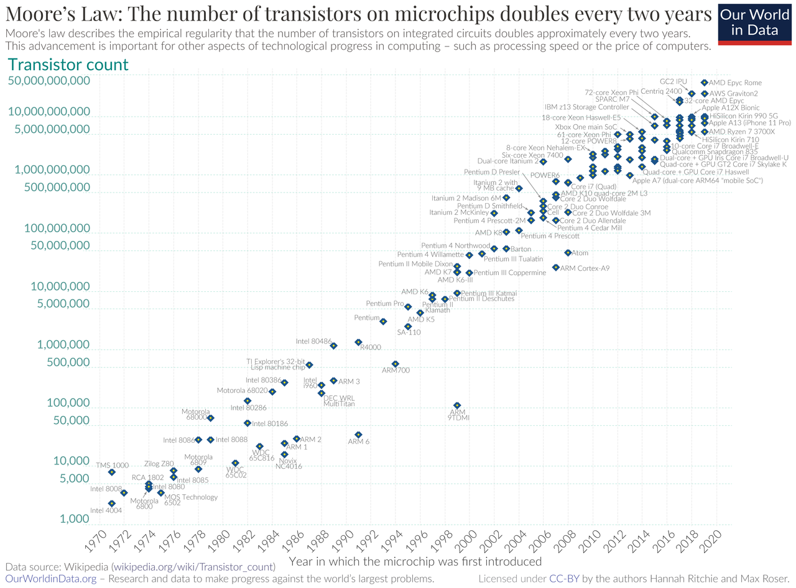
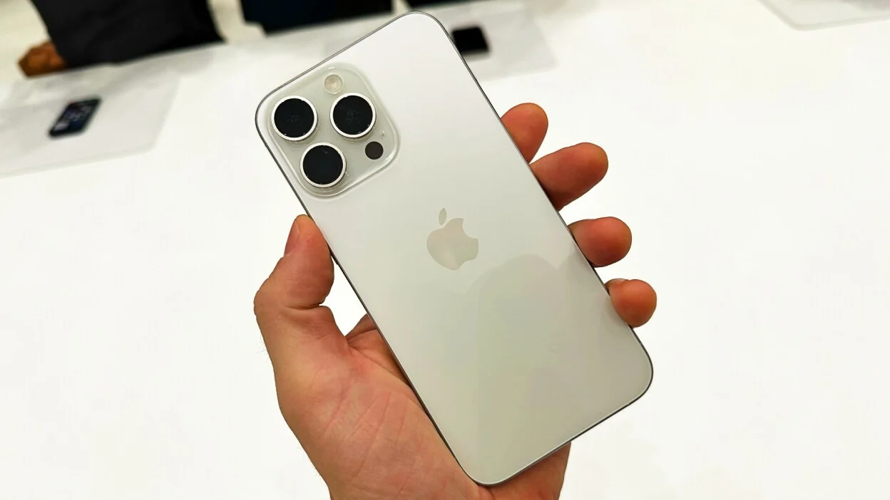
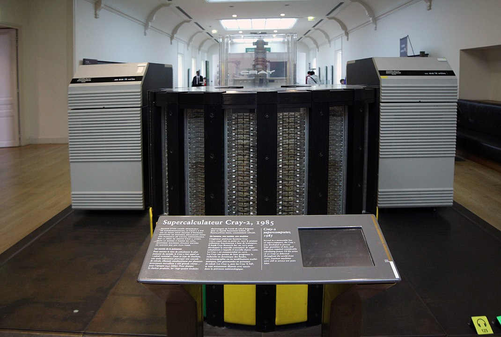
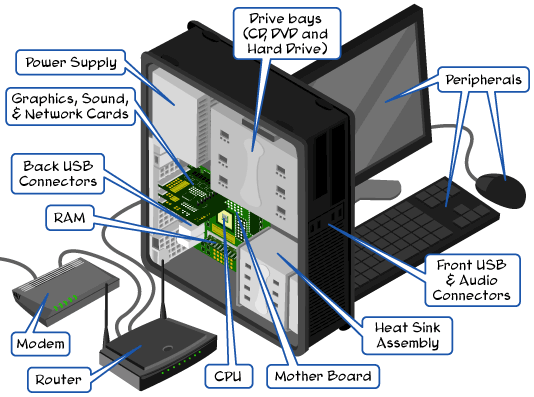
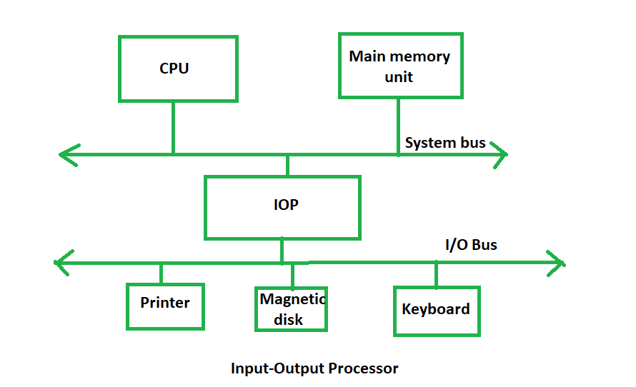
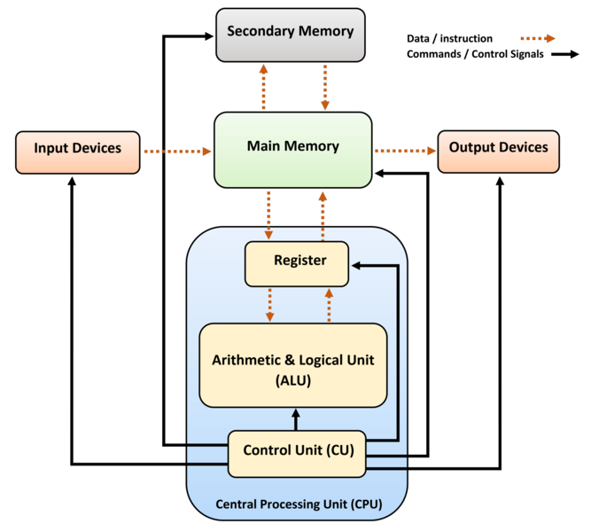
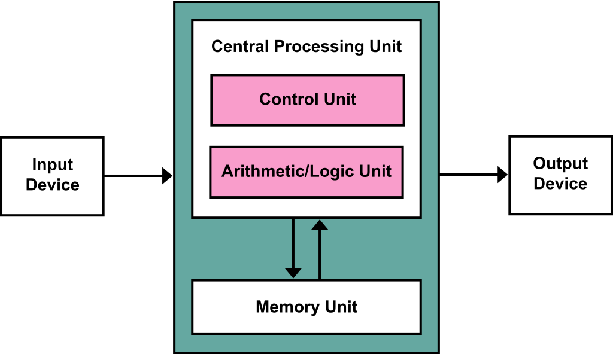
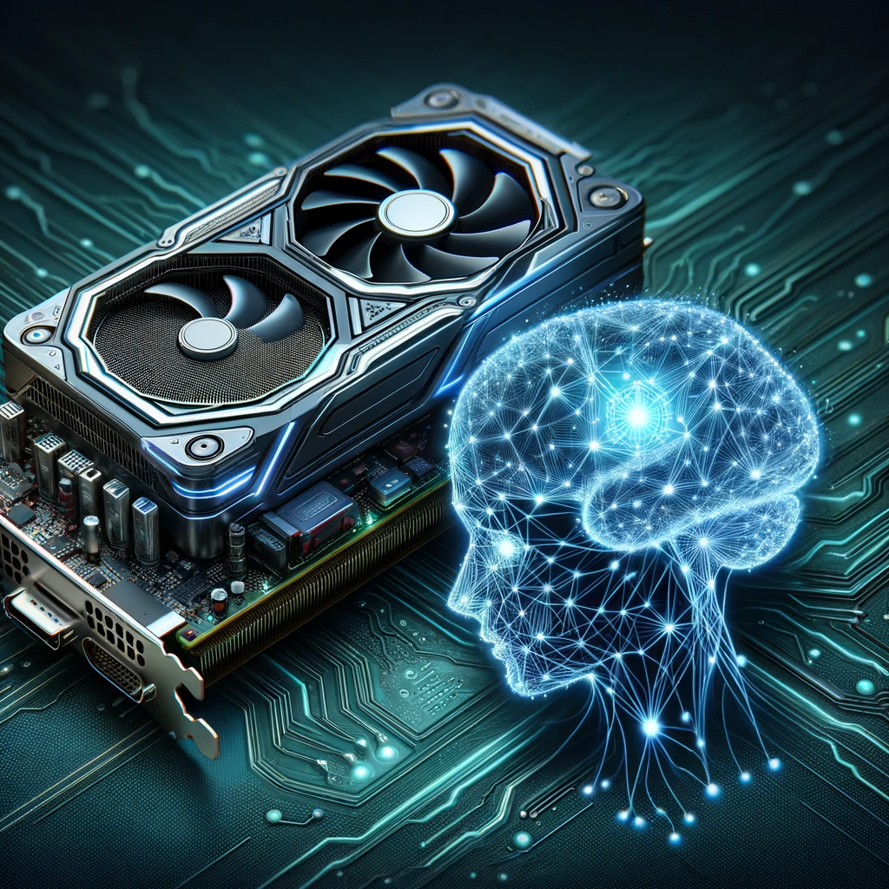
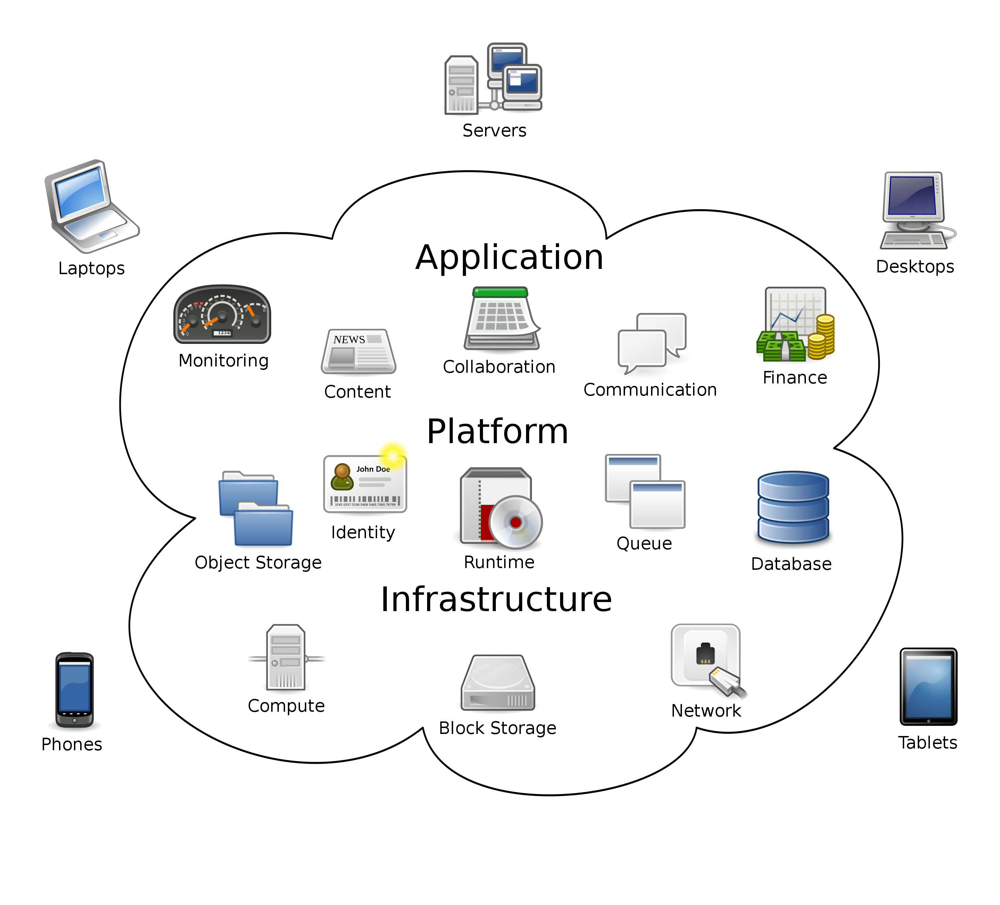
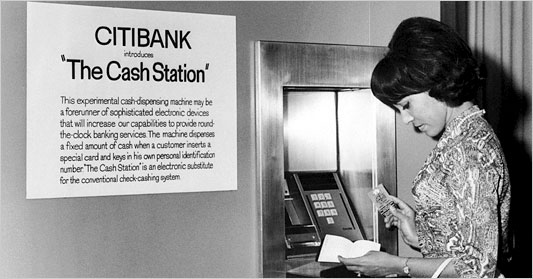

Today, it is difficult for any student to imagine life without a computer. However, computers have only been around since the mid 1900's. The computer industry went from making computers that took up an entire classroom to currently being able to fit into a student's backpack. Also, computers used to be much more expensive and required a greater amount of energy than today's computers. Finally, in the 1980s, people began placing these foreign objects into their home. During this time, people had to really study and be patient with this handy device

## 1 History

Computers have revolutionized modern life, transforming the way we work, communicate, and access information. However, their development has been a relatively recent phenomenon, spanning only a few decades.

### 1.1 Milestones

The history of computers spans several generations, from the early vacuum tube-based machines to the current microprocessor era. Some milestones are:

- Early Generations (1946-1970): The first generation of computers (1946-1957) used vacuum tubes, required physical effort to reprogram, and could only solve one problem at a time. The second generation (1958-1963) introduced transistors, which replaced vacuum tubes and enabled the use of punch cards for input. The third generation (1964-1970) employed integrated circuits, making computers smaller and more reliable, with keyboards and monitors becoming the primary input/output devices.
- Microprocessor Era (1971-Present): The fourth generation of computers began in 1971 with the development of microprocessors, leading to the creation of personal computers like IBM's PC and the Apple Macintosh. Today, consumers use a range of inputs, outputs, and storage devices, including keyboards, mice, monitors, printers, and optical disks.
- Fifth Generation: The fifth generation of computing, focused on artificial intelligence, is currently in development. This generation aims to create devices that respond to natural language input, learn, and self-organize. Emerging technologies like parallel processing, superconductors, quantum computation, and nanotechnology will continue to transform the computer industry.
- Future Quantum Computer (?): A quantum computer uses quantum mechanical phenomena to solve complex problems that cannot be solved by classical computers or supercomputers. Quantum computers use **qubits**, which can exist in a superposition of two states, to perform calculations. Quantum computers have the potential to perform calculations exponentially faster than classical computers and could be used to break widely used encryption schemes and to aid physicists in performing physical simulations.

### 1.2 Moore's Law

The rapid advancement of computers from vacuum tubes to microprocessors is a testament to human innovation and perseverance. While it may seem like a long journey, it has occurred relatively quickly in the grand scheme of human history.

Moore's Law was first proposed by Gordon Moore in 1965. The concept is simple yet profound: the number of transistors on a microchip doubles approximately every two years, leading to exponential improvements in computing power, memory, and overall processing efficiency.

Here are some examples of Moore's Law:

- In 1971, Intel introduced the Intel 4004 with a transistor count of 2,250.
- In 1976, Intel introduced the Intel 8085 processor with 6,500.
- In 1978, the Intel 8086 came with a transistor count of 29,000.
- In 1980, the Intel 8051 came in 1980 with 50,000 transistors.
- In 1982, Intel introduced 80186 with 55,000 transistors in 1982.
- In 1985, the Intel 80386 had a 275,000 transistor count.
- In 2024, chip makers can put 50 billion transistors on a chip the size of a fingernail.

[Source: Wikipedia Moore's Law](https://en.wikipedia.org/wiki/Moore%27s_law)

The performance gain of computers has been unprecedented in human history, with processing power doubling approximately every two years. This exponential growth has led to a staggering increase in computing capabilities, with modern smartphones possessing more processing power than the entire Apollo 11 spacecraft that landed humans on the moon. In fact, if the automotive industry had experienced similar progress, a car would have gone from a top speed of 30 miles per hour in 1971 to over 300,000 miles per hour today, and would have cost just $2. Moreover, this rate of progress is unmatched by any other technological advancement in human history, making the performance gain of computers a truly remarkable phenomenon.

Moore's Law has been a game-changer for businesses, enabling them to process vast amounts of data, automate complex tasks, and innovate at an unprecedented pace. It transforms the business landscape in numerous ways. Firstly, it has enabled businesses to process vast amounts of data quickly and efficiently, leading to better decision-making and improved operational efficiency. Secondly, it has automated complex tasks, freeing up human resources to focus on higher-value tasks such as innovation and strategy. Finally, it has enabled businesses to innovate at an unprecedented pace, bringing new products and services to market faster than ever before.

### 1.3 What's in Your Pocket?

The computational power of today’s iPhone is incredibly impressive, especially when compared to the total computational power in the United States in the 1980s. To provide a concrete comparison, let’s examine the performance data in terms of floating-point operations per second (FLOPS), a standard measure of computational performance.

The Apple iPhone 15, released in 2023, is equipped with the A17 Bionic chip. This chip includes a 6-core CPU and a 5-core GPU. According to benchmarks, the A17 Bionic chip is capable of achieving approximately 20 trillion operations per second (teraflops). In 2024, its price is about $1,000.

[Source: Mashable.com](https://mashable.com/article/apple-iphone-15-pro-max-hands-on)

In the 1980s, the computational landscape was dominated by mainframe computers and early supercomputers. One of the most powerful supercomputers of that era was the Cray-2, introduced in 1985. The Cray-2 was capable of approximately 1.9 billion floating-point operations per second (gigaflops). Its price is $16 million at that time and is about $41 million in today's dollar.

[Source: Wikipedia](https://en.wikipedia.org/wiki/Cray-2)

To compare the computational power of the iPhone 15 with the Cray-2: the iPhone 15 delivers about 20 teraflops (or 20,000 gigaflops), whereas the Cray-2 delivered about 1.9 gigaflops. This means the iPhone 15 is approximately `10,000` times more powerful than the Cray-2.

Estimating the total computational power in the US in the 1980s involves considering the number of supercomputers and mainframes in operation. Even if we assume there were several dozen supercomputers similar to the Cray-2 and numerous less powerful mainframes, the total computational power would still be like what a single modern iPhone can achieve. The estimated total computational power in the US during the 1980s would likely amount to several hundred gigaflops to a few teraflops at most. This stark contrast underscores the incredible advancements in technology, where a single handheld device today surpasses the entire nation’s computational capacity from a few decades ago.

Source: OpenAI DALL E3.

### 1.4 The Impact

The rapid advancement and democratization of computational power, exemplified by the evolution from supercomputers like the Cray-2 to today’s smartphones like the iPhone 15, is unparalleled in human history. This dramatic increase in computing power has revolutionized information technology and profoundly impacted business. Modern enterprises leverage advanced analytics, artificial intelligence, and real-time data processing to drive decision-making, optimize operations, and innovate new products and services. The accessibility of powerful computing technology has enabled businesses of all sizes to harness big data, automate complex processes, and enhance customer engagement, leading to unprecedented efficiency, scalability, and competitive advantage. This transformation underscores the critical role of information technology as a cornerstone of contemporary business strategy and economic growth.

## 2 Hardware Components

Computer hardware components are the physical elements that make up a computer system, enabling it to perform tasks, store data, and interact with users. The four primary components of computer hardware are input devices, output devices, storage devices, and the central processing unit (CPU).

[Source: How Computers Work](http://www.carnegiecyberacademy.com/facultyPages/computer/computers.html)

[Source: Geeks for Geeks](https://www.geeksforgeeks.org/introduction-of-input-output-processor/)

### 2.2 Input Devices

Input devices allow users to enter data, instructions, and commands into the computer. Examples include:

- Keyboards
- Mice
- Scanners
- Webcams
- Microphones

These devices enable users to interact with the computer, providing input that is processed and stored for later use.

### 2.3 Output Devices

Output devices display or produce the results of computer processing, allowing users to view, print, or hear the output. Examples include:

- Monitors
- Printers
- Speakers
- Headphones
- Plotters

Output devices provide the interface through which users receive feedback from the computer, making it an essential component of the system.

### 2.4 Storage Devices

Storage devices hold data, programs, and operating systems, allowing the computer to access and retrieve information as needed. Examples include:

- Hard Disk Drives (HDD)
- Solid-State Drives (SSD)
- Flash Drives
- Optical Discs (CD, DVD, Blu-ray)

Storage devices enable the computer to retain data even when powered off, making it possible to store and retrieve large amounts of information.

### 2.5 Central Processing Unit (CPU)

The CPU, also known as the processor, is the brain of the computer, executing instructions and performing calculations. It consists of:

- Control Unit
- Arithmetic Logic Unit (ALU)
- Registers

The CPU takes in instructions from memory, decodes them, and executes the necessary actions, making it the core component of the computer system.

## 3 Computer Architecture

Computer architecture refers to the design and organization of a computer's internal components, which work together to process, store, and communicate information. At the heart of this architecture lies the Central Processing Unit (CPU), Memory, Disk, and Input/Output (I/O) systems. These components collaborate seamlessly to execute instructions, store data, and interact with users.

### 3.1 Computer Components

- CPU: The Brain of the Operation. The CPU, also known as the processor, executes instructions and performs calculations. It consists of the Control Unit, Arithmetic Logic Unit (ALU), and Registers. The Control Unit retrieves instructions from memory, decodes them, and executes the necessary actions. The ALU performs arithmetic and logical operations, while Registers store data temporarily.
- Memory: The Data Repository. Memory, also known as Random Access Memory (RAM), stores data and program instructions temporarily while the CPU processes them. Memory is volatile, meaning its contents are lost when the computer is powered off. The CPU accesses memory through a process called memory addressing, where it requests specific data from memory using a unique address.
- Disk: The Permanent Storage. Disk storage, such as Hard Disk Drives (HDD) or Solid-State Drives (SSD), provides permanent storage for data and programs. The CPU stores data in memory temporarily, but when the computer is powered off, data is written to disk for long-term storage. Disk storage is non-volatile, meaning its contents are retained even when the computer is powered off.
- I/O Systems: The User Interface. Input/Output (I/O) systems enable users to interact with the computer, providing input devices like keyboards, mice, and scanners, and output devices like monitors, printers, and speakers. I/O systems allow users to enter data, view results, and communicate with the computer.

### 3.2 The Collaborative Process

The CPU, Memory, Disk, and I/O systems work together to execute instructions and process data. Here's an example of how they collaborate:

1. A user enters a command through an input device (I/O system).
1. The CPU retrieves the instruction from memory and decodes it.
1. The CPU executes the instruction, using data from memory or disk if necessary.
1. The CPU stores the results in memory temporarily.
1. The user views the results on an output device (I/O system).
1. The CPU writes the results to disk for permanent storage.

[Source: Wikipedia](https://en.wikipedia.org/wiki/Computer_architecture)

### 3.3 A Hierarchical Architecture

The design of computer architecture is significantly influenced by the substantial differences in speed between CPU registers, cache, memory, and disk. This hierarchy of speeds leads to a hierarchical architecture design, where each component plays a crucial role in optimizing performance.

At the core of the CPU are the registers, which are the fastest memory components, with access times of just 1-2 clock cycles (approximately 0.25-0.5 nanoseconds). These small, built-in memory locations are used for temporary storage of instructions and data, enabling the CPU to access them quickly and efficiently.

The next level in the hierarchy is the cache, which is a small, high-speed memory located close to the CPU. With access times of 2-10 clock cycles (approximately 0.5-2.5 nanoseconds), the cache stores frequently used data and instructions, reducing the time it takes for the CPU to access them.

Memory (RAM) is the next level in the hierarchy, with access times of 50-200 clock cycles (approximately 12.5-50 nanoseconds). This larger, volatile memory is used for storing programs, data, and virtual memory, and is slower than the cache but still relatively fast compared to disk storage.

Finally, disk storage is the slowest component, with access times measured in milliseconds (approximately 1,000,000-10,000,000 nanoseconds). This non-volatile storage is used for long-term data retention, storing operating systems, programs, and data.

The hierarchical architecture design takes advantage of these speed differences to optimize performance. Frequently used data and instructions are stored in faster, closer components (registers and cache), while less frequently used data is stored in slower, larger components (memory and disk). Data is transferred between components as needed, minimizing latency and optimizing bandwidth.

Please check out the web page of [Latency Numbers Every Programmer Should Know](https://colin-scott.github.io/personal_website/research/interactive_latency.html) to get a better understanding of the computer performance and motivation behind the computer architecture. You can move the top slide bar to see the speed number in different time.

## 3.4 Big RAM and Fast SSD

The design of computer architecture is significantly influenced by the substantial differences in speed between CPU registers, cache, memory, and disk. This hierarchy of speeds leads to a layered architecture design, where each component plays a crucial role in optimizing overall performance. CPU registers are the fastest and most limited in size, followed by cache memory, which stores frequently accessed data to reduce latency for the CPU. RAM, while slower than cache, offers larger storage capacity and serves as the main memory for active processes. SSDs, though the slowest in the hierarchy, provide substantial storage space and faster access times compared to traditional hard drives. This tiered approach ensures that the most critical and frequently used data is accessed quickly, enhancing the system’s efficiency and performance.

A balanced computer system ensures that the various components – cache, RAM, and SSD – are proportionally allocated to prevent bottlenecks and maximize efficiency. Cache memory, being the fastest, reduces the time the CPU spends waiting for data, but its high cost and limited size mean it must be used judiciously. Sufficient cache is essential for minimizing latency, yet over-investing in cache at the expense of RAM and storage can lead to diminishing returns. RAM, which provides ample space for active tasks, must be adequately sized to handle the workload without excessive reliance on slower storage solutions. SSDs, providing large capacity and quicker access times than traditional disks, support efficient data retrieval and storage for less frequently accessed data. Importantly, different applications have varying performance requirements, necessitating a tailored balance of these components to optimize performance for specific use cases.

For instance, video editing software like Adobe Premiere Pro requires large amounts of RAM to efficiently handle multiple high-resolution video files simultaneously. Adequate RAM allows for smoother playback, faster rendering, and efficient multitasking during the editing process. On the other hand, applications like 3D modeling and rendering in software such as Autodesk Maya benefit significantly from a fast CPU. High CPU speeds enable quicker computations and render times, allowing for real-time previews and efficient handling of complex models and simulations. Balancing the right amount of RAM for memory-intensive tasks and a fast CPU for compute-heavy applications is crucial for achieving optimal performance tailored to the specific demands of different workflows.

## 4 The Von Neumann architecture

Another way to understand computer architecture is the so-called Von Neumann architecture, also known as the von Neumann model or Princeton architecture. It is a computer architecture that has revolutionized the way computers process information and execute instructions. Based on a 1945 description by John von Neumann, this architecture has become the foundation of modern computing. Almost all programming languages are based on this architecture.

The von Neumann architecture consists of five main components: a processing unit, control unit, memory, external mass storage, and input and output mechanisms. The processing unit includes an arithmetic logic unit and processor registers, which enable the computer to perform calculations and store data temporarily. The control unit includes an instruction register and a program counter, which manage the execution of instructions and keep track of the program's progress. Memory stores both data and instructions, allowing the computer to access and execute programs repeatedly. External mass storage enables the computer to store large amounts of data and programs, making it a highly efficient and versatile tool. Input and output mechanisms allow users to interact with the computer and view the results of its calculations.

[Source: Wikipedia](https://en.wikipedia.org/wiki/Von_Neumann_architecture)

The sentence of "Memory stores both data and instructions, allowing the computer to access and execute programs repeatedly" introduces an innovative concept at that time: **stored program**. It refers to the idea that a computer program and its data are stored in the computer's memory, and the computer executes the program by fetching instructions from memory and executing them one by one. Here are the key aspects of the stored-program concept:

- Program and data stored in memory: The program instructions and data are stored in the computer's memory, which is a single, unified storage space.
- Fetch-Execute Cycle: The computer fetches an instruction from memory, decodes it, and executes it. This process is repeated for each instruction in the program.
- Program Counter: A program counter keeps track of the current instruction being executed, and increments to point to the next instruction after each execution.
- Memory Addressing: The computer uses memory addresses to access and store data, allowing the program to access and manipulate data as needed.
- Self-Modifying Code: The stored-program concept allows for self-modifying code, where the program can modify its own instructions or data as it runs.

The stored-program concept has several advantages, including:

- Flexibility: The computer can execute different programs and perform different tasks without manual reconfiguration.
- Efficiency: The computer can execute programs repeatedly without manual intervention.
- General-purpose computing: The stored-program concept enables general-purpose computing, where a single computer can perform a wide range of tasks.

Stored-program computers were a significant advancement over the manually reconfigured or fixed function computers of the 1940s, such as the Colossus and the ENIAC. These earlier computers required manual reconfiguration or rewiring to change their functionality, whereas stored-program computers can execute different programs and access different data without manual intervention.

## 5 GPU and AI

The Graphics Processing Unit (GPU) has undergone a significant transformation in recent years, evolving from a specialized component for graphics rendering to a powerhouse for artificial intelligence (AI) computing. This transformation has been driven by the growing demand for machine learning and deep learning applications, which require immense parallel processing capabilities.

Please watch the [Demo of GPU versus CPU](https://www.youtube.com/watch?v=-P28LKWTzrI).

Traditionally, Central Processing Units (CPUs) were the go-to choice for computing tasks, but they were limited by their serial processing architecture. In contrast, GPUs offered a massively parallel architecture, making them ideal for handling the complex mathematical calculations required for AI workloads. AI uses GPUs (Graphics Processing Units) because they are highly efficient at handling the large-scale parallel processing required for training and running deep learning models. Unlike CPUs, which are optimized for general-purpose tasks and can execute a few complex operations at a time, GPUs are designed to perform many simple, repetitive operations simultaneously. This makes them ideal for the matrix and vector computations that are fundamental to neural networks. The parallel processing capability of GPUs significantly accelerates the training process of AI models, allowing for the handling of vast amounts of data and complex calculations more quickly and efficiently than CPUs. Consequently, GPUs enable more rapid experimentation, iteration, and deployment of AI applications, making them essential for modern AI development.

NVIDIA, a pioneer in GPU technology, has played a significant role in this transformation. Their GPUs, such as the Tesla V100 and A100, are specifically designed for AI workloads, offering unprecedented performance and memory bandwidth. Additionally, their software frameworks, like CUDA and cuDNN, provide developers with the tools they need to harness the power of GPUs for AI applications.

The impact of GPUs on AI has been profound, enabling breakthroughs in various fields, including:

- Computer Vision: GPUs have accelerated the development of computer vision algorithms, enabling applications like object detection, segmentation, and image generation.
- Natural Language Processing: GPUs have improved the performance of NLP models, allowing for faster text processing, language translation, and chatbots.
- Robotics: GPUs have enabled robots to learn complex tasks, like grasping and manipulation, through deep reinforcement learning.
- Healthcare: GPUs have accelerated medical imaging, drug discovery, and personalized medicine, leading to improved patient outcomes.

The GPU has emerged as a crucial component in the AI ecosystem, offering unparalleled performance and efficiency for machine learning workloads. As AI continues to transform industries and revolutionize the way we live and work, the role of GPUs will only continue to grow, enabling new possibilities and innovations.

## 6 Cloud Computing

Cloud computing represents a paradigm shift in how computing resources are managed and utilized. At the hardware level, it involves the virtualization of physical components such as CPUs, RAM, and storage disks to provide scalable and efficient solutions. CPUs in cloud computing are provided as virtual CPUs (vCPUs), which are virtualized versions of physical CPUs managed by the cloud provider. RAM is allocated based on user needs, allowing for quick read and write operations that are crucial for application performance. Disk storage, often virtualized as block or object storage, enables scalable and persistent data storage solutions. This virtualization allows users to dynamically scale their resources, optimizing performance and cost efficiency. Amazon AWS, Microsoft Azure, and Google Cloud Platform (GCP) are top three cloud computing service providers.

[Source: Wikipedia](https://en.wikipedia.org/wiki/Cloud_computing)

For example, on Amazon Web Services (AWS), a micro instance offers 2 vCPUs and 1 GB of RAM, while larger instances provide 96 vCPUs and 768 GB of RAM. AWS Elastic Block Store (EBS) offers up to 16 TB of storage with high throughput.

One of the key features of cloud computing is on-demand self-service, which allows users to provision and manage computing resources as needed, without requiring human intervention from the service provider. Typically, launching an AWS computer instance can take anywhere from a few seconds to a few minutes. Additionally, cloud services offer broad network access, meaning they are available over the network and can be accessed through standard mechanisms by a variety of client devices, such as laptops, tablets, and smartphones. Rapid elasticity is another hallmark of cloud computing, enabling resources to be quickly and elastically provisioned, in some cases automatically, to scale out and scale in rapidly in response to demand. Lastly, cloud computing utilizes measured service, where cloud systems automatically control and optimize resource use by leveraging a metering capability at some level of abstraction appropriate to the type of service (e.g., storage, processing, bandwidth).

The benefits of cloud computing are substantial, offering cost efficiency by eliminating the capital expenses of on-site hardware and software, and the need for round-the-clock IT infrastructure management. It provides scalability to adjust IT resources as business needs change, improving performance and reducing latency through a global network of secure, regularly upgraded data centers. Additionally, cloud computing enhances speed and agility, allowing vast amounts of resources to be provisioned in minutes, and includes robust security measures to protect data and applications.

Cloud computing has its tradeoffs. Potential downtime is a risk due to internet-based service outages. Security and privacy concerns arise from storing data on external servers, requiring careful management to ensure compliance with regulations. Cost management can be challenging with pay-as-you-go models, leading to unpredictability and escalating expenses. Users also face limited control over backend infrastructure and potential vendor lock-in, making it difficult to migrate services between providers and increasing costs.

In February 2021, Amazon Web Services (AWS) experienced a significant outage that affected numerous online services and businesses. The disruption, which lasted several hours, was caused by a hardware failure in one of AWS’s data centers, leading to issues with the Elastic Block Store (EBS) and Relational Database Service (RDS). This outage impacted a wide range of customers, including major companies like Netflix, Slack, and Amazon’s own e-commerce operations, highlighting the potential risks associated with reliance on cloud service providers and the widespread effects of such disruptions on businesses and end-users globally.

## 7 Hardware for Business: A Case Study of ATM

In the early 1970s, Citibank embarked on a groundbreaking initiative that would transform the banking industry and significantly improve its business processes: the introduction of Automated Teller Machines (ATMs). During this period, banks faced several challenges in providing convenient and efficient services to their customers. Traditional banking required customers to visit branches during limited operating hours, often leading to long lines and wait times. This inconvenience was particularly acute in metropolitan areas where customer volumes were high.

To address these challenges and enhance customer service, Citibank decided to invest heavily in the deployment of ATMs. These machines would allow customers to perform basic banking transactions without needing to enter a branch, providing 24/7 access to banking services. Citibank began installing ATMs in strategic locations throughout New York City in 1977. The initial rollout included 100 machines, primarily in high-traffic areas such as shopping malls, airports, and busy street corners.

[Source: The Cash Machine Is Blue And Green](https://tedium.co/2023/09/15/atm-history-important-moments/)

Understanding customer concerns about security and reliability, Citibank implemented robust measures to ensure the safety and dependability of its ATMs. The machines were equipped with advanced encryption technologies to protect transactions, and a dedicated maintenance team was established to ensure continuous operation. To promote the new service, Citibank launched an aggressive marketing campaign titled “The Citi Never Sleeps,” which highlighted the convenience and round-the-clock availability of ATM services, emphasizing the bank’s commitment to customer accessibility and convenience.

The introduction of ATMs had a profound impact on Citibank's operations and customer service. ATMs allowed customers to perform transactions such as withdrawals, deposits, and balance inquiries at any time of day or night, significantly improving the convenience of banking services. By automating routine transactions, ATMs reduced the workload on branch staff, allowing them to focus on more complex customer needs. This automation also led to cost savings in terms of labor and branch operations.

The convenience and accessibility of ATMs attracted new customers to Citibank. The ability to access banking services 24/7 was particularly appealing to busy professionals and those who preferred not to visit bank branches. Citibank's early and extensive adoption of ATMs set it apart from competitors. The bank was able to offer a level of service that few others could match at the time, establishing it as a leader in innovation within the banking industry.

The successful deployment of ATMs had long-term benefits for Citibank. It paved the way for the development of more sophisticated banking technologies and services, such as online banking and mobile banking apps. The initial investment in ATM infrastructure also established a strong foundation for future technological advancements, positioning Citibank as a forward-thinking and customer-centric institution.

Citibank’s strategic investment in ATMs during the 1970s is a prime example of how new computer hardware can be leveraged to improve business processes and enhance customer service. The introduction of ATMs not only addressed existing challenges in traditional banking but also provided a competitive edge that helped Citibank expand its customer base and reduce operational costs. This case demonstrates the significant impact that innovative technology can have on the banking industry, transforming the way services are delivered and setting new standards for convenience and efficiency.
