Software refers to a set of instructions and data that enable a computer system to perform specific tasks or functions. It encompasses everything from operating systems that manage computer hardware to applications that fulfill user needs and desires. Software can be broadly categorized into two main types: system software and application software.

- System Software: System software includes operating systems, device drivers, utilities, and other essential programs that facilitate the operation of computer hardware and provide a platform for running application software. Examples of system software include Microsoft Windows, macOS, Linux, and Unix-like operating systems.
- Application Software: Application software comprises programs designed to perform specific tasks or provide services to users. This category encompasses a vast array of software, including word processors, web browsers, media players, games, and business applications. Examples of application software include Microsoft Office, Adobe Photoshop, Google Chrome, and Minecraft.

## 1 Machine Code and Instruction Set Architecture (ISA)

At the lowest level of abstraction, computers understand instructions in the form of binary digits, known as machine code or machine language. Machine code is composed of sequences of 0s and 1s, representing basic operations such as arithmetic, logic, and data movement. While efficient for computers, machine code is complex and cumbersome for humans to work with directly.

Each machine code instruction is a binary sequence that tells the CPU to perform a very specific task, as defined by the Von Neumann architecture:

- loading data from RAM to CPU register
- storing data from CPU register to RAM
- jumping to a different instruction
- performing an arithmetic or logic operation

To bridge the gap between machine code and human understanding, people developed assembly language to provide a symbolic representation of machine instructions. Assembly language uses mnemonic codes to represent machine operations and employs symbolic labels to denote memory addresses and data. Each assembly instruction corresponds to one machine instruction, making it more readable than raw machine code but still closely tied to the underlying hardware. Of course, a CPU doesn't understand assembly language code. To make an assembly program executable, one needs to use a compiler (also called an assembler here) to compile the assembly code into machine code.

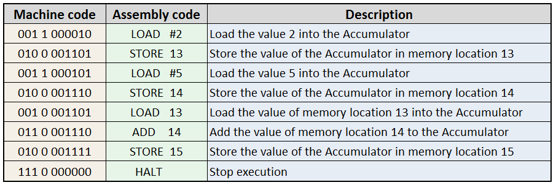

[Source: Assembly Language](https://computerscience.chemeketa.edu/cs160Reader/ProgrammingLanguages/Assembly.html)

An Instruction Set Architecture (ISA) is an abstract model of a computer that defines the set of instructions that a computer processor can execute and how those instructions are encoded in machine code. It serves as an interface between hardware and software, providing a standardized framework for software developers to write programs that can run on various hardware platforms. Different CPUs have different ISAs. Commonly used ISAs include:

- Intel x86 and x86-64: used by most desktop and server computers. AMD64 is x86-64 compatible. Here the 64 means that the integer data size or data/address bus width is 64-bit. Old computers data are often 32-bit, 16-bit, or 8-bit.
- ARM: used by most mobile processors
- RISC-V: relatively new, open source

## 2 Operating System (OS)

An operating system (OS) is the software that manages and controls a computer's hardware and software resources, providing a platform for running applications and performing various tasks. The OS acts as an intermediary between the user and the computer hardware, making it possible for users to interact with the computer in a more intuitive and efficient way.

### 2.1 OS Functions

Followings are common functions of OS:

- Process Management: The OS manages the creation, execution, and termination of processes (programs) running on the computer.
- Memory Management: The OS allocates and deallocates memory for programs, ensuring efficient use of system resources.
- File System Management: The OS provides a file system, allowing users to create, delete, and manage files and directories.
- Input/Output Management: The OS handles input/output operations between devices and programs.
- Security: The OS provides mechanisms for user authentication, access control, and protection against malware and viruses.

Popular operating systems include Windows, macOS, Linux, Android, and iOS. Following diagrams shows the relationship among hardware, OS, applications and users.

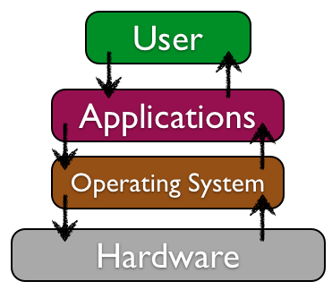

[Source](https://opentextbook.site/informationsystems2019/chapter/chapter-3-software-information-systems-introduction/)

### 2.2 UI

All operating systems provide the so-called user interface (UI) to let users access its functions. There are two types of UI:

- Graphical User Interface (GUI): A visual interface using icons, windows, and menus, allowing users to interact with the computer using a mouse and keyboard. Examples: Windows, macOS, Android.
- Command-Line Interface (CLI): A text-based interface where users enter commands using a keyboard, ideal for advanced users and automation.

Following picture shows a Linux CLI and a Windows GUI.

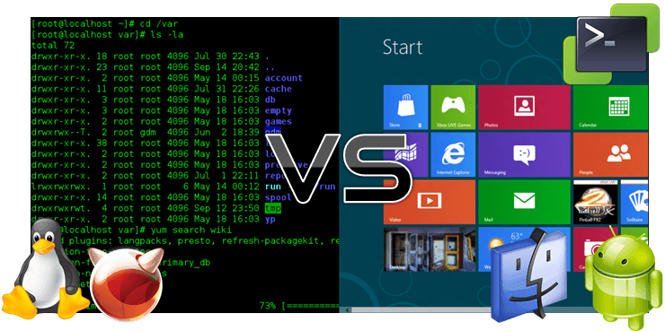

[Source](https://www.linkedin.com/pulse/cli-better-than-gui-olalekan-oladipupo/)

The Graphical User Interface (GUI) and Command Line Interface (CLI) are two distinct ways for users to interact with a computer system. The primary difference between the two lies in their approach to user interaction and system management.

#### 2.2.1 GUI

GUI, as the name suggests, relies heavily on visual elements such as windows, icons, menus, and buttons to facilitate user interaction. Users can navigate and perform tasks using a mouse and keyboard, with a greater emphasis on mouse usage. In a GUI environment, users can intuitively click, drag, and drop items to accomplish tasks, making it more accessible and user-friendly, especially for beginners.

#### 2.2.2 CLI and Shell

On the other hand, CLI requires users to enter specific commands using the keyboard to interact with the system. This interface is ideal for advanced users who prefer the efficiency and speed that comes with typing commands. In a CLI environment, users must rely solely on their keyboard skills, as mouse support is often limited or non-existent. Even in cases where CLI tools have a GUI representation, such as NMTUI, mouse input may not be supported.

The command-line interface (CLI) in Linux is called **shell** that enables users to interact with the operating system and execute commands. It acts as a layer between the user and the kernel, providing a way to communicate with the system and access its services. The shell is an essential component of Linux, and understanding its functionality and capabilities is crucial for working efficiently in the operating system. The shell is responsible for several critical functions, including command interpretation, file system navigation, process management, environment variables, and input/output management. It reads user input (commands) and interprets them, executing the corresponding actions. The shell allows users to navigate through the file system, creating, deleting, and managing files and directories. It also enables users to start, stop, and manage processes (programs) running on the system.

In addition, the shell sets and manages **environment variables**, which are used to store information about the system and user preferences. It handles input/output operations, such as reading from the keyboard and printing to the screen. The shell provides a range of built-in commands and utilities, making it a powerful tool for managing and customizing the Linux system.

There are several popular Linux shells, each with its unique features and advantages. Bash (Bourne-Again SHell) is the most widely used shell, known for its flexibility and customizability. Zsh (Z shell) is an enhanced version of the Bourne shell, with additional features and improvements. Fish is a user-friendly shell with a focus on usability and interactive features. Tcsh is a variant of the C shell, with additional features and improvements.

Basic shell commands are essential for working in Linux. The `cd` command changes the current directory, while the `ls` command lists files and directories. The `mkdir` command creates a new directory, and the `rm` command removes files or directories. The `cp` command copies files, and the `mv` command moves or renames files. The `echo` command prints text to the screen, and the `man` command displays manual pages for commands and functions.

Moreover, the linux shell support scripting languages such as Bash, Python, and Perl, enabling users to write complex scripts to automate repetitive tasks, streamline workflows, and customize system behavior. With access to a wide range of system utilities, libraries, and third-party tools, Linux shell scripts can perform a myriad of functions, including file management, text processing, system administration, and network communication. This flexibility and extensibility make the Linux shell an indispensable tool for both novice users seeking to automate routine tasks and seasoned developers crafting sophisticated automation solutions. Following is a simple shell program:

```sh
#!/bin/bash

# Prompt the user for their name
echo "What's your name?"

# Read the user's input into a variable
read name

# Greet the user
echo "Hello, $name! Welcome to the Bash scripting world."
```

#### 2.2.3 Comparison

In terms of user experience, GUI is generally considered more user-friendly and accessible, especially for beginners. However, CLI offers faster execution speeds and greater control over system processes, making it a preferred choice for advanced users and power users. Ultimately, the choice between GUI and CLI depends on individual user preferences, skill levels, and system requirements. For professional computer users such as software developers and data analysts, mastering CLI is a must to have skill.

For professional computer users, such as software developers, data analysts, and IT professionals, proficiency in Command Line Interface (CLI) is an essential skill to possess. Mastering CLI enables these professionals to efficiently manage complex tasks, automate workflows, and troubleshoot issues with ease. In addition, CLI expertise allows them to leverage powerful command-line tools and scripts, enhancing their productivity and effectiveness in their respective fields. In today's fast-paced digital landscape, having a strong foundation in CLI is a vital asset for any professional working with computers.

Interestingly, some GUI operating systems, like Windows, also offer a CLI option, known as the Command Prompt, which allows users to execute commands and perform tasks using text-based inputs. Windows Subsystem for Linux (WSL) was introduced in Windows 10. WSL allows users to run a Linux environment directly on Windows, providing a Linux CLI experience. Users can install various Linux distributions, such as Ubuntu, Debian, and Kali Linux, and run them alongside Windows. However, not all GUI users are familiar with this feature, and some may rarely use it.

## 3 Applications

There are many types of applications for personal users:

- Productivity Software: Helps with tasks like word processing, spreadsheet analysis, and presentation design. Examples: Microsoft Office, LibreOffice.
- Graphics and Multimedia Software: Used for image and video editing, graphic design, and audio editing. Examples: Adobe Photoshop, Audacity.
- Games: Entertainment software that provides interactive experiences. Examples: Minecraft, Fortnite.
- Educational Software: Teaches new skills or subjects, often used in schools. Examples: Duolingo, Khan Academy.
- Utility Software: Performs maintenance or management tasks, like disk cleanup or virus scanning. Examples: Norton Antivirus, CCleaner.

This course is about MIS that focuses on business applications. Business applications are software solutions designed to support and enhance the operations of businesses and organizations. These applications can be used to manage various aspects of a business, including manufacturing process, financial management, human resources, customer relationship management, and supply chain management. They are called Enterprise Resource Planning (ERP) or Enterprise System (ES) software. ERP software integrates all aspects of a business into one comprehensive system, allowing organizations to manage their manufacturing, inventory, accounting and financials in a single platform. Examples of ERP software include Microsoft Dynamics, SAP, and Oracle.

Each company has domain-specific applications to run its business. New business models require new business applications. Here are some examples of how today's businesses depend on applications to run their operations:

- Retail: Online shopping platforms like Amazon, eBay, and Walmart rely on e-commerce applications to manage their online stores, process transactions, and fulfill orders. Brick-and-mortar stores use point-of-sale (POS) applications to manage sales, inventory, and customer data.
- Food Delivery: Food delivery services like Grubhub, Uber Eats, and DoorDash rely on mobile applications to receive orders, manage logistics, and facilitate payment processing.
- Banking and Finance: Online banking platforms and mobile apps enable customers to manage accounts, transfer funds, and pay bills. Trading platforms like Robinhood and eToro rely on applications to facilitate stock trading and investment.
- Healthcare: Electronic Health Record (EHR) systems like Epic manage patient data, appointments, and medical history.Telemedicine platforms like American Well enable remote consultations and virtual care.
- Travel and Hospitality: Online travel agencies like Expedia and (link unavailable) rely on applications to manage bookings, pricing, and inventory. Hotel management systems like Hilton and Marriott use applications to manage room reservations, guest services, and loyalty programs.
- Transportation: Ride-hailing services like Uber and Lyft rely on mobile applications to connect drivers and passengers. Logistics companies like FedEx and UPS use applications to manage package tracking, shipping, and delivery.

As cloud computing becomes mature and cheap, more and more companies are using applications provided in the cloud to reduce the administrative burdens of hardware/software management.

## 4 Programming

Programming, also known as coding, is a systematic process that involves designing, writing, testing, and deploying sequences of instructions that computers can execute to perform specific tasks. It begins with designing algorithms, which are step-by-step procedures, and data structures to solve a problem or achieve a specific goal. This is followed by writing code in one or more programming languages, such as Python, Java, or C++, using various programming paradigms like object-oriented, functional, or procedural programming. The written code is then tested thoroughly to ensure it works correctly, efficiently, and reliably, using various testing techniques like unit testing, integration testing, and debugging. Finally, the tested code is deployed to the target environment, such as a web server, mobile device, or desktop computer, where it can be executed and maintained. Throughout this process, programmers must also consider factors like performance, security, scalability, and maintainability to ensure the software meets the required standards and user expectations.

### 4.1 High Level and Low Level Programming Languages

Programming languages can be categorized into two main types based on their level of abstraction, complexity, and proximity to the computer hardware. The distinction between high-level and low-level programming languages is a fundamental concept in computer science.

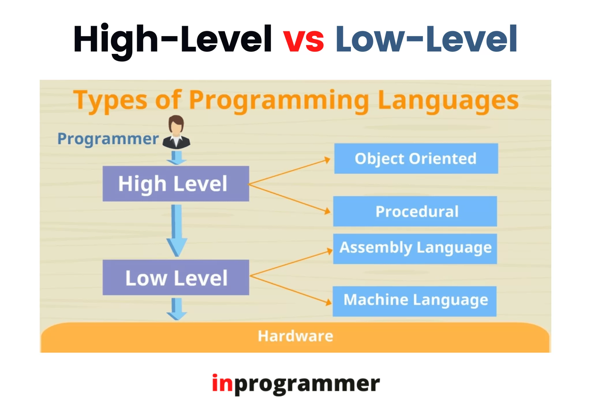

[Source: In Programmer](https://inprogrammer.com/high-level-vs-low-level/)

High-level programming languages are abstracted from the computer hardware, making them easier to read and write. They are portable across different platforms and require a compiler or interpreter to translate the code into machine language before execution. Examples of high-level languages include Python, Java, C#, JavaScript, Ruby, and PHP.

Python is a beginner-friendly language that's easy to learn and use, making it an ideal educational language for newcomers to programming. Its simplicity and versatility also make it a popular choice for data analysis and AI applications. On the other hand, Java and C# are more complex languages that are widely used in business application development, including e-commerce and website development. They offer robust features and tools for building large-scale enterprise applications. Meanwhile, Ruby and PHP are popular languages for web development, particularly for building dynamic websites and web applications. Ruby is known for its simplicity and ease of use, while PHP is a mature language with a vast array of libraries and frameworks for web development.

On the other hand, low-level programming languages are closer to the computer hardware, making them more difficult to read and write. They are less portable across different platforms and require a deeper understanding of computer architecture, memory management, and processor instructions. Examples of low-level languages include Assembly languages (e.g., x86, ARM), Machine code (binary code), and C (when used for systems programming). Low-level languages are ideal for systems programming, embedded systems, and performance-critical applications, where direct hardware manipulation and efficiency are essential.

Following digram shows the differences among four programming languages for a computer to say `Hello World`. Which is the simplest/slowest?

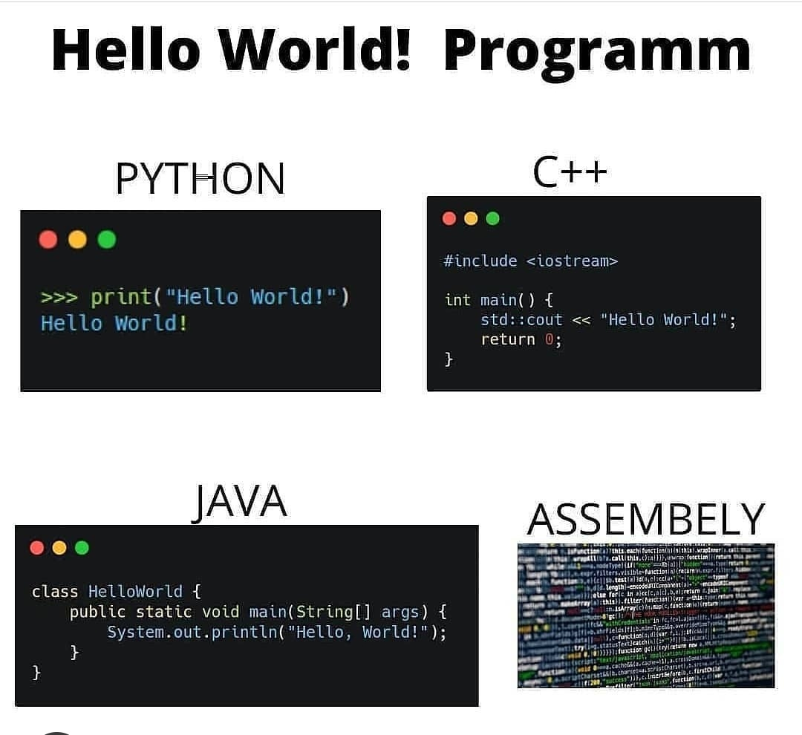

[Source: reddit](https://www.reddit.com/r/ProgrammerHumor/comments/ocxg91/python_rocks/)

### 4.2 Compiler and Interpreter

The computer's processor can only execute machine code, a series of binary instructions that are directly understood by the computer's hardware. For instance, the machine code instruction `10101010` might instruct the computer to add two numbers together. However, programming in machine code is a laborious and time-consuming task. To simplify and streamline programming, high-level languages like JavaScript, C, and Java were developed. These languages allow programmers to write code that is easier to read and understand, but the computer itself does not comprehend the code written in these languages.

To run high-level programming languages on a computer, there are three common approaches: compiling, interpreting, and a combination of both. While the names may seem confusing, the concepts behind them are relatively straightforward.

- Compiling: This approach involves translating the high-level code into machine code beforehand, creating an executable file that can be run directly by the computer.
- Interpreting: This approach involves translating the high-level code into machine code line by line, executing each line immediately, without creating an executable file. Essentially it is a program (the interpreter) executes (interprets) another program. An interpreter is also called a runtime, an engine or a virtual machine (VM).
- Compiling + Interpreting: This approach combines the two, where the high-level code is first compiled into an intermediate form, and then interpreted and executed by the computer.

These approaches allow programmers to write code in high-level languages, while still enabling the computer to understand and execute the instructions.

### 4.2.1 Compiling

The compiling concept is a fundamental process in computer science that allows programmers to write code in high-level programming languages and translate it into machine code that can be executed by a computer. C is a very successful high level system software programming language that is compiled into machine code before it can be executed in a computer.

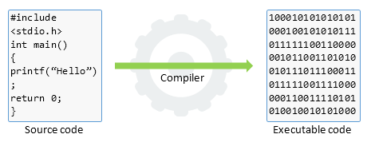

[Source: Code For Win](https://codeforwin.org/fundamentals/compiler-and-its-need)

First, a programmer writes C code in a text editor or IDE (Integrated Development Environment), using high-level syntax and semantics to express the desired program behavior. For instance:

```c
#include <stdio.h>

int main() {
 printf("Hello, World!\n");
 return 0;
}
```

This code is saved in a file with a `.c` extension, such as `hello.c`.

Next, the programmer compiles the C code using a compiler, such as `gcc`. The compiler translates the high-level C code into machine code, generating an object file with a `.o` extension, such as `hello.o`.

```sh
gcc hello.c -o hello.o
```

The object file contains machine code that the computer's processor can execute directly. However, it's not yet an executable file that can be run directly.

To create an executable file, the programmer links the object file with libraries and other object files, using a linker. This step generates an executable file with a specific format, such as `ELF` or `Mach-O`, that the operating system can load and execute.

```sh
gcc hello.o -o hello
```

Finally, the programmer runs the executable file, and the machine code is executed by the computer's processor.

### 4.2.2 Interpreting

The interpreting concept allows programmers to write code in high-level programming languages and execute it directly, without the need for compilation.

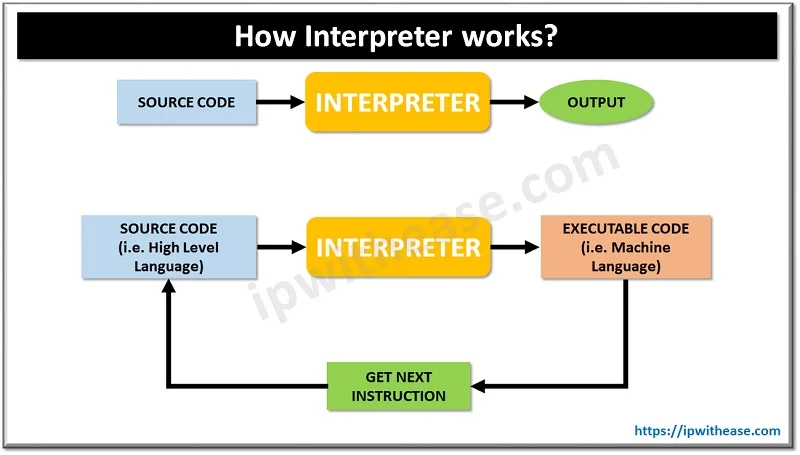

In JavaScript, code is written in a text editor or IDE, using high-level syntax and semantics to express the desired program behavior. For instance:

```js
console.log('Hello, World!');
```

This code is saved in a file with a `.js` extension, such as `hello.js`. When the code is executed, an interpreter reads the code line by line, interprets its meaning, and executes it immediately. The interpreter does not generate machine code beforehand; instead, it translates the code into machine code on the fly, during execution. Here's how it works:

- The interpreter reads the first line of code: `console.log("Hello, World!");`
- It interprets the meaning of the code, recognizing the `console.log()` function and the string argument `"Hello, World!"`
- It executes the code, printing the string to the console output. Here the console it a terminal window
- The interpreter moves on to the next line of code, repeating the process until the end of the program

In JavaScript, the interpreter is usually a web browser or a `Node.js` runtime environment. When we run a JavaScript program, the interpreter executes the code directly, without the need for compilation. The interpreting concept offers several advantages, including:

- Flexibility: JavaScript code can be written and executed quickly, without the need for compilation
- Dynamic behavior: JavaScript code can be modified and executed on the fly, without requiring a recompilation step
- Platform independence: JavaScript code can run on multiple platforms, including web browsers and `Node.js` environments

### 4.2.3 Compiling + Interpreting

The Compiling + Interpreting concept is a hybrid approach that combines the benefits of both compilation and interpretation. In this approach, the code is first compiled into an intermediate form, and then interpreted and executed by a virtual machine or runtime environment.

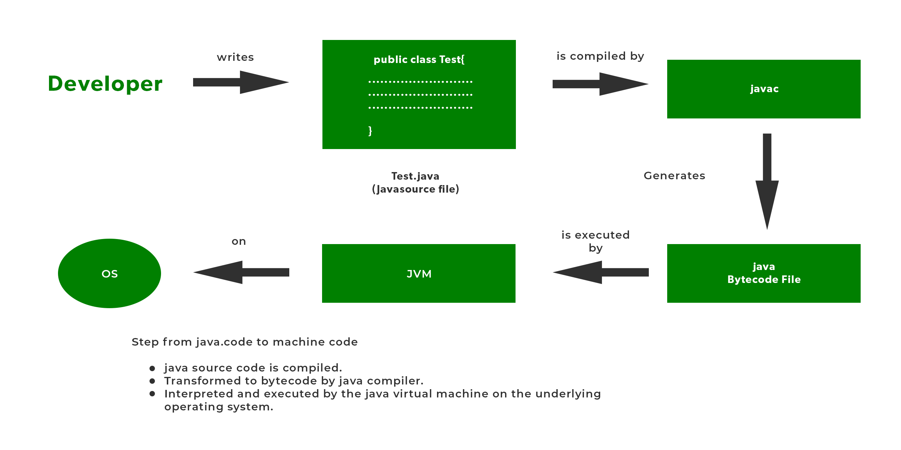

[Source: Geeks for Geeks](https://www.geeksforgeeks.org/what-are-the-roles-of-java-compiler-and-interpreter/)

Here's how it works:.

- Step 1 Coding: write the Java source code using a text editor or IDE

```java
public class Hello {
    public static void main(String[] args) {
        System.out.println("Hello, World!");
    }
}
```

- Step 2 Compilation: The Java code is first compiled into an intermediate form called bytecode (`.class` files). This step is similar to the compilation process in C or C++.

```sh
javac Hello.java
```

- Step 3 Interpretation: The bytecode is then interpreted and executed by the Java Virtual Machine (JVM). The JVM translates the bytecode into machine code, and executes it on the fly.

```sh
java Hello
```

The output is a string of `"Hello, World!"`.

In this example, the Java code is first compiled into bytecode, and then interpreted and executed by the JVM. This hybrid approach offers several advantages, including:

- Platform independence: Java code can run on multiple platforms, without the need for recompilation
- Flexibility: Java code can be written and executed quickly, without the need for a separate compilation step
- Memory management: The JVM manages memory allocation and garbage collection, reducing the risk of memory leaks and crashes

The Compiling + Interpreting concept is a powerful approach that combines the benefits of both compilation and interpretation.

### 4.3 Programming Paradigms

Programming paradigms are the fundamental styles or approaches to writing software. They shape the way developers design, organize, and write code. Over the years, three main programming paradigms have emerged: Procedural Programming, Object-Oriented Programming (OOP), and Functional Programming. Each paradigm has its unique principles, advantages, and applications, which are essential to understand in order to create effective and maintainable software solutions.

### 4.3.1 Procedural Programming

Procedural Programming is the oldest paradigm, focusing on procedures and functions that perform specific tasks. A procedural program is like a recipe, where a set of instructions (procedures) are followed in a specific order to produce a desired outcome. Just as a recipe tells you how to combine ingredients and cook a dish, a procedural program tells the computer exactly what steps to take and in what order to accomplish a task. This paradigm emphasizes step-by-step execution, sequential flow, and explicit control over data and program flow. Programs are built around procedures, each solving a specific problem. This paradigm is ideal for simple, linear applications, scripting, and embedded systems.

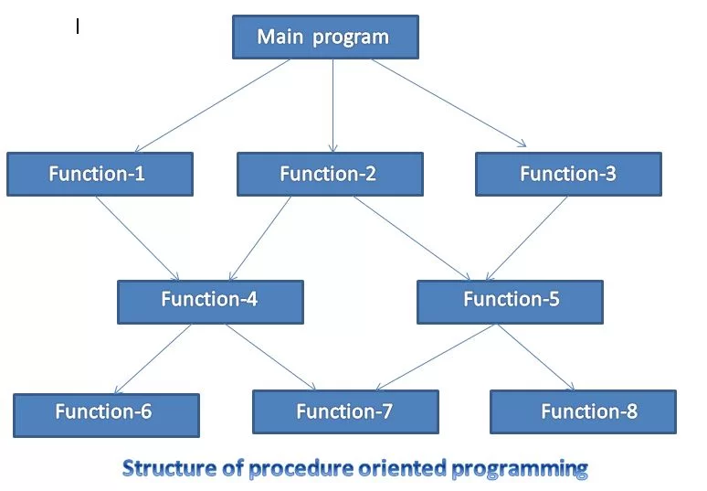

[Source: Programming Know](https://programmingknow.com/procedure-programming/)

Here's a simple example of procedural programming in JavaScript:

```javascript
// Define a function to calculate the area of a rectangle
function calculateArea(width, height) {
  return width * height;
}

// Define a function to calculate the perimeter of a rectangle
function calculatePerimeter(width, height) {
  return 2 * (width + height);
}

// Define a function to print the details of a rectangle
function printRectangleDetails(width, height) {
  console.log('Width: ' + width);
  console.log('Height: ' + height);
  console.log('Area: ' + calculateArea(width, height));
  console.log('Perimeter: ' + calculatePerimeter(width, height));
}

// Call the function to print the details of a rectangle
printRectangleDetails(5, 10);
```

In this example, we've defined three functions:

- `calculateArea` calculates the area of a rectangle.
- `calculatePerimeter` calculates the perimeter of a rectangle.
- `printRectangleDetails` prints the details of a rectangle, including its width, height, area, and perimeter.

We've then called the `printRectangleDetails` function with the arguments `5` and `10`, which prints the details of a rectangle with a width of `5` and a height of `10`. This example demonstrates the key characteristics of procedural programming:

- Functions are used to perform specific tasks.
- Data is shared between functions through parameters and return values.
- The program executes a sequence of statements, with each statement building on the previous one.

Note that in procedural programming, the focus is on the steps needed to accomplish a task, rather than on the objects and classes used to represent the data.

### 4.3.2 Object-Oriented Programming (OOP)

Object-Oriented Programming (OOP) is a revolutionary programming paradigm that has transformed the way developers design and build software systems. At the heart of OOP lies the concept of classes and objects, which enable developers to create modular, reusable, and maintainable code.

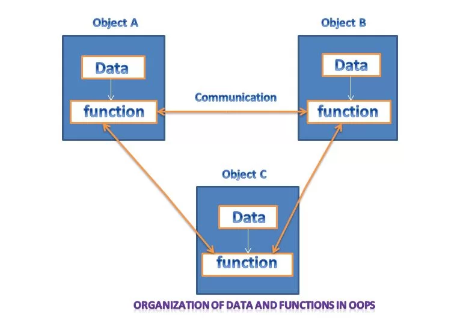

[Source: Programming Know](https://programmingknow.com/procedure-programming/)

Let's consider a simple example of a Vehicle class, which has attributes like `color`, `model`, and `year`, and methods like `startEngine()` and `accelerate()`. We can create multiple objects from this class, like `Car`, `Truck`, and `Motorcycle`, each with its own unique attributes and methods.

- Encapsulation: The `Vehicle` class encapsulates its attributes and methods, hiding them from the outside world. This means that the internal state of a `Vehicle` object is not directly accessible, and can only be modified through the methods provided by the class.
- Inheritance: The `Car`, `Truck`, and `Motorcycle` classes inherit the attributes and methods of the Vehicle class, and can also add their own unique features. For example, the `Car` class might add a method called `openTrunk()`, while the Truck class might add a method called `liftCargo()`.
- Polymorphism: We can treat all Vehicle objects (`Car`, `Truck`, `Motorcycle`) as if they were of the same class (`Vehicle`). This allows us to write generic code that can work with any type of Vehicle, without knowing its specific class. For example, we can create a method called `drive(Vehicle v)` that can take any `Vehicle` object as an argument, and call its `startEngine()` and `accelerate()` methods.

Below is a JavaScript implementation of the example:

```javascript
// Vehicle class (parent)
class Vehicle {
  constructor(color, model, year) {
    this.color = color;
    this.model = model;
    this.year = year;
  }

  startEngine() {
    console.log('Starting engine...');
  }

  accelerate() {
    console.log('Accelerating...');
  }
}

// Car class (child)
class Car extends Vehicle {
  openTrunk() {
    console.log('Opening trunk...');
  }
}

// Truck class (child)
class Truck extends Vehicle {
  liftCargo() {
    console.log('Lifting cargo...');
  }
}

// Polymorphic function
function drive(vehicle) {
  vehicle.startEngine();
  vehicle.accelerate();
}

// Using the classes
let myCar = new Car('red', 'Toyota', 2020);
let myTruck = new Truck('blue', 'Ford', 2015);

drive(myCar); // Outputs: Starting engine... Accelerating...
drive(myTruck); // Outputs: Starting engine... Accelerating...
```

The above code demonstrates the key concepts of OOP in JavaScript:

- Encapsulation: The Vehicle class encapsulates its attributes and methods.
- Inheritance: The `Car` and `Truck` classes inherit the attributes and methods of the `Vehicle` class.
- Polymorphism: The `drive()` function can take any Vehicle object as an argument, and call its methods without knowing its specific class.

### 4.3.3 Functional Programming

Functional programming is a programming paradigm that emphasizes the use of pure functions, immutability, and the avoidance of changing state. In functional programming, programs are composed of functions that take input and produce output, without modifying the state of the program. This approach has gained popularity in recent years, and JavaScript is a language that supports functional programming concepts. Here's a simple JavaScript example that demonstrates functional programming principles:

```js
// Example: Adding numbers using functional programming concepts

// Function to add two numbers immutably
function add(x, y) {
  return x + y;
}

// Function to double a number
function double(x) {
  return x * 2;
}

// Function to apply a given operation on two numbers
function applyOperation(x, y, operation) {
  return operation(x, y);
}

// Example usage:

const a = 5;
const b = 3;

// Adding two numbers using the add function
const sum = add(a, b);
console.log('Sum:', sum); // Output: Sum: 8

// Doubling the sum using the double function
const doubledSum = double(sum);
console.log('Doubled Sum:', doubledSum); // Output: Doubled Sum: 16

// Passing add function as a parameter to applyOperation
const result = applyOperation(a, b, add);
console.log('Result with add function:', result); // Output: Result with add function: 8

// Passing double function as a parameter to applyOperation
const result2 = applyOperation(a, b, double);
console.log('Result with double function:', result2); // Output: Result with double function: 16
```

In this example:

- define two functions add and double, which respectively add two numbers and double a given number.
- define a function applyOperation that takes two numbers and a function as parameters and applies the given function to the numbers.
- demonstrate the usage of these functions by adding numbers, doubling the result, and applying different operations using the applyOperation function.

This example demonstrates several functional programming principles:

- First-class function: a function works like a data that can be passed as a parameter of another function.
- Pure functions: Each function has no side effects and always returns the same output given the same input.
- Immutability: The data of the program is not modified by the functions.

Functional programming offers several benefits, including:

- Easier to reason about: Functional programs are often easier to understand and predict, since the output of a function depends only on its input.
- Less bugs: Immutable state and pure functions reduce the risk of bugs caused by shared mutable state.
- Better performance: Functional programs can be optimized more easily, since the output of a function depends only on its input.

As illustrated by the examples above, modern programming languages like JavaScript, Java, and C# provide support for multiple programming paradigms, including procedural, object-oriented, and functional programming. This flexibility allows programmers to select the most suitable paradigm for tackling specific problems, leveraging the strengths of each approach to write efficient, effective, and maintainable code. By choosing the best paradigm for the task at hand, developers can optimize their programming approach and create robust solutions that meet the needs of their projects.

## 5 Software Library and Software Package

### 5.1 Software Library

A software library is a collection of pre-written code, functions, and tools that developers can use to perform specific tasks or solve common problems. It provides a way to reuse code, reducing the need to write everything from scratch, and enables developers to focus on the unique aspects of their project.

Software Libraries are useful in many ways:

- Code Reusability: Libraries allow developers to reuse code, reducing duplication and saving time.
- Efficient Development: Libraries provide pre-built functionality, enabling developers to focus on the core logic of their project.
- Consistency: Libraries ensure consistency in coding styles and conventions, making it easier to maintain and update code.
- Community Support: Libraries are often maintained and contributed to by a community of developers, ensuring ongoing support and updates.

As an example, the Math library is a built-in JavaScript library that provides mathematical functions, such as `sqrt()` and `pow()`. By using the Math library, developers can perform mathematical calculations without writing their own implementation. For instance, the following code uses the `Math.sqrt()` function to calculate the square root of a number: `const result = Math.sqrt(16); // result = 4`. In this example, the `sqrt()` function is provided by the Math library, allowing the developer to focus on their project's logic without worrying about implementing mathematical calculations from scratch. Actually, the `Math.sqrt()` a part of the API provided by a JavaScript library.

### 5.2 Software Package

A software package is a collection of software tools that can be installed and configured in a consistent manner. It is typically much larger than a software library. Multiple software libraries can be combined into a single package. Software package is not only used in programming. Applications or application components can also be delivered as a software package.

Each programming language or operating system have one or more package installers. Following are popular package installer:

- NPM for JavaScript
- Pip for Python
- Gradle or Maven for Java
- Windows installer for Windows
- Brew for MacOS

## 6 API

### 6.1 What is and Why API?

Software API (Application Programming Interface) is the interface between software systems, enabling them to communicate and exchange data seamlessly. Just as a user interface (UI) facilitates interaction between humans and software, API acts as the intermediary between software applications, allowing them to request services, exchange data, and leverage each other's functionality. In essence, API defines the rules and protocols that govern how software systems interact, much like how UI defines how users interact with software. By providing a standardized interface, API enables software developers to access and utilize pre-built functionality, reducing the need to write code from scratch.

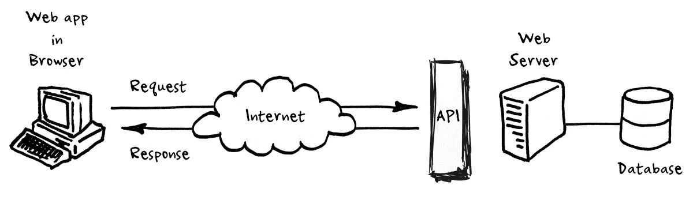

[Source Tech Funnel](https://www.techfunnel.com/information-technology/application-programming-interface/)

Functions of Software API include enabling communication between software systems, providing access to pre-built functionality, facilitating data exchange and integration, saving development time and resources, and promoting modularity and reusability of code.

Most software system has both UI and API. Operating system has its API: Windows API (Win32) allows software applications to access Windows operating system functionality, such as file management and graphics rendering. Linux API provides software applications with access to Linux operating system functionality, including process management and network communication.

Every software library has a set API. OpenSSL API offers cryptographic functionality for secure data communication between software applications. `zlib` API provides data compression and decompression functionality for software applications.

Many applications has API to let developers automate, extend or customize its functions. Twitter API enables software applications to access Twitter data, such as user timelines and tweets. Google Maps API provides geographic data and mapping functionality for software applications.

### 6.2 API Standards

Application Programming Interfaces (APIs) have become an essential part of software development, enabling different systems to communicate and exchange data. To ensure seamless interaction, APIs follow specific standards, which define the rules and protocols for data exchange. Following are some popular API standards:

- REST (Representational State of Resource) is a widely used API standard that leverages the HTTP protocol. It identifies resources using URIs and supports CRUD (Create, Read, Update, Delete) operations. RESTful APIs are stateless, meaning each request contains all the necessary information to complete the request. This standard is ideal for simple and lightweight APIs.
- GraphQL, on the other hand, is a query language for APIs that allows clients to specify exactly what data they need. The server then returns only the requested data, reducing bandwidth and improving performance. GraphQL has strong typing and validation, making it a popular choice for complex and scalable APIs.
- gRPC is a high-performance RPC (Remote Procedure Call) framework that uses Protocol Buffers for serialization and deserialization. It offers strong typing and validation, making it suitable for large-scale and mission-critical APIs. gRPC is particularly useful for building micro-services and distributed systems.

### 6.3 API as Core Service

At the heart of Stripe’s offerings lies its core service: Application Programming Interfaces (APIs). These APIs serve as the foundational building blocks that enable businesses to seamlessly integrate payment functionality into their software applications. Stripe’s APIs provide developers with a suite of tools and resources to facilitate secure payment processing, from tokenizing sensitive payment data to authorizing and processing transactions. By leveraging Stripe’s APIs, businesses can create customized payment experiences tailored to their unique needs while ensuring the highest standards of security and reliability. Stripe’s commitment to developer-friendly APIs empowers businesses of all sizes to innovate and grow in the digital economy.

Please see the YouTube Video [How to Create Stripe Payment Links to Add to Any Website](https://www.youtube.com/watch?v=JqQXgWPZQEw) to find out how easy it is to add payment function to a website.

ShopIT, an e-commerce platform, sought to streamline its payment processing capabilities by integrating Stripe's core service: its payment APIs. These APIs formed the backbone of ShopIT's transaction system, enabling seamless communication between its platform and Stripe's payment infrastructure. Upon setting up an account with Stripe and obtaining the necessary API keys, ShopIT's development team delved into integrating these APIs into their software services. They began by embedding Stripe's client-side JavaScript library into ShopIT's checkout process. This allowed them to create a secure payment form that collected customers' payment details without compromising sensitive data.

As customers submitted their payment information through the form, Stripe's APIs went to work, tokenizing the data in the background. This tokenization process ensured that critical information like credit card numbers remained secure, never passing through ShopIT's servers. With the tokenized data in hand, ShopIT's server-side application seamlessly communicated with Stripe's servers to authorize and process payment transactions.

Throughout this integration, Stripe's APIs served as the conduit for all payment-related activities, from tokenization to transaction processing. They handled payment responses, updating order statuses and notifying customers of transaction outcomes. Robust error handling mechanisms were put in place to gracefully manage any issues that arose during the process.

By leveraging Stripe's payment APIs, ShopIT not only enhanced the security of its payment processing but also improved the overall user experience. The streamlined checkout process resulted in higher conversion rates and increased customer satisfaction. Plus, with Stripe's scalable infrastructure, ShopIT could handle growing transaction volumes with ease.

## 7 Algorithm and Algorithmic Thinking

In the realm of computer science, an algorithm is a precise, step-by-step procedure or set of rules that defines how to solve a particular problem or perform a specific task. It is akin to a recipe that guides the process of completing a task, providing a systematic approach to problem-solving. Algorithms can range from simple procedures, such as sorting a list of numbers, to complex algorithms used in artificial intelligence and machine learning.

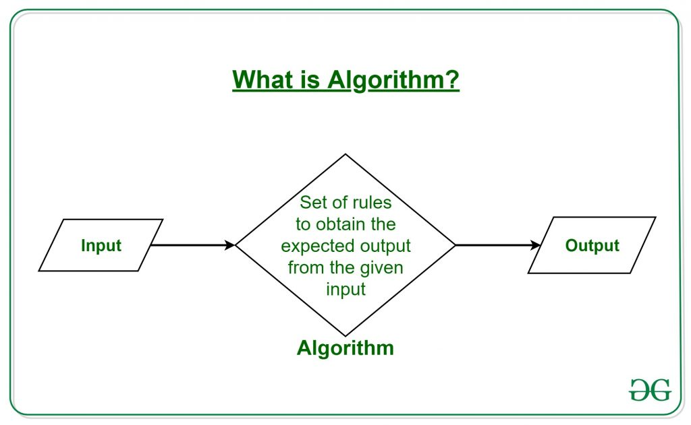

[Source: Geeks for Geeks](https://www.geeksforgeeks.org/introduction-to-algorithms/)

Algorithms exhibit several key characteristics that make them essential tools in computer science. Firstly, algorithms must be well-defined and unambiguous, meaning that each step is clearly specified and leaves no room for interpretation. This ensures that the algorithm can be executed consistently and reliably.

Additionally, algorithms must be finite, meaning they must eventually terminate after a finite number of steps. This finite nature ensures that algorithms are computationally tractable and can be executed within a reasonable amount of time. Finally, algorithms are deterministic, meaning that given the same input, they will always produce the same output. This predictability is crucial for ensuring the reliability and repeatability of algorithmic processes.

Algorithmic thinking, or computational thinking, is the ability to conceptualize, design, and analyze algorithms to solve problems effectively. It is a fundamental skill in computer science and is essential for leveraging the power of computers to solve complex problems efficiently. In today’s increasingly digital world, algorithmic thinking enables individuals to harness the power of computers to solve a wide range of problems efficiently. From optimizing business processes to analyzing large datasets and developing innovative software solutions, algorithmic thinking empowers individuals to leverage technology to drive innovation and progress.

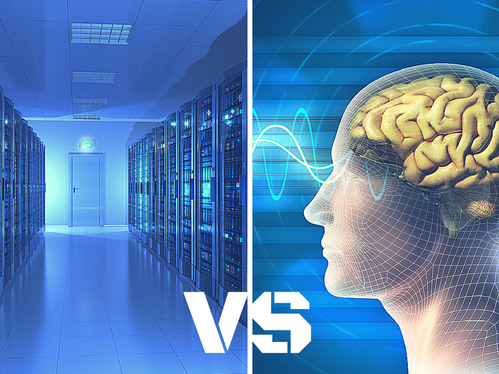

[Source: foglets.com](https://foglets.com/supercomputer-vs-human-brain/)
