## 1 Introduction

A digital computer network, sometimes abbreviated as network in this context, is a group of interconnected devices that communicate with each other to share resources, exchange data, and provide services. It is a critical component of modern computing, enabling communication, collaboration, and information sharing between individuals, organizations, and devices.

### 1.1 Communication

The core function of a computer is indeed communication - the ability to exchange information, instructions, and data between computers, and between computers and their users.Communication among computers, also known as inter-computer communication, enables the sharing of resources, data, and processing power. This is achieved through various networks, such as local area networks (LANs), wide area networks (WANs), and the Internet. These networks allow computers to communicate with each other, facilitating the exchange of information, collaboration, and remote access to resources. On the other hand, communication between computers and their users is equally important. Humans interact with computers through various input/output devices, such as keyboards, mice, displays, and speakers. This interaction enables users to provide instructions, data, and commands to the computer, which processes and responds accordingly. The computer's ability to understand and respond to user input has led to the development of intuitive interfaces, natural language processing, and artificial intelligence. Effective communication is critical to the functioning of computers and has numerous benefits. It enables:

- Resource sharing and collaboration
- Remote access and telecommuting
- Data exchange and transfer
- Internet and web-based services
- User-friendly interfaces and human-computer interaction

### 1.2 Communication Elements

Effective communication is the foundation of human interaction, and it is a crucial aspect of various aspects of life, including personal and professional relationships, business transactions, and technological exchanges. However, communication is not possible without certain essential elements. Any type of communication, whether verbal, written, or digital, requires four fundamental elements: a physical medium, an address, a communication protocol, and a common language.

Firstly, a physical medium is the tangible or intangible channel through which information is transmitted. This can be a face-to-face conversation, a phone call, an email, or a social media message. The physical medium provides the pathway for the communication to take place. For instance, in a phone call, the physical medium is the phone and the network that connects the caller and the receiver.

Secondly, an address is the unique identifier that enables the communication to reach its intended recipient. This can be a phone number, an email address, a physical address, or an IP address. The address ensures that the information is delivered to the correct person or device.

Thirdly, a communication protocol is the set of rules and standards that govern the communication process. This includes the format, timing, and sequence of the communication. Protocols ensure that both the sender and the receiver understand the communication process and can interpret the information correctly. For example, in a phone call, the protocol includes the ringing, answering, and hanging up procedures.

Lastly, a common language is the shared understanding of the meaning and interpretation of the communication. This can be a spoken language, a programming language, or a set of symbols and codes. The common language enables the sender and the receiver to comprehend the information being communicated. For instance, in a conversation between two people who speak different languages, a common language is necessary to facilitate understanding.

## 2 Computer Networks

Computer networks can be classified based on their geographical scope and distance, ranging from short-range to long-range networks. Each type can use either wired or wireless medium. Following are widely used networks:

- Near Field Communication (NFC): NFC networks operate within a short range of 10 cm, enabling communication between devices in close proximity. Examples include contactless payment systems and data transfer between devices. Common network protocols are NFCIP (NFC Infrastructure Protocol), and NFCEE (NFC Execution Environment). NFC enables contactless payments, such as Apple Pay, Google Wallet, and Samsung Pay, which allow users to make payments by tapping their phone on a payment terminal. It allows users to transfer data, such as photos or videos, between devices by tapping them together.
- Bluetooth Networks: Bluetooth networks have a range of around 10 meters, allowing devices to communicate with each other in a localized area. Common applications include wireless headsets, speakers, and file transfer between devices. Common network protocols are LMP (Link Manager Protocol), L2CAP (Logical Link Control and Adaptation Protocol). It is widely used in life. A user pairs their Bluetooth-enabled wireless headphones with their smartphone or music player. A smart home system includes Bluetooth-enabled devices such as light bulbs, thermostats, and security cameras.
- Local Area Networks (LAN): LANs cover a distance of up to 1 kilometer, connecting devices within a building or campus. They enable resource sharing, Internet access, and communication between devices. The most common LAN is called Ethernet, including wired and wireless lans. IEEE 802.3 is a wired Ethernet protocol. Wireless Ethernet (Wireless LAN or WLAN) is often called Wi-Fi that is defined by IEEE 802.11. It is used in a home office with several devices connected to a central router using Ethernet cables or Wi-FI. The typical range for a WiFi network is 50 meters for 2.4GHz or 15 meters for 5GHz.
- Wide Area Networks (WAN): WANs span distances up to thousand kilometers, connecting multiple LANs and enabling communication between devices across cities or regions. Examples include Internet service providers and enterprise networks. Common network protocols are Frame Relay, ATM (Asynchronous Transfer Mode), TCP/IP.
- Satellite Networks: Satellite networks use orbiting satellites to transmit data over long distances, covering entire continents or even global coverage. They provide connectivity in remote areas and support applications like GPS and satellite television.

### 2.1 Home Network

A home network is one kind of LAN. A typical home network consists of several interconnected devices that enable communication and data sharing among household members. The central component of the network is the router, which serves as the gateway between the home network and the Internet. Connected to the router are various devices such as computers, smartphones, tablets, smart TVs, gaming consoles, and smart home devices.

These devices are usually connected to the router either wirelessly via Wi-Fi or through Ethernet cables. Wi-Fi connections provide convenience and flexibility, allowing devices to connect to the network without the need for physical cables. Ethernet connections, on the other hand, offer faster and more reliable speeds, making them ideal for devices that require high bandwidth, such as desktop computers or gaming consoles. In addition to the router, many home networks also include network-attached storage (NAS) devices, printers, and other peripherals that can be shared among multiple devices on the network. These devices enable centralized storage and printing capabilities, enhancing the efficiency and convenience of the home network.

Home networks connect to the Internet through various methods, each with its own advantages and limitations. Some of the most common connection methods include:

1. **ADSL (Asymmetric Digital Subscriber Line):** ADSL uses existing telephone lines to transmit data, allowing for simultaneous voice and data communication. It provides a broadband Internet connection with faster download speeds than upload speeds, making it suitable for typical home Internet usage.
2. **Broadband Network (Cable or DSL):** Broadband networks, such as cable or DSL (Digital Subscriber Line), use dedicated lines to deliver high-speed Internet access to homes. Cable Internet typically utilizes coaxial cables, while DSL uses telephone lines. These networks offer faster and more reliable connections than dial-up connections, making them popular choices for home Internet access.
3. **Fiber Optic Network:** Fiber optic networks use optical fibers to transmit data using light signals. Fiber optic Internet offers the fastest and most reliable connection speeds, with symmetrical upload and download speeds. However, fiber optic infrastructure may not be available in all areas and can be more expensive than other connection options.
4. **Satellite Internet:** Satellite Internet uses satellites in Earth's orbit to provide Internet access to remote or rural areas where traditional wired connections are not feasible. Satellite Internet can offer broadband speeds but may experience latency issues due to the distance data must travel between the satellite and the ground.
5. **Mobile Broadband (4G/5G):** Mobile broadband utilizes cellular networks to provide Internet access to devices using mobile data connections. With the advent of 4G and 5G technology, mobile broadband offers high-speed Internet access on the go, making it a convenient option for users who require Internet access outside of their homes.

Overall, the choice of Internet connection method for a home network depends on factors such as geographic location, available infrastructure, desired speed and reliability, and budget constraints. Regardless of the connection method, a well-configured home network provides households with access to the wealth of resources and services available on the Internet, enabling communication, entertainment, and productivity in the digital age.

Following is a diagram of a typical home network.

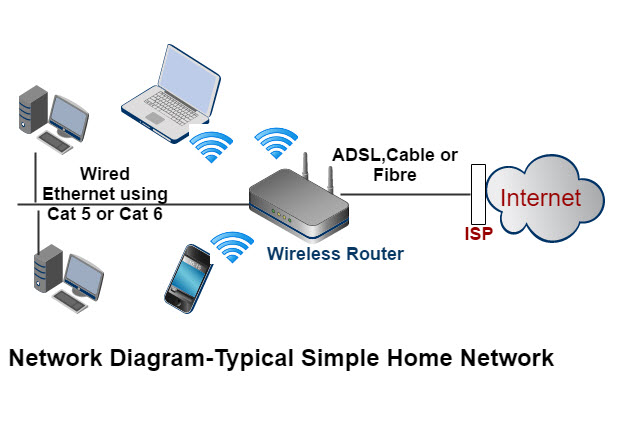

[Source: Steve’s Smart Home Networking Guide](https://stevessmarthomeguide.com/build-home-network/)

### 2.2 Internet

There is a special WAN called Internet: the global network of networks. The Internet is a complex and dynamic system that has revolutionized the way we communicate, access information, and connect with others. At its core, the Internet is a network of networks, comprising millions of interconnected computers, servers, and devices that span the globe. The Internet's origins can be traced back to the 1960s, when the United States Department of Defense's Advanced Research Projects Agency (ARPA) funded a project to create a network of computers that could communicate with each other. This early network, called ARPANET, was designed to be robust and fault-tolerant, with multiple paths for data to travel in case of a failure.

Today, the Internet is a vast and diverse network of networks, encompassing everything from small home networks to massive enterprise networks and global social media platforms. It is estimated that there are over 4.4 billion Internet users worldwide, with millions of devices connecting to the Internet every day. One of the key benefits of the Internet's network of networks is its ability to facilitate global communication and collaboration. The Internet has enabled people from all over the world to connect with each other, share ideas and information, and work together on projects and initiatives. It has also enabled the free flow of information, allowing people to access knowledge and resources from anywhere in the world. However, in many countries, governments have implemented strict Internet regulations, blocking access to certain websites, social media platforms, and online services. This censorship can be politically motivated, aimed at suppressing dissent, opposition, and free speech. For instance, China's Great Firewall blocks access to websites like Google, Facebook, and Twitter, while Iran has blocked access to social media platforms during times of political unrest. Governments also use surveillance and monitoring to control online activities. They may use sophisticated technologies to track online behavior, monitor online communications, and identify political dissidents. This surveillance can lead to arrests, imprisonment, and even physical harm for those who express dissenting opinions or share sensitive information online.

Here are two videos about [Internet](https://youtu.be/Dxcc6ycZ73M) and [History of Internet](https://www.youtube.com/watch?v=9hIQjrMHTv4).

## 3 Internet: Layers and Components

### 3.1 Network Layers

The Internet is a complex system that connects many different networks, enabling communication and data transfer between billions of devices worldwide. This complexity arises from the diverse range of networks, devices, and protocols that must work together seamlessly to facilitate efficient data transfer. To manage this complexity, the Internet is organized into five layers, each with a specific function and protocols that operate at that layer. Each layer defines a standard interface to provide services to the layer above it.

- **Layer 1: Physical Layer**. The Physical Layer is the lowest layer of the Internet, responsible for transmitting raw bits over physical mediums such as cables, Wi-Fi, or fiber optic connections. This layer defines the physical means of data transmission, including voltage levels, cable specifications, and network topology. Protocols at this layer include Ethernet, Wi-Fi, and Fiber Distributed Data Interface (FDDI). This layer interfaces with the Data Link Layer, which provides error control and flow control, ensuring reliable data transfer. The Data Link Layer uses protocols such as Ethernet and Wi-Fi to transmit data frames between devices on the same network.
- **Layer 2: Data Link Layer**. The Data Link Layer is responsible for framing, error control, and flow control of data transmitted over the Physical Layer. It ensures that data is transmitted reliably and efficiently, using protocols such as Ethernet, Point-to-Point Protocol (PPP), and Frame Relay. The Data Link Layer provides reliable point-to-point data transfer between devices on the same network and routes data packets between networks.
- **Layer 3: Network Layer**. The Network Layer is responsible for routing data between devices on different networks. It provides logical addressing, routing, and congestion control, enabling data to be transmitted between devices on different networks. Key protocols at this layer include Internet Protocol (IP), Routing Information Protocol (RIP), and Open Shortest Path First (OSPF).
- **Layer 4: Transport Layer**. The Transport Layer provides reliable data transfer between devices, ensuring that data is delivered in the correct order and without errors or duplication. This layer is responsible for segmentation, acknowledgement, and reassembly of data. Protocols at this layer include Transmission Control Protocol (TCP) and User Datagram Protocol (UDP).
- **Layer 5: Application Layer**. The Application Layer is the highest layer of the Internet, responsible for providing services and interfaces for applications to communicate with each other. This layer supports protocols such as Hypertext Transfer Protocol (HTTP), Simple Mail Transfer Protocol (SMTP), and File Transfer Protocol (FTP).

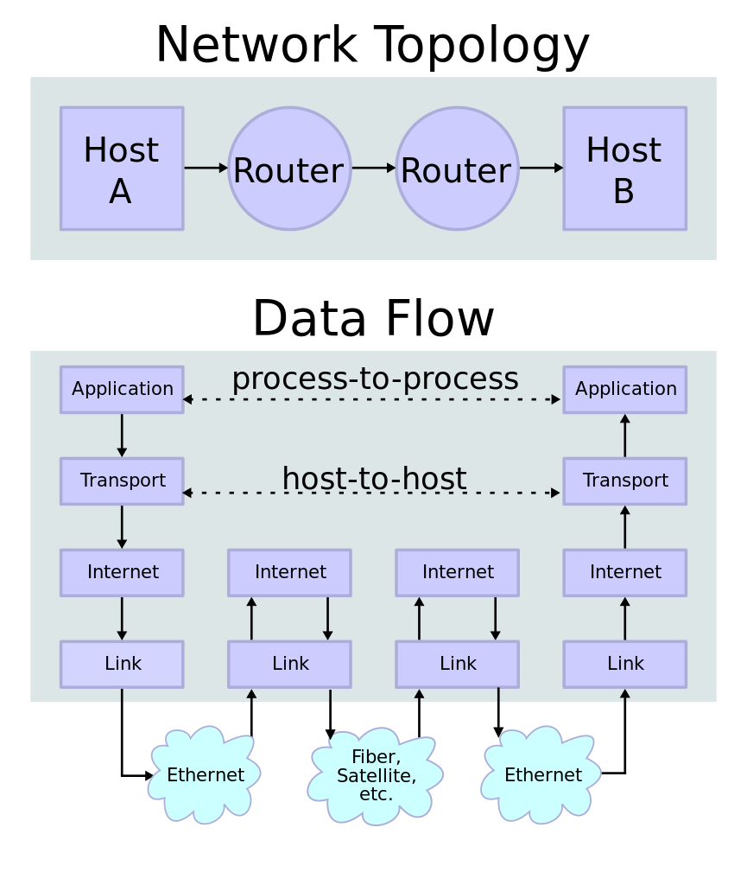
[Source: WikiPedia](https://en.wikipedia.org/wiki/Internet_protocol_suite)

These layers are necessary for several reasons:

- Modularity and Scalability: The layered architecture of the Internet promotes modularity, with each layer responsible for a specific set of functions. This modularity allows for easier management, maintenance, and scalability of the network infrastructure. By dividing the network into separate layers, changes or updates to one layer can be implemented without affecting the other layers, facilitating rapid adaptation to evolving technological and operational requirements.
- Abstraction and Simplification: The layered model abstracts the complexities of the underlying network infrastructure, allowing users and applications to interact with the network at a higher level of abstraction. This abstraction simplifies the design and implementation of network protocols, making it easier for developers to create interoperable and compatible networking solutions. Additionally, the layered architecture enables the development of standardized protocols and interfaces, promoting interoperability and compatibility across different networking technologies and devices.
- Flexibility and Interoperability: The layered architecture of the Internet promotes flexibility and interoperability by providing well-defined interfaces between adjacent layers. These interfaces enable different networking technologies and devices to communicate with each other seamlessly, regardless of their underlying hardware or software implementations. This interoperability facilitates the integration of diverse networking technologies, such as wired and wireless networks, into a unified and cohesive Internet infrastructure, enhancing connectivity and accessibility for users and applications.
- Fault Isolation and Troubleshooting: The layered architecture of the Internet facilitates fault isolation and troubleshooting by compartmentalizing network functionality into distinct layers. If a problem occurs in one layer, it can be localized and addressed without affecting the operation of other layers. This modular approach to network design simplifies the process of diagnosing and resolving network issues, minimizing downtime and disruption to network services.

### 3.2 Internet Components

The Internet is essentially a communication network. As with any communication network, the Internet requires four fundamental elements to function effectively: a physical medium, an address system, a communication protocol, and a common language. Though each layer has all four components to facilitate communication, the following description is about the network layer and transport layer.

### 3.2.1 Physical Medium

The physical medium refers to the infrastructure that enables data transmission. In the case of the Internet, this infrastructure consists of various Local Area Networks (LANs) and Wide Area Networks (WANs). LANs connect devices in a limited geographical area, such as a home or office, while WANs connect multiple LANs over a larger geographical area, such as a city or country. The Internet uses a combination of these LANs and WANs to form its physical medium, enabling data transmission across the globe.

### 3.2.2 Address System

The address system is responsible for identifying and locating devices on the network. The Internet Protocol (IP) is the backbone of the internet, enabling communication and data transfer between devices across the globe. The two versions of IP, IPv4 and IPv6, have played a crucial role in shaping the internet as we know it today.

IPv4, the original version of IP, was developed in the 1980s and was designed to support a small number of devices. Its 32-bit addressing scheme allowed for approximately 4.3 billion unique addresses, which seemed sufficient at the time. The 32-bit address is divided into four parts, each representing a byte in decimal. The four parts are separated by dots (.) and are known as octets - because each byte has 8 bits. Each octet can have a value ranging from 0 to 255. 255 is the decimal equivalent of the binary number `11111111`.

An IPv4 address consists of two parts: a network part and a host part. The network part identifies the network, while the host part identifies the specific device on the network. The network part of an IPv4 address can be further classified into five categories: Class A, Class B, Class C, Class D, and Class E. Each class has a specific range of values and is used for different types of networks.

- Class A addresses have a first octet value of 0-127 and are used for large networks. The first octet represents the network ID, and the remaining three octets represent the host ID. Example: 10.0.0.1. Class A addresses are suitable for very large networks, such as those used by Internet Service Providers (ISPs) or huge enterprises. They have a large number of possible host IDs, making them ideal for networks with a massive number of devices.
- Class B addresses have a first octet value of 128-191 and are used for medium-sized networks. The first two octets represent the network ID, and the remaining two octets represent the host ID. Example: 172.16.0.1. Class B addresses are suitable for medium-sized networks, such as those used by large enterprises or organizations with multiple smaller networks. They have a moderate number of possible host IDs, making them ideal for networks with a sizable number of devices.
- Class C addresses have a first octet value of 192-223 and are used for small networks. The first three octets represent the network ID, and the remaining octet represents the host ID. Example: 192.168.1.1. Class C addresses are suitable for small networks, such as those used by small businesses, home networks, or departments within a larger organization. They have a limited number of possible host IDs, making them ideal for networks with a small number of devices. Most home networks use class C addresses.
- Class D addresses are reserved for multicasting and have a first octet value of 224-239. Example: 239.0.0.1. Class D addresses are reserved for multicasting, which allows a single packet to be sent to multiple devices on a network. They are not used for regular networking and are not assigned to individual devices.
- Class E addresses are reserved for future use and have a first octet value of 240-254. Example: 240.0.0.1

It's worth noting that Class D and Class E addresses are not used for regular networking, and Class A, B, and C addresses are the most commonly used.

Following are digrams of IP addresses.

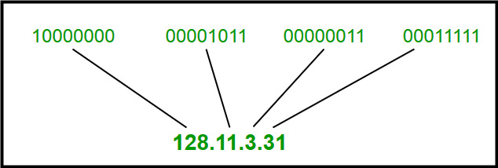
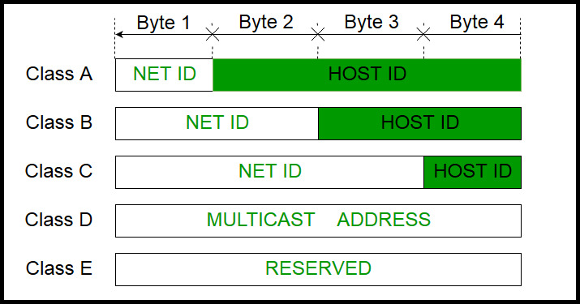
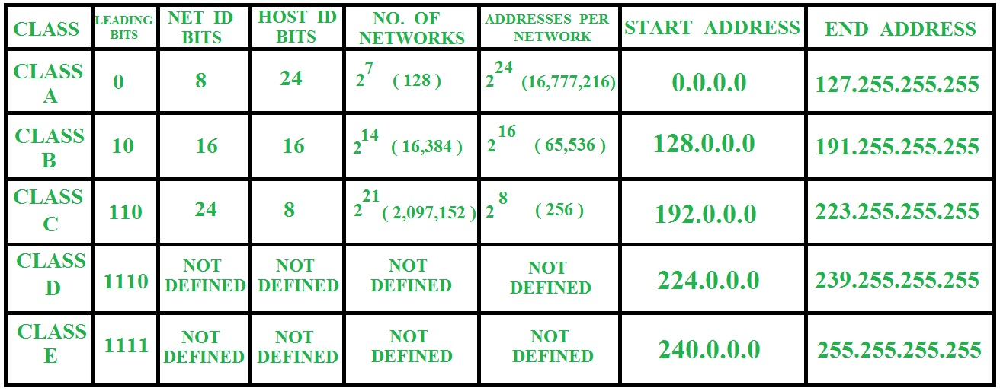

[Source: Geeks for Geeks](https://www.geeksforgeeks.org/introduction-of-classful-ip-addressing/)

However, with the rapid growth of the internet and the increasing number of devices connected to it, IPv4's limitations became apparent. The depletion of address space, lack of hierarchy support, complex network configuration, and lack of built-in authentication and confidentiality made it clear that a new protocol was needed. Enter IPv6, designed to address the limitations of IPv4 and provide a more scalable, secure, and efficient internet protocol. With its 128-bit addressing scheme, IPv6 can support approximately 340 trillion trillion devices, making it an ideal solution for the growing internet of things (IoT). Its hierarchical addressing scheme, auto-configuration capabilities, and built-in authentication and confidentiality features make it a more efficient and secure protocol. For instance, the IPv6 address `3FFE:FFFF:0:CD30:0:0:0:0/64` is a unicast address that identifies a single interface, while `FFED:0:0:0:0:BA98:3210:4562` is a multicast address that identifies a set of interfaces. The transition from IPv4 to IPv6 is a necessary step towards ensuring the continued growth and development of the internet. As more devices become connected, the need for a more robust and scalable protocol becomes increasingly important. IPv6 provides a foundation for future innovation and development, enabling new technologies and applications to flourish.

### 3.2.3 Communication Protocol

The communication protocol governs how data is transmitted over the network. The TCP/IP protocol suite is the backbone of the internet, enabling communication and data transfer between devices across the globe. At its core, TCP/IP consists of three fundamental protocols: Internet Protocol (IP), Transmission Control Protocol (TCP), and User Datagram Protocol (UDP). Each protocol plays a vital role in ensuring reliable and efficient communication over the internet.

Internet Protocol (IP) is responsible for addressing and routing data packets between devices. It provides a unique identifier, known as an IP address, to each device on the network, allowing data to be routed to its intended destination. IP addresses are divided into two parts: the network ID and the host ID. The network ID identifies the network, while the host ID identifies the specific device on the network. IP's primary functions include addressing and routing, enabling data to be routed efficiently across networks and allowing devices to communicate with each other.

The Internet Protocol (IP) is a packet-switching network protocol. In contrast to circuit-switching networks, which establish a dedicated end-to-end connection for the duration of the communication session, IP protocol breaks data into small packets and routes each packet independently through the network to its destination. This approach has numerous advantages, making IP a more reliable, flexible, scalable, efficient, and error-tolerant technology. IP's packet-switching approach provides fault tolerance via dynamic routing, ensuring that data can still be delivered even if some network segments fail - IP can retransmit the packet or route it through an alternative path. If a packet is lost or corrupted during transmission, the receiving device can simply send an error message to the sender, requesting retransmission of the affected packet. The sender can then resend the packet, and the receiving device can reassemble the data with the retransmitted packet. This process is seamless and efficient, with minimal disruption to the overall communication session. In contrast, circuit switching establishes a dedicated connection for the entire communication session. If a packet is lost or corrupted during transmission, the entire connection is terminated, and the connection must be reestablished before data can be resent. This process is not only time-consuming but also inefficient, as it requires the reestablishment of the entire connection.

[Source: Wikipedia](https://en.wikipedia.org/wiki/Packet_switching)

[Packet Switching Video](https://youtu.be/pWLSS9fFhiM)

Transmission Control Protocol (TCP) ensures reliable communication over the internet by providing error-checking and correction mechanisms. It establishes a connection between devices before transmitting data and guarantees that data is delivered in the correct order. TCP's functions include connection establishment, error-checking, and correction, ensuring that data is delivered reliably and in the correct order. This protocol is essential for applications that require guaranteed delivery, such as file transfers and email.

User Datagram Protocol (UDP) is a connectionless protocol that prioritizes speed over reliability. It does not establish a connection before transmitting data and does not guarantee that data will be delivered. UDP's functions include transmitting data without establishing a connection and not guaranteeing delivery or order of data packets. This protocol is suitable for applications that require fast transmission, such as video streaming or online gaming, as it reduces overhead and improves performance.

### 3.2.4 Common Language

The common language refers to the format in which data is transmitted and understood by devices on the network. On the Internet, different protocols use different language formats to transmit data. The Internet Protocol (IP) packet, Transmission Control Protocol (TCP) segment, and User Datagram Protocol (UDP) datagram are the fundamental units of data transmission in computer networks. Each has a unique data format that enables efficient and reliable communication over the internet.

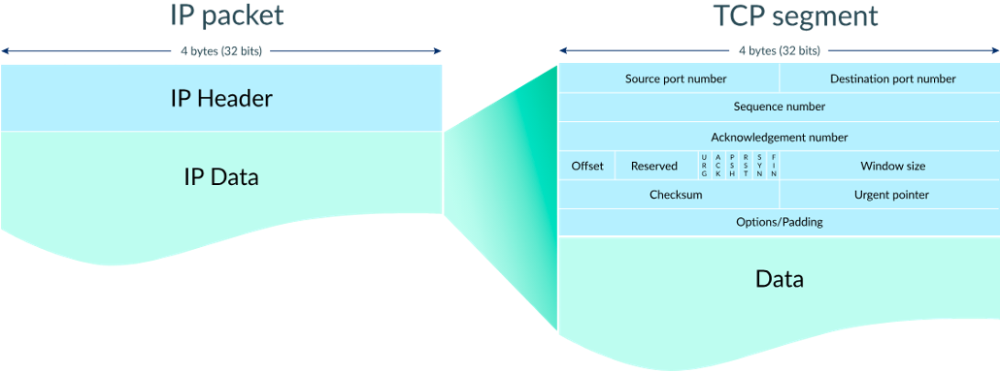

[Source: Khan Academy](https://www.khanacademy.org/computing/computers-and-internet/xcae6f4a7ff015e7d:the-internet/xcae6f4a7ff015e7d:transporting-packets/a/transmission-control-protocol--tcp)

The IP packet is the basic unit of data transmission in the internet layer. It consists of a header and payload, with the header containing source and destination IP addresses, packet length, and other control information. The payload carries the actual data being transmitted. The IP packet header is 20 bytes long and contains several fields, including source and destination IP addresses, packet length, identification, flags, fragment offset, time to live, protocol, and header checksum.

The TCP segment is the basic unit of data transmission in the transport layer. It consists of a header and payload, with the header containing source and destination port numbers, sequence number, acknowledgment number, and other control information. The payload carries the actual data being transmitted. The TCP header is 20 bytes long and contains several fields, including source and destination port numbers, sequence number, acknowledgment number, data offset, reserved, flags, window size, checksum, and urgent pointer.

The UDP datagram is also a basic unit of data transmission in the transport layer. It consists of a header and payload, with the header containing source and destination port numbers, length, and checksum. The payload carries the actual data being transmitted. The UDP header is 8 bytes long and contains several fields, including source and destination port numbers, length, and checksum.

### 3.3 Domain Name System (DNS)

The Domain Name System (DNS) is a vital component of the internet, enabling users to access websites and online services using easy-to-remember domain names instead of complex IP addresses. Without DNS, the internet would be a cumbersome and inaccessible place, requiring users to memorize long strings of numbers and letters to access their favorite websites and services. DNS provides a scalable and flexible system for resolving domain names to IP addresses, allowing users to access online resources from anywhere in the world. It also enables online services to change IP addresses or server locations without affecting the domain name, making it easier to manage online infrastructure.

#### 3.3.1 Domain Name Structure

The domain name is a hierarchical naming system used to organize and identify resources on the Internet in a structured manner. Domain names are organized into levels, with each level representing a different part of the hierarchy. The most common levels include the top-level domain (TLD), second-level domain (SLD), and subdomain.

**1. Top-Level Domain (TLD):** The top-level domain is the highest level in the domain name hierarchy and typically denotes the purpose or geographic location of a website. Examples of top-level domains include:

- Generic Top-Level Domains (gTLDs), such as .com (commercial), .org (organization), .net (network), .edu (education), and .gov (government).
- Country Code Top-Level Domains (ccTLDs), such as .us (United States), .uk (United Kingdom), .ca (Canada), .jp (Japan), and .au (Australia).
  For example, in the domain name “example.com,” “.com” is the top-level domain.

**2. Second-Level Domain (SLD):** The second-level domain is the level directly below the top-level domain and typically represents the organization, entity, or purpose of a website. Examples of second-level domains include:

- “google” in “google.com”
- “wikipedia” in “wikipedia.org”
- “amazon” in “amazon.com”

Second-level domains can also be used for geographic or thematic purposes, such as “nyc” in “nyc.gov” or “edu” in “harvard.edu.”

**3. Subdomain:** A subdomain is a level below the second-level domain and is used to further categorize or organize content within a website. Subdomains are separated from the second-level domain by a period (dot). Examples of subdomains include:

- “blog” in “blog.google.com”
- “mail” in “mail.yahoo.com”
- “store” in “store.amazon.com”

Subdomains can be used to host different services, such as blogs, email servers, or online stores, under the same second-level domain.

#### 3.3.2 Domain Name Resolving

The DNS resolving process begins when a user enters a URL or sends an email. The device sends a request to a DNS resolver, typically provided by the operating system or internet service provider, to look up the IP address associated with the domain name. The DNS resolver breaks down the domain name into its constituent parts, including the top-level domain (TLD), domain name, and subdomain.

The DNS resolver then sends a query to a DNS root server, which directs the query to a TLD server. The TLD server contains information about the domain name and refers the query to a domain name server (DNS) that is authoritative for the domain. The authoritative DNS server contains the actual IP address associated with the domain name and returns it to the DNS resolver. The DNS resolver then caches the IP address and returns it to the device, which can then establish a connection with the server hosting the website or service. The caching mechanism enables faster resolution of subsequent queries, as the DNS resolver can retrieve the cached IP address instead of repeating the entire resolution process.

Here is a [Video about IP and DNS](https://youtu.be/5o8CwafCxnU). Following diagrams give a DNS resolving and DNS architecture.

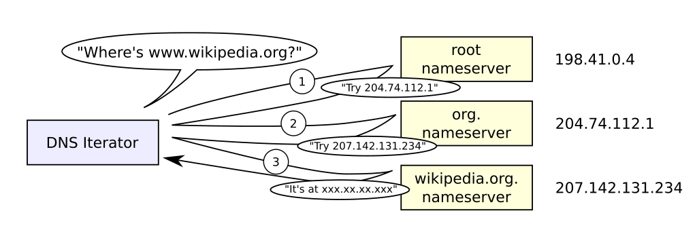

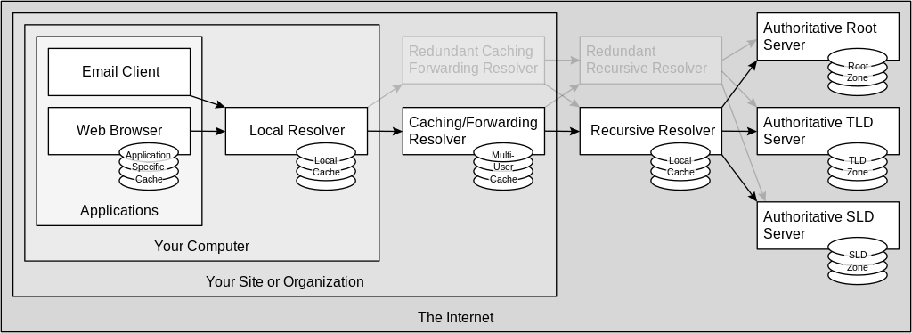

[Source: Wikipedia](https://en.wikipedia.org/wiki/Domain_Name_System)

## 4 WWW

The World Wide Web (WWW), commonly referred to as the web, is a system of interlinked hypertext documents that can be accessed via the Internet. The web was invented by Tim Berners-Lee in 1989 and has since become an integral part of modern life, revolutionizing the way we communicate, access information, and share knowledge. The web is a network of documents, images, videos, and other resources, identified by uniform resource locators (URLs), and accessed via web browsers, such as Google Chrome, Mozilla Firefox, and Microsoft Edge.

The web, at its core, is a communication network that enables the exchange of information between individuals and devices across the globe. As with any communication network, the web requires four fundamental elements to function effectively: a physical medium, an address system, a communication protocol, and a common language.

### 4.1 Physical Medium

The physical medium refers to the infrastructure that enables data transmission. In the case of the web, the physical medium is the Internet, a global network of interconnected computers and servers. The Internet provides the backbone for data transmission, allowing information to be sent and received across the world. WWW is one application runs on top of Internet. There are other applications such as email, FTP, EDI, and more.

### 4.2 Address System

The address system is responsible for identifying and locating devices on the network. On the web, this is achieved through the use of Uniform Resource Locators (URLs). The Uniform Resource Locator (URL) is a fundamental component of the internet, enabling users to access specific web pages and resources with ease. A URL is a string of characters that identifies the location of a resource on the internet, and it is composed of several parts, each serving a unique purpose. The different parts of a URL include Protocol (http or https), Subdomain (optional), Domain name, Port number (optional), Path, and Anchor/Fragment (optional). The following shows the structure of an URL.

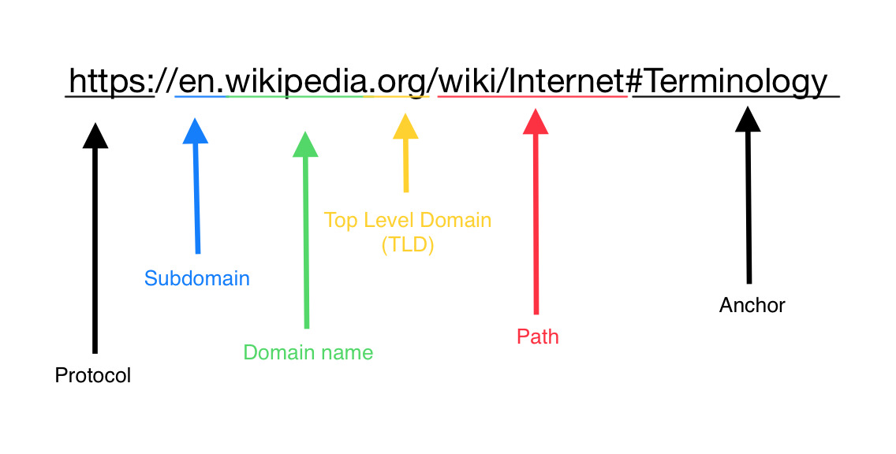

[Source: Wikimedia commons](https://commons.wikimedia.org/wiki/File:URL_structure.jpg)

### 4.3 Communication Protocol

The communication protocol governs how data is transmitted over the network. On the web, the primary communication protocol is Hypertext Transfer Protocol (HTTP). HTTP is a set of rules that dictate how data is sent and received over the Internet. It enables devices to communicate with each other and exchange information in a standardized way.

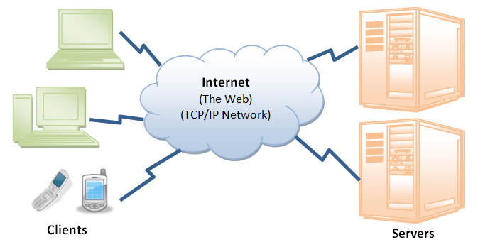

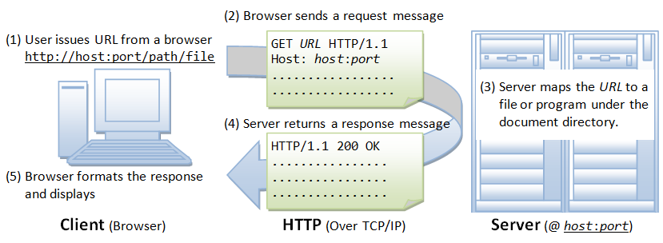

[Source: ntu.edu.sg](https://www3.ntu.edu.sg/home/ehchua/programming/webprogramming/HTTP_Basics.html)

HTTP is a client-server protocol, meaning that it consists of a client, typically a web browser, and a server, which hosts the requested resources. The client sends a request to the server, and the server responds with the requested information. The request and response are formatted in a specific way, using HTTP methods and status codes. HTTP methods, such as GET, POST, PUT, and DELETE, define the action to be performed on the requested resource. For example, the GET method retrieves a resource, while the POST method submits data to the server. Status codes, such as `200 OK`, `404 Not Found`, and `500 Internal Server Error`, indicate the outcome of the request.

HTTP also uses headers and body to exchange information between the client and server. Headers provide metadata about the request and response, such as the type of data being sent, while the body contains the actual data. HTTP has undergone several revisions, with the latest version being HTTP/2. HTTP/2 introduces several improvements, such as multiplexing, header compression, and binary encoding, which enhance performance and efficiency. In addition to its technical aspects, HTTP has played a significant role in shaping the internet as we know it today. It has enabled the creation of web applications, online services, and social media platforms, which have transformed the way we communicate, access information, and conduct business.

The Hypertext Transfer Protocol Secure (HTTPS) is an extension of the Hypertext Transfer Protocol (HTTP) that adds an extra layer of security to the communication between a website and its users. HTTPS ensures that all data exchanged between the website and its users is encrypted, making it difficult for hackers to intercept and read the data. The need for HTTPS arose due to the increasing number of online transactions and the sensitive nature of the information being exchanged. HTTP, the predecessor to HTTPS, was not designed with security in mind and was vulnerable to eavesdropping, tampering, and man-in-the-middle attacks. HTTPS addresses these vulnerabilities by using encryption to protect the data in transit. HTTPS (an application layer protocol) relies on SSL/TLS (Secure Sockets Layer/Transport Layer Security: two transportation layer protocols) for secure data transportation. HTTPS provides several benefits, including:

- Encryption: HTTPS encrypts the data exchanged between the website and its users, making it difficult for hackers to intercept and read the data.
- Authentication: HTTPS verifies the identity of the website, ensuring that users are communicating with the intended website and not an imposter.
- Trust: HTTPS establishes a secure connection, giving users confidence that their data is protected.
- SEO: Google gives a slight ranking boost to websites that use HTTPS, making it a crucial factor in search engine optimization.

HTTPS is no longer a choice for businesses; it's a requirement for security, trust, compliance, and credibility. Businesses that fail to adopt HTTPS risk losing customer trust, compromising sensitive data, and damaging their reputation.

### 4.4 Common Language

The common language is the final element required for effective communication on the web. The web's common language consists of three sub-components: Hypertext Markup Language (HTML), Cascading Style Sheets (CSS), and JavaScript.

- HTML provides the structure and content of web pages, allowing developers to create and organize information in a standardized way.
- CSS is used for styling and layout, enabling developers to control the visual appearance of web pages.
- JavaScript is a programming language that adds interactivity to web pages, allowing developers to create dynamic and engaging user experiences.
  Together, these three languages form the web's common language, enabling developers to create and share information with others across the globe.

## 5 Case Study: Colocation

In the world of high-frequency stock trading, the strategic placement of trading servers in close proximity to stock exchange market servers, known as colocation, holds immense significance. This strategy involves situating trading servers near the servers of stock exchange markets. Within electronic trading, the time it takes for communication to travel, known as latency, is crucial in determining trade execution speed. Latency stems from processes like data transmission, routing, and processing by exchange systems, which can vary due to factors like network congestion, distance, and processing speed.

In high-frequency trading, where decisions occur in microseconds or even nanoseconds, minimizing latency is paramount. Even a slight latency advantage can offer a competitive edge in executing trades ahead of rivals. Colocation addresses this need by reducing the physical distance between trading servers and exchange market servers. By colocating within the same data center or building as the exchange’s servers, traders can significantly reduce latency associated with data transmission. This proximity enables trading orders to reach the exchange’s servers in the shortest possible time, facilitating faster order execution and real-time response to market conditions.

For example, consider a scenario where a trading firm in Los Angeles sends an order to buy a particular stock listed on the New York Stock Exchange (NYSE). The order, traversing long-distance network cables and encountering multiple network hops, faces considerable latency. The minimum communication delay is `2,451 miles/60 miles per ms = 49 ms`. A fast computer can perform milliions of operations in 49ms. In contrast, a trading firm colocated within the same data center as the NYSE servers experiences minimal latency due to the negligible physical distance between their servers. Real-world comparisons of communication time delay between cities like Los Angeles and New York underscore the tangible benefits of colocation in high-frequency trading. By leveraging colocation, market participants can execute trades with unparalleled speed and precision, enhancing profitability in the fast-paced world of electronic trading.

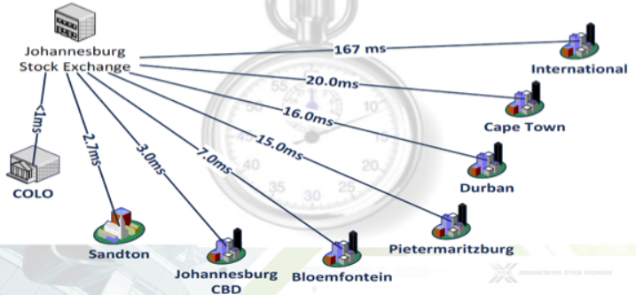

[Source: Colocation from SA Financial Marekts Journal](https://financialmarketsjournal.co.za/colocation-reducing-latency-in-financial-market-transactions-and-creating-an-algo-trading-friendly-market-environment/)
