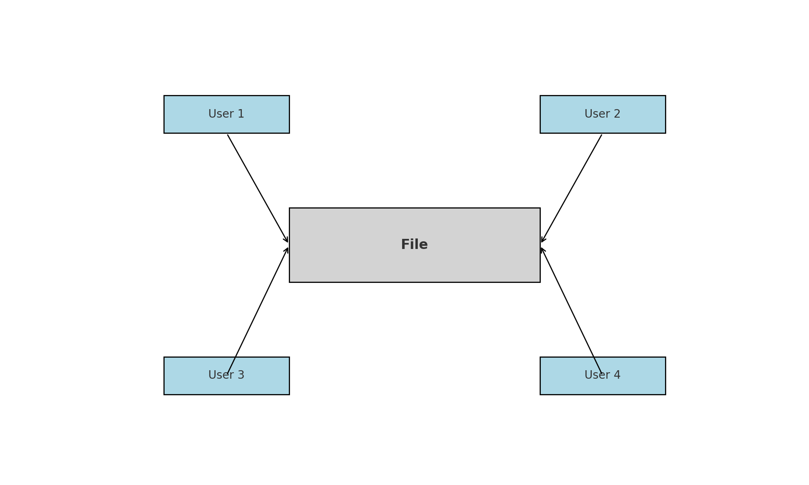
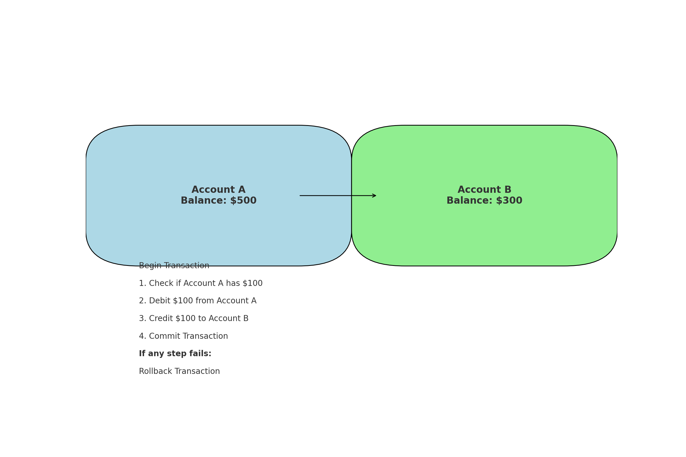
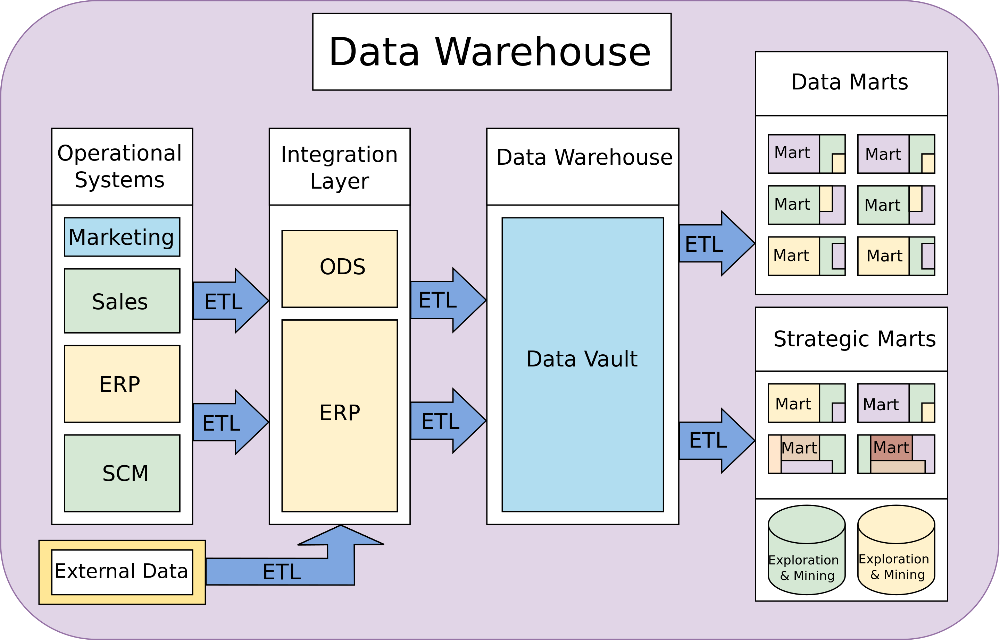

## 1 Introduction

In today's digital age, we generate vast amounts of data every day, from simple text messages and emails to complex files and transaction records. This data is invaluable to businesses, as it contains crucial information about customers, sales, and operations. For example, [FreshDirect](https://www.freshdirect.com/), a prominent online grocery store based in New York, has revolutionized the grocery shopping experience by utilizing customer purchasing data as a core component of its business strategy.

### 1.1 Background and Business Challenges

Founded in 2002, FreshDirect delivers fresh, high-quality groceries directly to customers' doors in the New York metropolitan area. The company has distinguished itself from traditional brick-and-mortar grocery stores through its comprehensive online platform and focus on convenience, quality, and customer satisfaction. A key element of FreshDirect's success lies in its strategic use of customer purchasing data. The grocery industry is highly competitive, with thin margins and complex logistics. Traditional grocery stores face challenges such as inventory management, waste reduction, personalized marketing, and customer retention. FreshDirect recognized early on that leveraging customer data could address these challenges and provide a competitive edge.

### 1.2 Data-Driven Business Operations

FreshDirect’s innovative approach to data-driven business operations has been instrumental in addressing various industry challenges. One significant area of impact is inventory management and demand forecasting. Managing perishable inventory and reducing waste are critical for profitability. FreshDirect uses historical purchasing data to forecast demand accurately. By analyzing trends and patterns in customer orders, the company optimizes inventory levels, ensuring that popular items are always in stock while minimizing overstock and spoilage. This approach not only reduces waste but also increases operational efficiency. For example, FreshDirect’s data-driven inventory system has reduced waste by approximately 30%, saving the company millions annually.

Enhancing the customer experience is another critical area where FreshDirect’s data-driven strategy shines. The company uses purchasing data to improve the user experience on its platform, offering personalized homepages, tailored product suggestions, and customized shopping lists. These features make it easier for customers to find what they need, enhancing their overall shopping experience. Additionally, data-driven insights into customer preferences allow FreshDirect to refine its product offerings continually, ensuring a diverse and appealing selection. As a result, FreshDirect has seen a 25% increase in customer satisfaction scores and a 10% boost in revenue.

Operational efficiency and cost savings are also achieved through FreshDirect’s strategic use of data. By leveraging data analytics, the company optimizes its delivery routes and schedules, understanding customer ordering patterns to plan efficient delivery routes. This optimization reduces fuel costs and delivery times, lowering operational costs while enhancing customer satisfaction through timely deliveries. FreshDirect’s data-driven delivery optimization has resulted in a 15% reduction in delivery times and a 12% decrease in fuel consumption.

[Youtube Video: FreshDirect's Secret Sauce](https://www.youtube.com/watch?v=sKvRhjWJkO4).

## 2 Database Management System (DBMS)

However, managing and processing this data efficiently and securely is a significant challenge. This is where databases come into play. A database is a systematic collection of data that is organized, stored, and managed in a way that allows for efficient retrieval and manipulation. The primary reason for having a database is to store and process large amounts of data in a structured and controlled environment. This enables businesses to make informed decisions, track transactions, and analyze customer behavior, all while ensuring the security and integrity of their data.

Without a database, managing and processing this data would be a daunting task. Imagine trying to sort through thousands of paper documents or searching through endless email threads to find a specific piece of information. Databases solve this problem by providing a centralized and organized system for storing and retrieving data. By using a database, businesses can:

- Store large amounts of data in a single location (virtually from a single location, physically the data can be in multiple locations)
- Easily retrieve and manipulate data as needed
- Ensure data consistency and accuracy
- Implement security measures to protect sensitive data
- Analyze and report on data to inform business decisions

### 2.1 Why Not File System?

File systems are designed for storing and retrieving files, not for processing transactional data. While file systems are excellent for storing large amounts of unstructured data, they lack the necessary features to support high-performance, concurrent, and fault-tolerant transactional data processing. One of the main reasons file systems are not suitable for transactional data processing is that they are not designed to handle concurrent access. In a transactional system, multiple users or applications need to access and update data simultaneously. File systems, however, are designed for sequential access, making them prone to bottlenecks and conflicts when multiple users try to access the same file simultaneously. Another reason file systems are not a good fit for transactional data processing is that they lack transactional consistency and durability. Transactional systems require that all changes be atomic, consistent, isolated, and durable (ACID). File systems, however, do not provide these guarantees, making it difficult to ensure data integrity and consistency in a transactional system.



Let's consider an example to illustrate this point. Suppose we have an e-commerce application that needs to process orders and update inventory levels in real-time. If we were to use a file system to store our transactional data, we might encounter the following issues:

- Concurrent access: Multiple users might try to access and update the same order file simultaneously, leading to conflicts and data corruption.
- Lack of transactional consistency: If an order is processed but the inventory update fails, the data becomes inconsistent, leading to incorrect inventory levels.
- Lack of durability: If the file system crashes or becomes corrupted, we risk losing all our transactional data.

In contrast, a database management system (DBMS) is designed specifically for transactional data processing. DBMS provides features like concurrency control, transactional consistency, and durability, making it an ideal choice for processing transactional data.

### 2.2 Database Management System (DBMS)

A Database Management System (DBMS) is a software solution that enables the efficient management and utilization of data. It serves as a bridge between users and databases, providing a platform for data storage, retrieval, and manipulation. The need for a DBMS arises from the complexities of managing large amounts of data, ensuring data integrity, and supporting multiple user access. Without a DBMS, data management becomes a daunting task, leading to data redundancy, inconsistency, and security breaches. A DBMS addresses these issues by providing a centralized framework for data management, ensuring data accuracy, security, and accessibility. The primary functions of a DBMS include:

- Data Definition: Defining database structure, including schema and relationships.
- Data Storage: Storing data in a secure and efficient manner.
- Data Retrieval: Providing mechanisms for data retrieval and querying.
- Data Manipulation: Allowing data insertion, update, and deletion.
- Data Security: Ensuring authorized access and preventing data breaches.
- Data Integrity: Maintaining data consistency and accuracy.
- Data Recovery: Restoring data in case of failures or errors.
- Performance Optimization: Ensuring efficient data processing and querying.
- Multi-User Access: Supporting concurrent access and managing user permissions.
- Data Backup and Recovery: Ensuring data safety and availability.

Data Retrieval and Data Manipulation are two essential functions of a Database Management System (DBMS), and together, they are often referred to as CRUD (Create, Read, Update, Delete). These functions enable users to interact with the database, accessing and modifying data as needed. The CRUD functions are:

- Create (Data Insertion): This function allows users to add new data to the database, such as inserting a new customer record or adding a new product to an e-commerce platform.
- Read (Data Retrieval): This function enables users to retrieve existing data from the database, such as querying customer information or fetching product details.
- Update (Data Modification): This function allows users to modify existing data in the database, such as updating a customer's address or changing a product's price.
- Delete (Data Deletion): This function enables users to remove data from the database, such as deleting an obsolete product or removing a customer record.

### 2.3 Transaction

A database transaction is a sequence of operations performed as a single logical unit of work. A transaction must exhibit four key properties, known as ACID properties: Atomicity, Consistency, Isolation, and Durability. We can understand these concepts better through the example of transferring $100 between two bank accounts.



- **Atomicity**: A transaction is an atomic unit of processing; it either fully completes or fully fails. When transferring $100 from Account A to Account B, the transaction includes two operations: debiting $100 from Account A and crediting $100 to Account B. Atomicity ensures that either both operations are completed successfully, or neither is done at all. If the system crashes after debiting Account A but before crediting Account B, the transaction will roll back, restoring Account A to its original state.
- **Consistency**: A transaction must transition the database from one valid state to another, maintaining database rules. For example, if Account A has $500 and Account B has $300 before the transfer, the total amount of money in both accounts combined should still be $800 after the transfer. Consistency ensures that the database rules, such as the total balance remaining the same, are not violated.
- **Isolation**: Transactions are executed in isolation from one another. Intermediate states of a transaction are not visible to other transactions. Suppose two transactions are happening simultaneously: transferring $100 from Account A to Account B and transferring $50 from Account B to Account C. Isolation ensures that these transactions do not interfere with each other. If Transaction 1 is not yet complete, Transaction 2 should not see the intermediate state where Account B has neither the original $300 nor the credited $100.
- **Durability**: Once a transaction has been committed, it will remain so, even in the event of a system failure. After successfully transferring $100 from Account A to Account B and committing the transaction, this change is permanent. If the system crashes after the commit, the database will remember that $100 has been transferred, and this information will not be lost.

Rollback is the process of undoing a transaction if it cannot be completed successfully. In our example, suppose the system crashes or encounters an error after deducting $100 from Account A but before adding it to Account B. The transaction system will initiate a rollback, which restores Account A's balance to its original amount of $500, ensuring that no partial changes are applied to the database. This maintains the database's integrity and consistency.

### Transaction Process in the Context of Money Transfer

1. **Ensure Isolation:** While the transaction is in progress, no other transaction can see the intermediate state where $100 has been deducted from Account A but not yet added to Account B.

2. **Begin Transaction:** The database starts a new transaction for transferring $100 from Account A to Account B. If any error happens before successful transaction commit, rollback all changes.

3. **Debit Operation (Part one of Atomicity):** The system deducts $100 from Account A. This step is part of the transaction.

4. **Credit Operation (Part two of Atomicity):** The system adds $100 to Account B. This step is also part of the same transaction.

5. **Commit Transaction (Durability):** Once both operations (debit and credit) are successfully completed and the database state is consistent, the transaction is committed. The changes are now permanent and will persist even if there is a system failure.

### 2.4 Data Models

The evolution of databases has led to the development of various types, each with its unique characteristics and advantages. The three main categories of databases are Relational, Document, and Key-Value databases, which have emerged over time to address specific data management needs.

Relational databases, first introduced in the 1970s by Edgar F. Codd, revolutionized data management with their table-based structure and SQL (Structured Query Language) interface. Relational databases follow the ACID principles to ensure data integrity and consistency. They are ideal for managing complex transactions, supporting business intelligence, and enforcing data relationships.

Popular relational databases include MySQL (open source), PostgreSQL (open source), Oracle, and SqlServer (Microsoft). Access is a relational DBMS for personal users. It doesn't have multi-user access control and security functions required by enterprise DBMS.

Document databases, also known as NoSQL databases, emerged in the late 1990s and early 2000s as a response to the limitations of relational databases. They store data in self-describing documents, such as JSON or XML, offering flexible schema design and high scalability. Document databases are optimized for modern web and mobile applications, handling large amounts of unstructured data. MongoDB, Couchbase, and RavenDB are popular document databases.

Key-Value databases have their roots in the 1960s and 1970s, with the development of simple database systems like Berkeley DB. However, modern Key-Value databases, such as Redis and Riak, have evolved to support high-performance, distributed, and in-memory storage. They excel in handling fast data retrieval, caching, and session management, making them ideal for real-time web applications and analytics.

## 3 Relational Database

The relational database has been the most widely used database management system in business applications for decades, and its popularity can be attributed to several key factors. High performance, high reliability, data integrity, and standard query language SQL are some of the reasons why relational databases have become the go-to choice for businesses.

Firstly, relational databases offer high performance, which is critical for businesses that require fast and efficient data processing. Relational databases use a structured query language (SQL) that allows for quick and easy data retrieval, making it ideal for applications that require real-time data processing.

Secondly, relational databases offer high reliability, which is essential for businesses that require continuous operation. Relational databases use transactions that ensure data consistency and integrity, even in the event of system failures or errors.

Thirdly, relational databases ensure data integrity, which is critical for businesses that require accurate and trustworthy data. Relational databases use constraints and triggers to ensure data consistency and accuracy, making it ideal for applications that require high data quality.

Lastly, relational databases use a standard query language SQL, which makes it easy for developers and users to transfer their skills between different relational database platforms. SQL is a widely adopted and standardized language that allows for easy data manipulation and retrieval, making it an ideal choice for businesses that require flexible and adaptable data management solutions.

In addition to these factors, relational databases offer a range of other benefits, including scalability, flexibility, and security. Relational databases can handle large amounts of data and scale horizontally by adding more servers, making them ideal for businesses that require high data storage and processing capacity. Relational databases also offer a range of security features, including user authentication and access control, making them suitable for businesses that require high data security.

### 3.1 Relational Model

A relational database organizes data into tables, also called relations. Other important concepts include keys, foreign keys, tuples, and data integrity. Each table consists of rows, also known as tuples, and columns, which represent attributes or fields. A key is a unique identifier for each tuple in a table. It ensures that each row has a distinct value, preventing duplication and ensuring data consistency. There are two types of keys: primary and foreign. The primary key is a unique identifier for each tuple, while the foreign key references the attribute that is a primary key of another table.

Consider a simple example of a university database with three tables: `Students`, `Courses`, and `Enrollments`. The `Students` table has attributes such as `student_id` (primary key), `first_name`, `last_name` and `email`, while the `Courses` table has attributes such as `course_id` (primary key) and `course_name`. The `Enrollments` table has three attributes: `enrollment_id`,`student_id` (foreign key), `course_code` (foreign key) and `grade`. A foreign keys in the `Enrollments` table establish a relationship between the three tables, indicating which students are enrolled in which courses.

Students Table:

| student_id (Primary Key) | first_name | last_name | email                  |
| ------------------------ | ---------- | --------- | ---------------------- |
| 123                      | John       | Smith     | <john.smith@email.com> |
| 456                      | Jane       | Doe       | <jane.doe@email.com>   |

Courses Table:

| course_id (Primary Key) | course_name                      |
| ----------------------- | -------------------------------- |
| CS101                   | Introduction to Computer Science |
| MATH101                 | Calculus                         |

Enrollments Table:

| enrollment_id (Primary Key) | course_id (Foreign Key) | student_id (Foreign Key) | grade |
| --------------------------- | ----------------------- | ------------------------ | ----- |
| 7283                        | CS101                   | 123                      | 85    |
| 7284                        | MATH101                 | 456                      | 90    |

Key Concepts

- Tables (Relations): tables are the primary structure in a relational database. Each table represents an entity (e.g., Students, Enrollments) and consists of rows and columns. Example: Students, Courses and Enrollments.
- Rows (Tuples): rows represent individual records in a table. Each row contains data for one entity. Example: in the Students table, a row represents a student. In relational database, each row must have be unique -- that's the reason that there is a `student_id` column there.
- Columns: columns represent the attributes of the entity. Each column has a specific data type and constraints. Example: in the Students table, columns include student_id, first_name, last_name, and email. One constraint is that email value must have an `@` to be a valid email address.
- Primary Key: a primary key is a unique identifier for each record in a table. It ensures that each row can be uniquely identified. Example: `student_id` in the Students table.
- Foreign Key: a foreign key is a field (or a collection of fields) in one table that uniquely identifies a row in another table. It is used to establish a relationship between the tables.Example: `student_id` in the Enrollments table is a foreign key referencing student_id in the Students table.

Data integrity is a critical aspect of the relational data model, ensuring that data is accurate, consistent, and reliable. There are several types of data integrity, including entity, referential, and domain integrity. Entity integrity ensures that each tuple has a unique primary key. The referential integrity ensures that foreign keys reference existing primary keys, eg, `student_id` values in the Enrollments table must be valid primary keys in Students table. Domain integrity ensures that data values conform to specified formats and ranges that are called constraints. Constraints are rules enforced on data columns to ensure data integrity. Examples include unique constraints (for example: each email must be unique), not null constraints (email can not be null/empty), and check constraints (email contains `@`).

### 3.2 SQL

SQL (Structured Query Language) is a programming language designed for managing and manipulating data stored in relational database management systems. It is a standard language for accessing, managing, and modifying data in relational databases. SQL is used to perform various operations such as creating, reading, updating, and deleting data in a database. These operations are commonly referred to as CRUD (Create, Read, Update, Delete) operations.

SQL (Structured Query Language) has been the cornerstone of database management for decades, and its popularity shows no signs of waning. In fact, SQL has become an essential tool for anyone working with data, from developers and analysts to scientists and researchers. But what makes SQL so popular, and why has it remained a staple in the industry for so long?

One reason for SQL's enduring popularity is its versatility. SQL can be used for a wide range of tasks, from simple data retrieval to complex data modeling and analysis. Its flexibility and power make it an ideal language for working with large datasets, and its ability to handle complex queries has made it a go-to tool for data professionals. Another reason for SQL's popularity is its ease of use. SQL has a simple and intuitive syntax, making it easy for beginners to learn and master. Additionally, SQL is a declarative language, meaning that users can focus on the results they want to achieve rather than the specific steps needed to get there. This makes it easier for users to write efficient and effective queries, even for complex tasks. SQL's popularity is also due to its widespread adoption. SQL is a standard language, and its use is not limited to any particular industry or platform. This means that SQL skills are transferable, and developers and analysts can use their knowledge of SQL to work with a variety of databases and systems. Furthermore, SQL's importance in data analysis and science has contributed to its popularity.

As data becomes increasingly important for businesses and organizations, the demand for professionals who can work with data effectively has grown. SQL is an essential tool for data professionals, and its popularity has grown as a result. To learn more, the [W3School](https://www.w3schools.com/sql/) has a good SQL tutorial.

Let's consider the Students, Courses, and Enrollments tables as an example. To create tables and perform CRUD operations on these tables, we can use the following SQL queries.

### 3.2.1 Creation Operations

```sql
CREATE TABLE Students (
    student_id INT PRIMARY KEY,
    first_name VARCHAR(50) NOT NULL,
    last_name VARCHAR(50) NOT NULL,
    email VARCHAR(100) UNIQUE NOT NULL
);

CREATE TABLE Courses (
    course_id INT PRIMARY KEY,
    course_name VARCHAR(100) NOT NULL
);

CREATE TABLE Enrollments (
    enrollment_id INT PRIMARY KEY,
    student_id INT,
    course_code INT(10),
    grade INT CHECK (grade >= 0 AND grade <= 100),
    FOREIGN KEY (student_id) REFERENCES Students(student_id),
    FOREIGN KEY (course_code) REFERENCES Courses(course_id)
);
```

### 3.2.2 Creation Operations

````sql
-- Insert data into Students table
INSERT INTO Students (student_id, first_name, last_name, email) VALUES
(1, 'John', 'Doe', 'john.doe@example.com'),
(2, 'Jane', 'Smith', 'jane.smith@example.com');

-- Insert data into Courses table
INSERT INTO Courses (course_id, course_name) VALUES
(101, 'Computer Science 101'),
(202, 'Mathematics 202');

-- Insert data into Enrollments table
INSERT INTO Enrollments (enrollment_id, student_id, course_code, grade) VALUES
(1, 1, 101, 85),
(2, 2, 202, 90);
```sql

### 3.2.3 Read Operations

```sql
-- Select all students
SELECT * FROM Students;

-- Select all courses
SELECT * FROM Courses;

-- Select all enrollments
SELECT * FROM Enrollments;

-- Select student details with their enrollments
SELECT s.student_id, s.first_name, s.last_name, c.course_name, e.grade
FROM Students s
JOIN Enrollments e ON s.student_id = e.student_id
JOIN Courses c ON e.course_code = c.course_id;

-- Select students enrolled in a specific course
SELECT s.first_name, s.last_name
FROM Students s
JOIN Enrollments e ON s.student_id = e.student_id
WHERE e.course_code = 101;
````

### 3.2.3 Update Operations

```sql
-- Update a student's email
UPDATE Students
SET email = 'john.newemail@example.com'
WHERE student_id = 1;

-- Update a course name
UPDATE Courses
SET course_name = 'Advanced Computer Science 101'
WHERE course_id = 101;

-- Update a student's grade in a course
UPDATE Enrollments
SET grade = 95
WHERE enrollment_id = 1;
```

### 3.2.4 Delete Operations

```sql
-- Delete a student (and their enrollments due to foreign key constraint)
DELETE FROM Students
WHERE student_id = 2;

-- Delete a course
DELETE FROM Courses
WHERE course_id = 202;

-- Delete an enrollment
DELETE FROM Enrollments
WHERE enrollment_id = 1;
```

## 3.3 SQL Transaction

An important feature of relational DBMS is transaction processing. Following is an example that performs a money transfer transaction in real SQL statements: all operations between the `BEGIN TRANSACTION;` and `COMMIT TRANSACTION;` will be processed as an atomic operation: either all are done or nothing happen where there is an error.

```sql
-- Step 1: Ensure Isolation
-- Isolation is ensured by the transaction management system. No need to explicitly write SQL for this.
-- However, setting the appropriate isolation level can be done if needed.
-- For example:
SET TRANSACTION ISOLATION LEVEL SERIALIZABLE;

-- Step 2: Begin Transaction, if any error happens before successful transaction commit, rollback all changes.
BEGIN TRANSACTION;

-- Step 3: Debit Operation (Part one of Atomicity)
UPDATE Accounts
SET balance = balance - 100
WHERE account_id = 'Account_A';

-- Step 4: Credit Operation (Part two of Atomicity)
UPDATE Accounts
SET balance = balance + 100
WHERE account_id = 'Account_B';

-- Step 5: Commit Transaction (Durability)
COMMIT TRANSACTION;
```

### 3.4 Popular RDBMS

- MySQL: Open source, high performance and widely used for web applications (LAMP stack).
- PostgreSQL: Open source, highly extensible with support for complex queries, JSON, and full-text search.
- Oracle Database: Enterprise-grade with high performance, scalability, and security.
-Microsoft SQL Server: Deep integration with Microsoft products (Azure, Power BI, .NET).
- SQLite: Open source, lightweight, and ideal for mobile apps and embedded systems.

## 4 Data Warehouse and Big Data

The advent of Database Warehouses and Big Data has revolutionized the way we store, manage, and analyze data. A Database Warehouse is a centralized repository that stores data from various sources, making it easily accessible for analysis and reporting. Big Data, on the other hand, refers to the large and complex sets of data that traditional databases cannot handle.

### 4.1 Data Warehouse

A Data Warehouse is designed to support business intelligence (BI) activities, such as data analysis and reporting. It provides a single, unified view of an organization's data, making it easier to make informed decisions. A Data Warehouse typically consists of dimensions and facts. Dimensions provide context to the data, such as time, location, and product category, while facts represent the data being measured, such as sales amount and number of units sold.

The benefits of using a Data Warehouse are numerous. Firstly, it enables improved decision-making by providing a comprehensive view of an organization's data. Secondly, it increases efficiency by automating the process of consolidating and analyzing data.

To illustrate the application of a Data Warehouse, let us consider a retail company that wants to analyze its sales data. The company has multiple stores, each with its own database of sales transactions. To analyze sales data across all stores, the company creates a Data Warehouse that consolidates data from each store's database. The Data Warehouse contains dimensions such as store location, product category, and time period, and facts such as sales amount and number of units sold. With this Data Warehouse, the company can easily generate reports and perform analysis, such as sales by store location, sales by product category, and sales trend over time.

One of the key features of a data warehouse is its ability to store aggregated data, which plays a crucial role in facilitating data analysis. Aggregated data refers to the summary of large datasets into smaller, more manageable chunks. This summary can be in the form of totals, averages, counts, or other calculations. In a data warehouse, aggregated data is stored in fact tables, which are optimized for querying and analysis. The use of aggregated data in a data warehouse offers several benefits for data analysis. It enables fast querying and analysis of large datasets. By pre-aggregating data, analysts can quickly retrieve summary-level data without having to scan the entire detailed dataset. This saves time and resources, making data analysis more efficient.
Aggregated data also enables drill-down capabilities, allowing analysts to explore data in more detail. For instance, an analyst may start with a high-level view of sales data by region and then drill down to see sales by individual stores or products. aggregated data supports data visualization tools, making it easier to represent complex data insights. Analysts can create charts, graphs, and other visualizations to communicate findings more effectively.

Following is an architecture of typical data warehouse system.



A data warehouse has the following components:

- ETL (Extract, Transform, Load): ETL is a process used to extract data from multiple sources, transform the data into a standardized format, and load it into a target system such as a data warehouse.
- Data Vault: Data Vault is a data warehousing architecture that focuses on storing data in a raw, untransformed form.
- Data Marts: Data Marts are subsets of a data warehouse, designed to serve a specific business need or department. They are typically built on top of a Data Vault and contain transformed data, making it easier for business users to access and analyze the data

### 4.2 Big Data

Big Data refers to the vast and complex sets of data that traditional data processing tools and techniques cannot manage due to their large size, variety, and speed of generation. It is defined by its four V model that includes Volume, Variety, Velocity, and Veracity. Volume refers to the vast amount of data generated, while Variety encompasses the different types of data, such as structured, semi-structured, and unstructured from various sources. Velocity deals with the speed at which data is generated and processed, often in real-time. Veracity addresses the accuracy, quality, and trustworthiness of the data. Managing these aspects involves challenges like efficient storage, integration of diverse formats, rapid processing, and ensuring data reliability to derive meaningful and trustworthy insights.

Big Data includes structured, semi-structured, and unstructured data, such as social media data, sensor data, and text data.

## 5 Cloud Database

The advent of cloud computing has revolutionized the way we store, manage, and analyze data. The traditional methods of data management, which were often cumbersome and prone to errors, have been replaced by the cloud database, a more efficient and effective way of handling data. More and more companies are turning to cloud databases for their scalability, reliability, and reduced management effort.

One of the key benefits of cloud databases is their scalability. With traditional databases, scaling up or down to meet changing data needs was a complex and costly process. In contrast, cloud databases can be scaled quickly and easily, without the need for expensive hardware upgrades or new hardware purchases. This makes it easy for businesses to adapt to changing demands and ensure that their database can handle sudden spikes in traffic or data growth.

Another advantage of cloud databases is their reliability. Traditional databases were often prone to downtime and data loss, which could have serious consequences for businesses. Cloud databases, on the other hand, offer built-in redundancy and 24/7 uptime, ensuring that data is always available and accessible. This is especially important for businesses that rely on their database to operate, such as e-commerce sites or social media platforms.

In addition to scalability and reliability, cloud databases also offer reduced management effort. With traditional databases, managing and maintaining the database was a time-consuming and labor-intensive process. Cloud databases, on the other hand, are managed and maintained by the cloud provider, freeing up businesses to focus on other tasks. This reduces the administrative burden on businesses and allows them to allocate resources more efficiently.

Cloud service providers such as Microsoft Azure, Amazon Web Service (AWS), and Google Cloud offer a range of cloud databases. These databases provide high performance, scalability, and reliability, making them ideal for businesses that require real-time data processing and analytics. The benefits of using cloud databases from these providers include reduced costs, increased scalability, and improved reliability. Users can choose the database that best fits their needs, and easily scale up or down as required. Additionally, cloud databases provide automatic software updates, backups, and security, freeing up users to focus on their applications and business.

## 6 Two Cases

### 6.1 U.S. Flights Grounded Due to FAA System Failure

On January 11, 2023, a major disruption affected air travel across the United States when the Federal Aviation Administration (FAA) ordered a nationwide ground stop. Thousands of flights were delayed or canceled due to a critical failure in the Notice to Air Missions (NOTAM) system, which provides essential safety information to pilots. Over 11,000 flights were delayed, and more than 1,300 flights were canceled. Passengers across the country faced long wait times and travel disruptions.

The FAA later reported that the issue was caused by a damaged database file. During routine maintenance, a corrupted file affected both the primary and backup systems, leading to a system-wide failure. This failure prevented the distribution of vital flight safety updates, making it unsafe for aircraft to operate.

### 6.2 Slow Query That Almost Took Down a Bank

In the late 1990s, a large international bank was undergoing a major digital transformation. They were moving from a legacy system to a modern relational database to handle millions of daily transactions. The project was ambitious: a relational database would allow them to scale, ensure consistency, and improve query performance.

Everything seemed fine—until one day, seemingly out of nowhere, the entire system began slowing down. ATM withdrawals took minutes to process, online banking sessions timed out, and internal reports that previously ran in seconds now took hours.

The IT team scrambled to figure out the problem. At first, they blamed hardware issues, but everything checked out fine. Then they suspected network latency, but other applications were working smoothly. Finally, the database administrators (DBAs) dove into the system logs and found something terrifying: a single SQL query was consuming an overwhelming amount of system resources. A junior developer had written a query to generate daily transaction reports:

```sql
SELECT * FROM transactions WHERE transaction_date = '1999-07-15';
```

At first glance, this seemed like a harmless query. But in reality, it had disastrous consequences:

- No Index on `transaction_date` – Since the transactions table contained millions of records, scanning it sequentially was extremely slow.
- `SELECT *` – The query was retrieving every single column, including large text fields and unnecessary metadata.

Because this query was executed every few minutes for reporting purposes, it bogged down the entire database, causing transactions to queue up. ATM withdrawals, online banking, and teller operations were all affected, leading to frustrated customers and significant financial losses.

The DBA team made three key changes:

- Added an Index – They created an index on transaction_date, allowing the database to retrieve relevant records much faster. `CREATE INDEX idx_transaction_date ON transactions(transaction_date);`
- Optimized the Query – Instead of using `SELECT *`, they rewrote the query to fetch only the necessary columns. `SELECT transaction_id, amount, account_id FROM transactions WHERE transaction_date = '1999-07-15';`
- Implemented Query Caching – Since the report only needed to be updated once an hour, they cached results instead of running the query repeatedly.

After these fixes, the query execution time dropped from several minutes to milliseconds, and the banking system returned to normal. This story is a classic example of how bad database design and inefficient queries can cripple an entire system.
