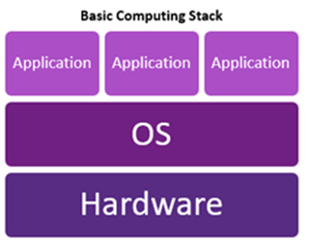
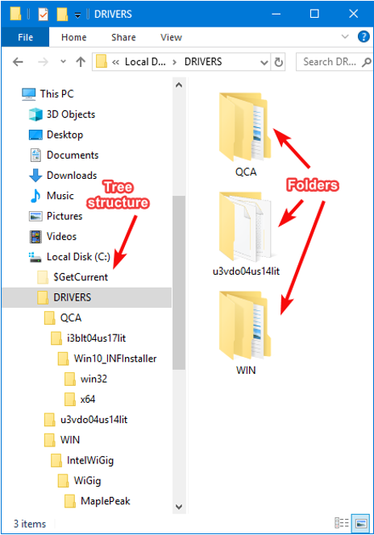
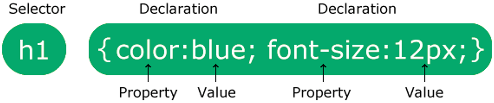
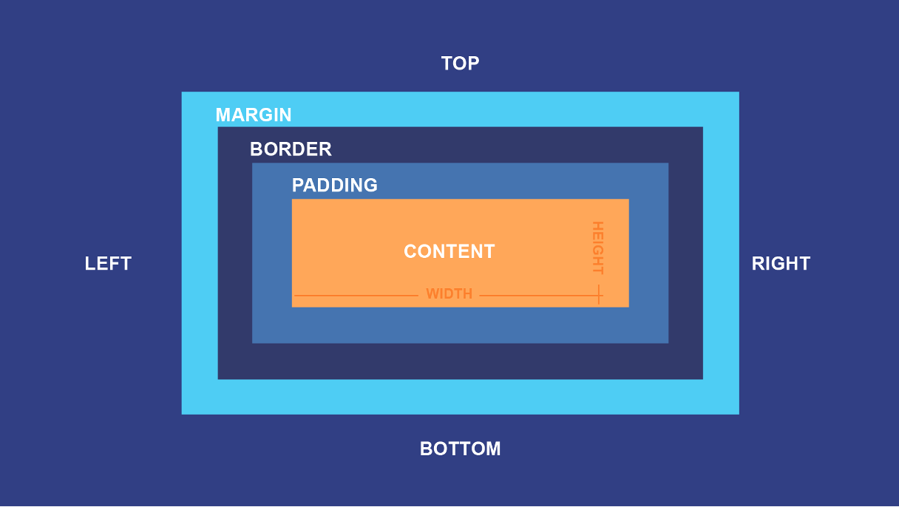
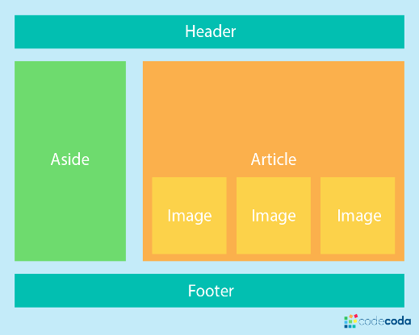

## 1 Introduction

### 1.1 The Basic Computing Stack

Software applications do not run in isolation; they exist within a layered computing hierarchy:



* **Hardware**: The physical computational and storage machinery (Personal Computers, Laptops, Smartphones, Cloud Data Center Servers, CPUs, RAM, and SSDs).
* **Operating System (OS)**: System software (such as Microsoft Windows, macOS, and Linux) that acts as the intermediary between raw hardware and user-facing software, managing system memory, file access, hardware drivers, and security.
* **Applications**: User-level programs executed on top of the OS (e.g., Google Chrome, Microsoft Office, VS Code, and custom business applications).

### 1.2 Data Organization & Hierarchical File Systems

Web servers and local development environments rely on **hierarchical tree structures** for organizing files and directories.



* **Root and Subdirectories**: Folders branch downward from parent directories into child folders.
* **File Extensions**: The suffix at the end of a filename (such as `.html`, `.css`, `.js`) signals file type and MIME association to both the Operating System and web browsers.

### 1.3 Development Environment: Why Text Editors / IDEs Matter

Standard word processors (e.g., Microsoft Word, PowerPoint) embed proprietary rich-text binary formatting and metadata that break web runtimes. Web development requires pure, unadorned plaintext editors.

* **Integrated Development Environment (IDE)**: Professional software that bundles source code editing with development productivity tooling:
  * **Syntax Highlighting**: Color-codes language keywords, strings, tags, and attributes.
  * **IntelliSense & Autocompletion**: Predicts tags, parameters, and variable names.
  * **Live Error Diagnostics**: Highlights syntax flaws and unclosed tags in real-time.
  * **Integrated Terminal & Debugger**: Runs and tests scripts directly within the workspace.
* **Visual Studio Code (VS Code)**: The industry standard development environment:
  * *VS Code for Web* (`https://vscode.dev`): Lightweight, browser-based editor.
  * *VS Code Desktop Application*: Full-featured local install with native file system access and plugin ecosystems.

## 2: HTML: The Content

### 2.1 The Anatomy of a Web Page

Every web document follows a standardized hierarchical markup structure defined by the World Wide Web Consortium (W3C):

```html
<!DOCTYPE html>
<html lang="en">
  <head>
    <meta charset="UTF-8">
    <title>IS300 Web Site</title>
  </head>
  <body>
    <h1>Welcome to Web Development</h1>
    <p>This is where visible page content lives.</p>
  </body>
</html>
```

#### Core Components Breakdown

* `<!DOCTYPE html>`: Document type declaration instructing the browser engine to render the document using modern **HTML5 standards mode**.
* `<html>...</html>`: The root container encapsulating all document code.
* `<head>...</head>`: The metadata container housing machine-readable configuration:
  * `<title>`: Specifies the document title shown in browser tabs and search engine results.
  * `<meta>`: Sets character encoding (UTF-8), viewport scaling for mobile responsiveness, and SEO keywords.
  * `<link>` & `<style>`: Imports external style sheets and internal CSS rules.
  * `<script>`: Imports or embeds client-side JavaScript.
* `<body>...</body>`: Contains all renderable content visible to the end user.

### 2.2 Essential HTML Elements & Semantic Markup

* **Emmet Abbreviations**: Typing `!` followed by `Tab` in VS Code automatically expands into a complete, standard HTML5 boilerplate.
* **Headings**: `<h1>` down through `<h6>` define hierarchical typography in descending visual prominence and semantic importance.
* **Structural Containers**:
  * `<p>`: Paragraphs of running text.
  * `<div>`: Generic division / block-level styling container.
  * `<ul>` & `<li>`: Unordered (bulleted) lists and individual list items.

### 2.3 HTML Attributes & Resource Addressing (URLs)

Attributes provide configuration metadata to opening tags using standard `name="value"` key-value pairs.

```html

<a href="https://www.google.com" target="_blank">Search Google</a>
```

#### Uniform Resource Locators (URLs)

* **Absolute URLs**: Provide full network paths including protocol and domain name (`https://images.freeimages.com/example.jpg`). Used for external third-party assets.
* **Relative URLs**: Specify resource locations relative to the current site root or file directory (`/images/dog.jpg`, `../styles/main.css`). Used for local assets.

### 2.4 User Input: Interactive Forms

HTML forms capture user input and submit payloads to processing server endpoints:

```html
<form action="/action_page.php" id="form1">
  <label for="fname">First name:</label><br>
  <input type="text" id="fname" name="fname"><br>
  
  <label for="lname">Last name:</label><br>
  <input type="text" id="lname" name="lname"><br>
  
  <input type="submit" value="Submit Form">
</form>
```

* `id` Attribute: Assigns a globally unique identifier to an element within the DOM (Document Object Model).
* `name` Attribute: Identifies the form parameter key submitted in HTTP requests.

## 3 CSS: Styling & Layout Engineering

### 3.1 CSS Rule Anatomy

CSS applies formatting rules to targeted HTML elements using a declarative syntax:



A CSS rule consists of:

1. **Selector**: Specifies which HTML element(s) to style (e.g., `h1`).
2. **Declaration Block**: Enclosed in curly braces `{ ... }`, containing one or more declarations separated by semicolons.
3. **Property & Value**: Each declaration pairs a CSS property name (e.g., `color`, `font-size`) with a valid measurement or keyword value (e.g., `blue`, `12px`).

### 3.2 CSS Selectors & Combinators

* **Element Selector**: Targets all matching HTML tag types:

  ```css
  p { color: red; }
  ```

* **ID Selector (`#`)**: Targets a single element with a matching unique `id`:

  ```css
  #para1 { color: red; }
  ```

* **Class Selector (`.`)**: Targets all elements sharing a specific reusable `class` attribute:

  ```css
  .center { text-align: center; color: red; }
  ```

* **Grouping & Combinator Selectors**:

  ```css
  /* Grouping: Applies to h1, h2, and p */
  h1, h2, p { text-align: center; color: red; }

  /* Specificity Combinator: Applies only to p elements with class="center" */
  p.center { text-align: center; color: red; }
  ```

### 3.3 Methods of Applying Styles

1. **Inline Styles**: Declared directly in element opening tags (`<p style="color:red;">`). *Discouraged due to poor maintainability.*
2. **Internal Styles**: Declared inside `<style>` blocks in the `<head>` tag. *Useful for single-page isolated prototypes.*
3. **External Stylesheets (Industry Best Practice)**: Linked via `<link rel="stylesheet" href="style.css">`. Promotes strict separation of concerns, page caching, and site-wide reusability.

### 3.4 The CSS Box Model

Every renderable HTML element is interpreted by browser rendering engines as a modular rectangular box composed of four concentric layers:



1. **Content**: The inner rectangular area where text, images, and nested elements appear (sized by `width` and `height`).
2. **Padding**: The clear space immediately surrounding the content area, sitting inside any borders.
3. **Border**: The stroke or line wrapped around the padding and content.
4. **Margin**: The outermost transparent buffer space separating the element's border from adjacent elements on the page.

#### Code Demonstration

```css
h2 {
  background-color: lightgrey;
  width: 300px;
  border: 15px solid green;
  padding: 50px;
  margin: 20px;
}
```

### 3.5 Modern Layout Architecture: Flexbox

Modern web pages avoid rigid, table-based layouts in favor of flexible, multi-device layouts such as **Flexbox** and **CSS Grid**:



* **Header**: Global top-level branding and navigation banner.
* **Aside**: Sidebar container for auxiliary navigation, secondary links, or metadata.
* **Article / Main**: Primary thematic body content area enclosing dynamic components (such as image grids or article feeds).
* **Footer**: Global bottom section for legal disclaimers, copyrights, and sitemaps.

## 4 JavaScript & Programming Fundamentals

### 4.1 Role of JavaScript in Modern Web Systems

JavaScript provides runtime client-side execution, handling:

* User interface events (button clicks, form validations, keyboard events).
* Dynamic DOM manipulation (modifying HTML content and CSS classes on the fly).
* Asynchronous network requests (fetching data in the background via APIs without page reloads).

### 4.2 Programming Language Execution Models

Programming languages translate human-readable logic into machine-executable instructions through three primary execution paradigms:

| Category | Execution Mechanism | Common Languages | Web Context |
| :--- | :--- | :--- | :--- |
| **Interpreted / Scripting** | Code is interpreted and executed dynamically line-by-line by a Virtual Machine engine. | JavaScript, Python, PHP | V8 Engine inside Chrome executes JS. |
| **Compiled** | Source code is converted ahead-of-time by a compiler into direct machine-code binaries. | C, C++, Rust | High-performance system utilities and game engines. |
| **Hybrid / Bytecode** | Source code compiles to intermediate bytecode, executed inside a language runtime / VM. | Java, C#, Kotlin | Enterprise backend business services. |

### 4.3 Universal Programming Control Structures

1. **Sequential Execution**: Instructions execute in top-to-bottom order.
2. **Branching (Conditionals)**: Evaluating boolean logic expressions (`if (condition) { ... } else { ... }`).
3. **Loops (Iteration)**: Repeating execution blocks until conditions terminate (`while`, `for`).
4. **Functions**: Modular, reusable subroutines grouping related instruction sets together.

### 4.4 JavaScript Implementation Strategies

#### A. Inline Event Handlers

```html
<button type="button" onclick="document.getElementById('demo').innerHTML = 'Hello World!'">
  Say Hello
</button>
<p id="demo"></p>
```

#### B. Internal `<script>` Block

```html
<p id="demo"></p>
<script>
  document.getElementById("demo").innerHTML = "Hello World!";
</script>
```

#### C. Head Functions vs. Bottom-of-Body Scripts

```html
<!DOCTYPE html>
<html>
<head>
  <script>
    // Functions defined in head are loaded in memory before DOM rendering
    function updateGreeting() {
      document.getElementById("demo").innerHTML = "Hello World!";
    }
  </script>
</head>
<body>
  <h2>Head Script Example</h2>
  <p id="demo">Original Text</p>
  <button type="button" onclick="updateGreeting()">Click Me</button>
</body>
</html>
```

* **Scripts in `<head>`**: Executed before the HTML document body has parsed. Suitable for configurations or background data pre-fetching.
* **Scripts before `</body>`**: Recommended for DOM-manipulating scripts, ensuring HTML elements are fully parsed before scripts query or modify them.
* **External Script Files (`<script src="script.js"></script>`)**: Standard for production applications, maintaining clean separation of business logic from presentation.

## 5 Enterprise Perspective — Dynamic Web Applications

In contemporary software architecture, virtually **100% of commercial enterprise websites** are not static handwritten HTML files. Instead, they are generated dynamically by **Web Applications** (built with frameworks in JavaScript/Node.js, Python, Java, or C#). These server applications query relational and distributed databases, enforce access control, and construct responsive HTML/CSS/JS payloads on the fly for client browsers.

## Student Review & Practice Questions

1. **Architecture**: Differentiate between the distinct roles of HTML, CSS, and JavaScript in web applications.
2. **CSS Box Model**: If an element has a specified `width` of 300px, `padding` of 50px on all sides, `border` of 15px, and `margin` of 20px, what is the total horizontal layout footprint occupied by this element?
3. **Script Placement**: Why is it frequently recommended to place `<script>` tags that interact with DOM elements at the very bottom of the `<body>` element rather than inside `<head>`?
4. **CSS Selectors**: Contrast the intended use case of an ID selector (`#header`) versus a Class selector (`.highlight`).
