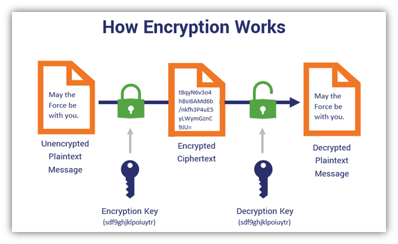
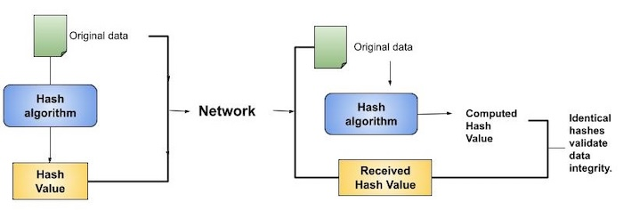
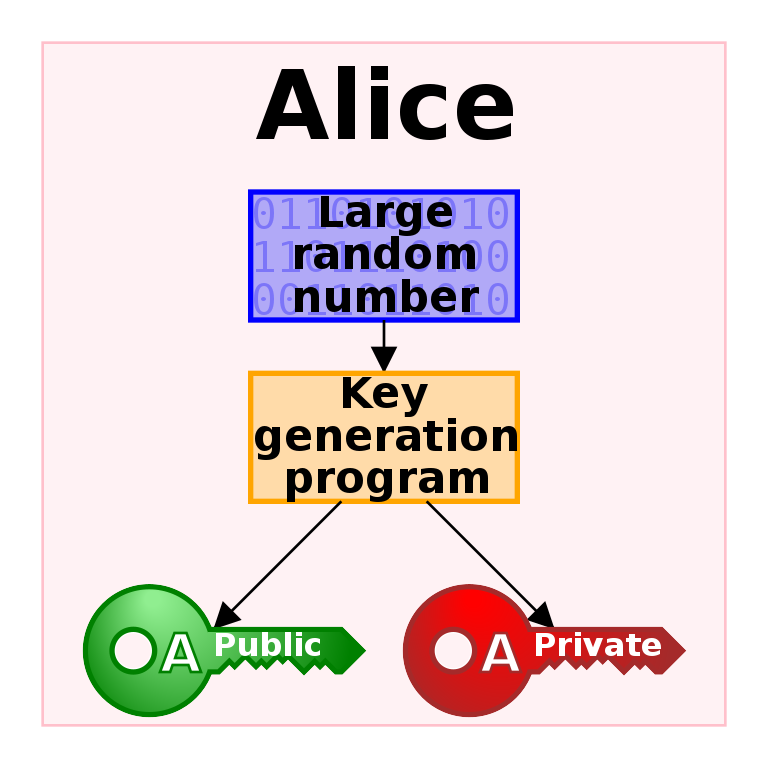
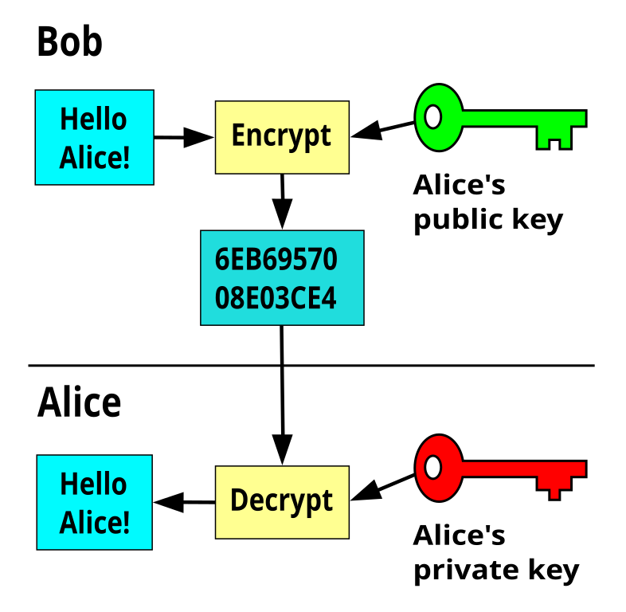
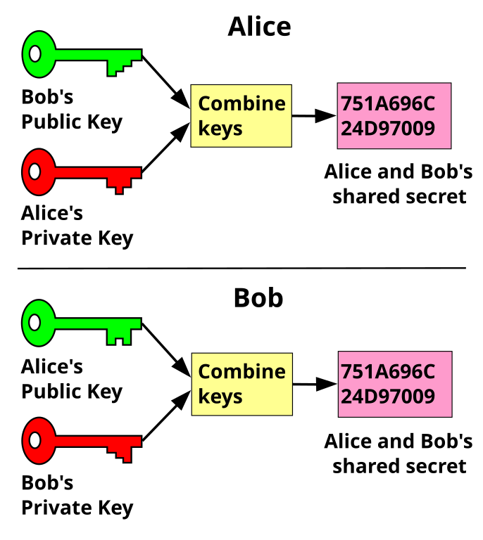
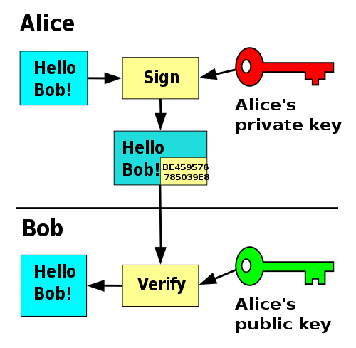
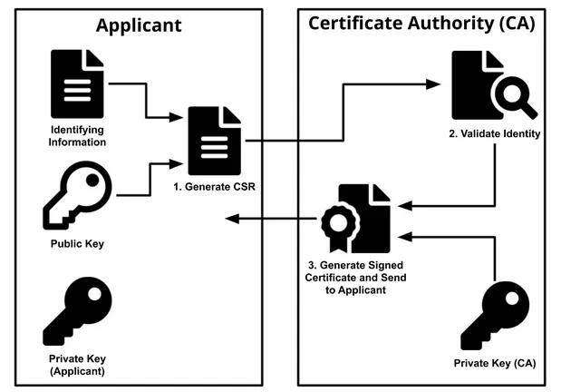

## 1 Symmetric Encryption

Symmetric encryption is a type of cryptography that uses the same secret key for both encryption and decryption. This means that the key used to lock the information is the same key used to unlock it. Symmetric encryption algorithms are fast, efficient, and widely used in various applications, including secure web browsing, email encryption, and digital signatures.

The process of symmetric encryption involves three main steps: plaintext, encryption, and decryption. The original information or data that needs to be protected is referred to as plaintext. The plaintext is then combined with the secret key using a mathematical algorithm, resulting in ciphertext. Finally, the ciphertext is combined with the same secret key using the same algorithm, restoring the original plaintext.

[Source: Symmetric Encryption 101](https://www.thesslstore.com/blog/symmetric-encryption-101-definition-how-it-works-when-its-used/)

Symmetric encryption has been a cornerstone of modern cryptography, providing confidentiality and integrity to data. Three algorithms have played a significant role in shaping the landscape of symmetric encryption: Data Encryption Standard (DES), Triple Data Encryption Algorithm (Triple DES), and Advanced Encryption Standard (AES).

- Data Encryption Standard (DES): introduced in 1976, DES was the first widely adopted symmetric encryption algorithm. Developed by IBM, DES uses a 56-bit key and operates on 64-bit blocks. Its simplicity and speed made it an attractive choice for various applications. However, its short key length and vulnerability to brute-force attacks led to its eventual deprecation. DES was a pioneering effort in standardizing symmetric encryption. Its widespread adoption and use in various industries paved the way for future algorithms.
- Triple Data Encryption Algorithm (Triple DES): introduced in the late 1990s, aimed to address DES's security concerns. It uses three separate 56-bit keys, effectively increasing the key length to 168 bits. This enhancement provided better security, but its performance was slower due to the multiple encryption and decryption processes. Triple DES served as a transitional algorithm, bridging the gap between DES and more secure alternatives.
- Advanced Encryption Standard (AES): introduced in 2001, revolutionized symmetric encryption. AES uses a variable key length (128, 192, or 256 bits) and operates on 128-bit blocks. Its efficiency, security, and flexibility have made it the de facto standard for various applications, including data storage and online transactions. It is a modern algorithm used by HTTPS and SSH. HTTPS (Hypertext Transfer Protocol Secure) is a secure version of the HTTP protocol used for transferring data over the internet, using encryption and authentication to protect the integrity and confidentiality of online communications. SSH (Secure Shell) is a cryptographic network protocol used for secure remote access to a computer or server. It allows users to securely access and manage remote systems, transfer files, and run commands as if they were sitting in front of the remote machine.

Despite its advantages, such as speed and efficiency, symmetric encryption has two significant drawbacks that need to be addressed. A major challenge with symmetric encryption is securely distributing the secret key to all parties involved. This key must be kept confidential and secure, as its compromise would render the entire encryption process useless. Managing the keys becomes increasingly complex as the number of users grows. Each pair of users needs a unique key, leading to a large number of keys that must be securely stored and managed. Symmetric encryption does not provide non-repudiation. Since the same key is used for both encryption and decryption, it is impossible to prove which party encrypted the message, making it unsuitable for scenarios where proof of origin is required.

Let's consider a scenario where a group of 10 people need to communicate securely with each other using symmetric encryption.
To share the symmetric key, they could try the following approaches:

- Meet in person: This would require each person to meet with every other person individually, resulting in 45 separate meetings (10 people x 9 others = 90, but since each meeting involves two people, we divide by 2).
- Share via email or messaging: This would require each person to send the key to every other person, resulting in 45 separate key transmissions as meet in person. However, this method is insecure since the keys could be intercepted or compromised during transmission.
- Use a central key server: This would require each person to trust the key server and connect to it to retrieve the shared key. However, this creates a single point of failure and a potential target for attacks.

As the number of users increases, the complexity of sharing symmetric keys grows exponentially. In a larger group, managing and securing the key exchange process becomes impractical. For example, with 100 users, each person would need to share the key with 99 others, resulting in 4,950 separate key exchanges (100 people x 99 others = 9,900, but since each exchange involves two people, we divide by 2). This highlights the scalability issue with sharing symmetric keys in large groups. In Internet that has millions of businesses and billions of users, sharing symmetric key is a an impossible mission. Asymmetric encryption and public-key cryptography offer a more efficient and secure solution for key exchange and management. Public key cryptography is often used with hashing algorithm for digital signature, thus we introduce the hashing algorithm first.

## 2 Hashing Algorithms

Hashing algorithms are a fundamental component of modern cryptography, playing a crucial role in ensuring data integrity, authenticity, and security. A hashing algorithm is a mathematical function that takes input data of any size and generates a fixed-size output, known as a hash value or digest. This output is unique to the input data and is designed to be **irreversible**, meaning it is computationally infeasible to recreate the original input data from the hash value. The key characteristic of a hashing function is that it is a one-way function, meaning it is:

- Deterministic: Given the same input, it always produces the same output.
- Non-invertible: It is computationally infeasible to reverse-engineer the original input from the output hash value.

### 2.1 Hashing Algorithm Applications

#### 2.1.1 Data Integrity

Hashing ensures that data is not tampered with or altered during transmission or storage. For instance, when downloading a software update, a hash value is generated and sent along with the update. The recipient can recalculate the hash value and compare it with the sent value to ensure the update was not tampered with during transmission. An example is software downloading introduced in the next section.

#### 2.1.2 Password Storage

Hashing is used to store passwords securely, making it difficult for attackers to obtain the original password. When a user creates a password, a hash value is generated and stored instead of the actual password. When the user logs in, the input password is hashed and compared with the stored hash value to authenticate the user. This way, even if an attacker gains access to the stored hash values, they cannot obtain the original passwords.

[Source: Authgear](https://www.authgear.com/post/password-hashing-salting)

`bcrypt` in the above picture is a popular password hashing function because it allows the computational cost to be increased as computational power grows, enhancing security.

### 3.2 The Role of Hashing in Ensuring Data Integrity: A Case Study on Downloading Software

Data integrity is a critical aspect of ensuring the reliability and trustworthiness of digital information. With the increasing reliance on digital systems, it is essential to guarantee that data remains unaltered and uncorrupted during transmission and storage. Hashing is a widely used technique that plays a vital role in ensuring data integrity.

When downloading software, it is crucial to ensure that the file is not tampered with or altered during transmission. Hashing provides a robust solution to this problem. On the server-side, a hash value is generated using a hashing algorithm, such as `SHA-256`, for the software update file. This hash value is a unique digital fingerprint that represents the file's contents. The server then sends the software update file and the corresponding hash value to the client. The hash value is made public to all in a trustable place such as the software company's web site.

On the client-side, the received software update file is recalculated to generate a new hash value. This recalculated hash value is then compared with the received hash value from the server. If the comparison matches, it ensures that the software update file was not tampered with or altered during transmission. However, if the comparison does not match, it indicates that the file was modified or corrupted during transmission, and the client can alert the user or take appropriate action.

[Source: Tutorial Point](https://www.tutorialspoint.com/cryptography/cryptography_hash_functions.htm)

For example, the download page of the popular open source [Apache Web server](https://httpd.apache.org/download.cgi) lists hash codes for different hashing algorithms.

## 3 Asymmetric Encryption

In the realm of cryptography, asymmetric encryption has emerged as a game-changer, offering unparalleled security and flexibility in secure communication. Unlike its symmetric counterpart, which relies on a shared secret key, asymmetric encryption employs a pair of keys: one public and one private. This innovative approach has transformed the way we protect sensitive information, enabling secure communication over public channels. Asymmetric encryption offers several advantages over symmetric encryption. Firstly, it eliminates the need for a shared secret key, making it ideal for scenarios where secure key exchange is challenging. Secondly, it enables digital signatures, allowing individuals to authenticate the source and integrity of messages. Finally, it facilitates key exchange and secure communication over public channels, such as the internet.

One of the most popular asymmetric encryption algorithms is RSA, widely used for secure web browsing, email encryption, and digital signatures. Other notable algorithms include Elliptic Curve Cryptography (ECC) and PGP (Pretty Good Privacy). Secure Web Browsing (HTTPS) is based on ECC to provide encryption and authentication for Web.

### 3.1 Key Concepts

The fundamental principle of asymmetric encryption is based on the concept of key pairs. A user first generate a pair of keys that consists of a public key and a private key from a large random number.

[Source: Wikipedia](https://en.wikipedia.org/wiki/Public-key_cryptography)

#### 3.1.1 Public Key

A public key is a cryptographic key that is freely accessible to anyone. It is used for encryption, allowing anyone to send secure messages to the owner of the corresponding private key. Public keys are typically shared openly and are used to encrypt data, verify digital signatures, and establish secure connections. Characteristics of Public Keys:

- Publicly available
- Used for encryption
- Not sensitive, shared openly

#### 3.1.2 Private Key

A private key, on the other hand, is a cryptographic key that is kept confidential and secure. It is used for decryption, allowing the owner to access encrypted messages and data. Private keys are sensitive and must be protected from unauthorized access to prevent compromise. Characteristics of Private Keys:

- Kept confidential: it is computationally impossible to find out the private key from its public key
- Used for decryption, digital signature, and key exchange
- Sensitive, not shared publicly

#### 3.1.3 Public Key Encryption

In a public-key encryption system, anyone can use the public key to lock (encrypt) a message, but only the person with the matching private key can unlock (decrypt) it to read the original message.

[Source: Wikipedia](https://en.wikipedia.org/wiki/Public-key_cryptography)

### 3.2 Authentication

A common application of asymmetric encryption is user authentication. Following is a simplified authentication process:

1. Generate Key Pair: Create a linked public and private key pair for the user.
2. Bind Identity: Associate the public key with the user’s identity (e.g., username, email) and store this information in the service provider’s database.
3. Send Challenge: When the user requests access, the server sends a random challenge (nonce) to the user.
4. Sign and Verify: The user signs the challenge with their private key and sends the signature to the server. The server verifies the signature with the public key. If valid, the user is authenticated and granted access.

### 3.2 Key Exchange

Public key and private key can be used in a key exchange protocol to create a shared key for symmetric encryption. The Diffie-Hellman (DH) key exchange protocol is a secure way for two parties (let's call them Alice and Bob) to share a secret key without actually sharing the key itself. This protocol is important for modern cryptography because it allows Alice and Bob to communicate securely over public channels.Here's how it works:

- Alice and Bob agree on some mathematical parameters (like algorithm version and key length etc).
- They use these parameters to generate two keys: a public key and a private key. They keep their private keys secret, but share - their public keys openly.
- Alice and Bob exchange their public keys over a reliable channel (like a trusted messenger or a secure Web site).
- They use each other's public keys and their own private keys to calculate a shared secret key. This shared key is never sent in plain text, so it remains secure.

[Source: Wikipedia](https://en.wikipedia.org/wiki/Public-key_cryptography)

The beauty of the DH key exchange protocol lies in its ability to establish a secure shared secret key without actually exchanging the key itself. This eliminates the risk of the key being intercepted or compromised during transmission. A key exchange protocol like Diffie-Hellman or RSA is used to create a session key. A session key is a temporary, symmetric encryption key used for secure communication between two parties during a single session or transaction. Session keys provide improved security by limiting the exposure of the long-term secret key. This is essential because long-term secret keys are highly sensitive and need to be protected from unauthorized access. If a long-term secret key is compromised, it can lead to a complete breakdown of the security system. Session keys, on the other hand, are temporary and are used for a single session or transaction. This means that even if a session key is compromised, the damage is limited to that specific session, and the long-term secret key remains secure. Session keys also facilitate efficient key management. In any secure communication system, key management is a critical component. Managing long-term secret keys can be complex and cumbersome, especially in large-scale systems. Session keys simplify key management by minimizing the number of long-term secret keys that need to be stored and managed.

Key exchange protocols are widely used in almost everywhere in today's digital communication:

- Secure Internet Communication: Diffie-Hellman is a fundamental component in TLS and SSL protocols, enabling secure connections between web browsers and servers.
- Wi-Fi Security: The Diffie-Hellman key exchange enables secure connections between devices and access points in Wi-Fi networks.
- Remote Access Protocols: Remote desktop protocols often use Diffie-Hellman to establish encrypted communication channels between remote users and servers.
- Virtual Private Networks (VPNs): VPNs commonly use Diffie-Hellman to establish secure communication channels over the Internet.
- Secure Messaging: Many messaging applications, including Signal and WhatsApp, use Diffie-Hellman to protect the privacy of conversations.
- Email Protection: Several email security protocols (e.g., Pretty Good Privacy (PGP) or its open standard OpenPGP) use Diffie-Hellman to ensure safe key exchanges.
- Voice over Internet Protocol (VoIP): VoIP services use Diffie-Hellman to establish secure communication channels for voice and video calls.
- Secure File Transfers: SSH (Secure Shell) and SFTP (Secure File Transfer Protocol) use Diffie-Hellman for secure key exchanges when establishing a secure channel for data transfers.

### 3.3 Digital Signature

The use of private keys and public keys in digital signatures is a fundamental aspect of asymmetric cryptography. This technology enables secure communication over the internet by providing authentication, integrity, and non-repudiation.

Private keys play a crucial role in generating digital signatures. When a sender, Alice, wants to send a secure message to Bob, she uses her private key to encrypt the hash of the message. This creates a digital signature that is unique to the message and Alice's private key. The digital signature is then sent along with the original message. On the receiving end, Bob uses Alice's public key to decrypt the digital signature. Bob also hashes the received message using the same algorithm as Alice. He then compares the decrypted digital signature with the newly generated hash. If the two values match, Bob can be certain that the message came from Alice and was not tampered with during transmission.

[Source: Wikipedia](https://en.wikipedia.org/wiki/Public-key_cryptography)

The PGP protocol is a prime example of how private keys and public keys facilitate digital signatures. PGP uses a combination of symmetric and asymmetric cryptography to ensure secure communication. The digital signature is generated using the sender's private key and is verified using the sender's public key. This ensures that the message is authentic and has not been tampered with.
In addition to authentication and integrity, digital signatures also provide non-repudiation. This means that the sender cannot deny having sent the message, as the digital signature serves as proof of their involvement. This is particularly important in legal and financial transactions, where authenticity and accountability are crucial.

### 3.4 Bitcoin User ID and Digital Signature

Bitcoin, the pioneering cryptocurrency, has revolutionized the way we think about money and financial transactions. One of the fundamental components of Bitcoin's decentralized and secure nature is its use of public key cryptography to identify users.

The process of identifying users in Bitcoin begins with the generation of a key pair, consisting of a private key and a public key. The private key is kept secret, while the public key is shared with others. The public key serves as a unique identifier, allowing users to receive bitcoins and participate in the Bitcoin network. From the public key, a bitcoin address is generated through a series of mathematical operations, providing a shorter and more convenient version of the public key. The bitcoin address, starting with `1` or `3`, is a string of letters and numbers (For example, `1A1zP1eP5QGefi2DMPTfTL5SLmv7DivfNa`) that is used to receive bitcoins. When a user wants to receive bitcoins, they share their bitcoin address with the sender, who uses this address to send bitcoins. The bitcoin network then verifies that the sender has the private key corresponding to the public key used to receive the bitcoins, ensuring that the transaction is secure and legitimate.

[Source: Wikipedia](https://en.wikipedia.org/wiki/Bitcoin)

The use of digital signatures in Bitcoin is a crucial component of the cryptocurrency's decentralized and secure nature. When a user initiates a transaction in Bitcoin, they create a message that includes the sender's and recipient's public addresses, the amount of bitcoins to be transferred, and other relevant information. This message is then hashed using a cryptographic hash function, such as SHA-256, to create a fixed-length digest. The user's private key is then used to sign the hashed message, generating a digital signature. This digital signature is unique to the transaction and the user's private key, ensuring that the transaction is authentic and cannot be tampered with. The digital signature is then broadcast to the Bitcoin network, where it is verified by nodes using the user's public key. If the digital signature is valid, the transaction is considered authentic and is combined with other verified transactions in a block. The block is then added to the blockchain, a decentralized and public ledger that records all Bitcoin transactions.

### 3.4 PKI

Public Key Infrastructure (PKI) is a crucial component of modern cryptography, enabling secure communication, authentication, and digital signatures over the internet. It builds the secure infrastructure for Web based on public-key cryptography. The concept of PKI dates back to the 1970s, when cryptographers introduced the idea of public-key cryptography. This revolutionary concept enabled secure communication over public channels, using a pair of keys: a public key for encryption and a private key for decryption. Over the years, PKI evolved to address the growing need for secure online transactions, authentication, and digital signatures.

The first PKI systems emerged in the 1980s, with the development of X.509, a standard for digital certificates. The structure of X.509 digital certificates includes the subject's identity, public key, and algorithm, as well as the issuer's identity and digital signature. A Certificate Authority (CA) plays a crucial role in the issuance of digital certificates, which are essential for secure online transactions and communication.

One of the critical steps in this process is the validation of a Certificate Signing Request (CSR). The process has the following steps:

- Step 1: Receipt of Certificate Signing Request (CSR). The Certificate Authority (CA) receives the CSR from the applicant through a web interface or email.
- Step 2: Validation of CSR. The CA validates the CSR to ensure it meets the required format and contains all necessary information, such as: Applicant's public key, Name, Email address. This step prevents errors and ensures the CSR is complete.
- Step 3: Verification of Applicant's Identity. The CA verifies the applicant's identity through documentation, such as: Business registration, Articles of incorporation, and/or Government-issued ID. This step establishes the authenticity of the applicant and ensures the digital certificate is issued to a legitimate entity.
- Step 4: Verification of Domain Ownership (for SSL/TLS certificates): The CA verifies the applicant's ownership of the domain name through: DNS records, Email verification, or other means. This step ensures the digital certificate is issued to the rightful owner of the domain, preventing potential security breaches.
- Step 5: Issuance of Digital Certificate. If validation and verification steps are successful, the CA issues a digital certificate containing: Applicant's public key and Identity information (use id, email address, domain name).
- Step 6: Signing of Digital Certificate. The CA signs the certificate using its private key, creating a digital signature that verifies the certificate's authenticity.
- Step 7: Delivery of Signed Certificate. The CA sends the signed certificate to the applicant, who can then install it on their server or device.

[Source: Automate the Local Certificate Authority Registration with Python](https://python.plainenglish.io/automate-the-local-certificate-authority-registration-with-python-ced8771b2742)

PKI operates on a hierarchical trust model, with a Root CA at the top, issuing certificates to intermediate CAs, which in turn issue certificates to organizations, individuals, or devices. This hierarchy ensures that each certificate is traceable back to a trusted Root CA. How could one get the public key of a Root CA (there are multiple Root CAs)? Pre-installed trust stores in operating systems and browsers provide a convenient starting point. These trust stores come with a collection of trusted Root CA public keys, regularly updated to include the latest additions. This approach ensures that most users have access to trusted Root CA public keys without needing to take additional steps. Alternatively, users can visit the CA's website to download the Root CA public key. Most CAs provide their Root CA public keys in the form of a certificate or PEM file, making it easily accessible. This approach requires some technical knowledge but provides a direct path to obtaining the necessary public key. Public key repositories, such as the Mozilla Public Key Repository or the Apple Root Certificate Program, offer a centralized collection of trusted Root CA public keys. These repositories provide a convenient way to access a wide range of Root CA public keys, making it easier to establish trust in digital certificates.

PKI serves several purposes, including:

- Secure Communication: PKI enables secure communication over public channels, ensuring confidentiality, integrity, and authenticity of data. For example, online banking and e-commerce transactions rely on PKI for secure communication. When you access your online bank account, PKI ensures that your login credentials and financial data remain confidential and tamper-proof.
- Authentication: PKI verifies the identity of individuals, organizations, and devices, ensuring trust and credibility in online transactions. For instance, digital certificates issued by a trusted CA authenticate the identity of a website. When you visit a website with a digital certificate, your browser verifies the certificate, ensuring that you are communicating with the genuine website and not an imposter.
- Digital Signatures: PKI enables digital signatures, allowing individuals to sign documents and messages electronically, ensuring non-repudiation and authenticity. Digital signatures are used in legal documents, contracts, and digital agreements. For example, when signing a digital contract, your digital signature ensures that you cannot deny having signed the document.
- Encryption: PKI facilitates encryption, protecting sensitive data from unauthorized access. Encryption ensures that even if data is intercepted, it cannot be read or accessed without the decryption key. For instance, when you send sensitive data over the internet, PKI enables encryption, ensuring that only the intended recipient can access the data.
